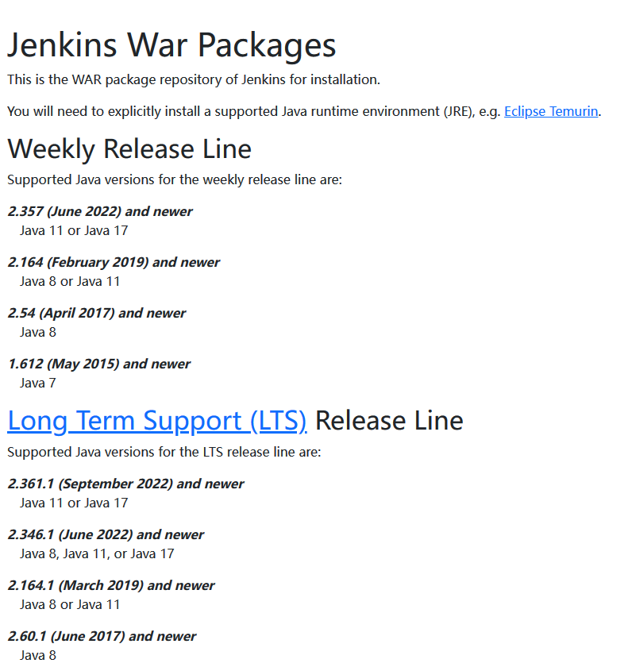
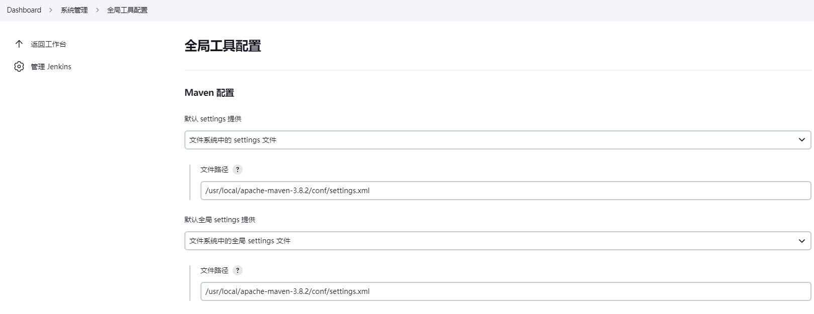
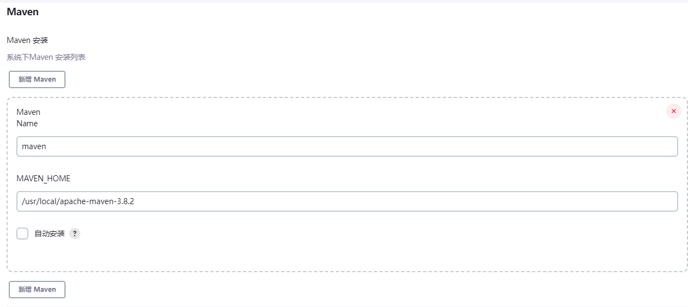
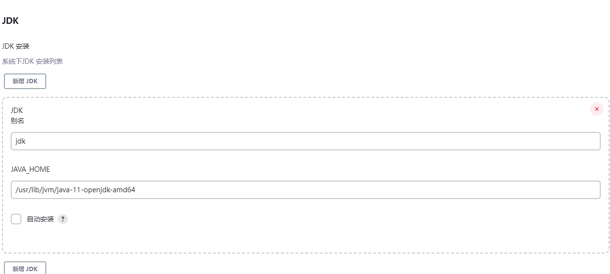
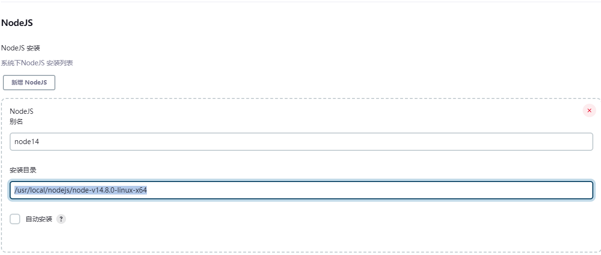
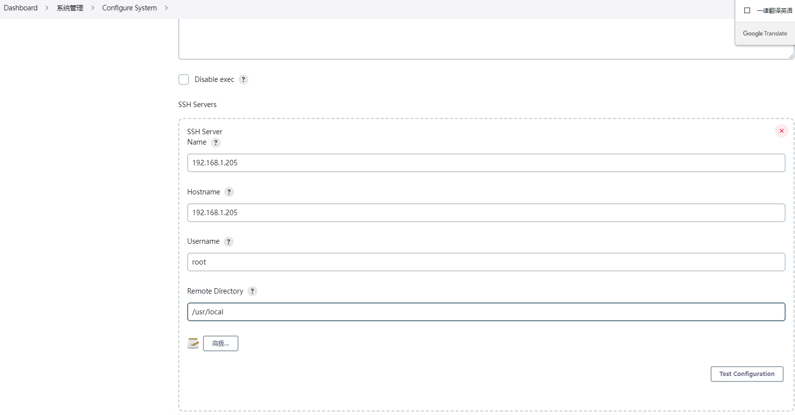

# jenkins的安装

## 1.去官网下载好需要的版本包

```
https://www.jenkins.io/
```

注意不同版本的对于jdk



## 2.创建文件夹放置war包

```
sudo mkdir Jenkins
sudo mv jenkins.war /opt/Jenkins/
```

## 3.启动

```
nohup java -jar jenkins.war --httpPort=9527 > /dev/null 2>&1 &
```

当然你也可以把这个jar包做成一个服务，并且开机自启动，都是可以的，本质就是运行这个jar包

## 4.初次登录会要求重置密码

## 5.安装插件

安装前先切换下国内站点

```sh
https://mirrors.tuna.tsinghua.edu.cn/jenkins/updates/update-center.json
```

安装的插件

```
Maven Integration 
Locale
NodeJS
Publish over SSH
Gitlab
Git
JDK Parameter Plugin
Workspace
```

## 6.配置常用全局配置和系统配置

maven





```
/usr/local/apache-maven-3.8.2/conf/settings.xml
```

```
/usr/local/apache-maven-3.8.2
```

加速地址

````
<mirror>
        <id>alimaven</id>
        <name>aliyun maven</name>
        <url>http://maven.aliyun.com/nexus/content/groups/public/</url>
        <mirrorOf>central</mirrorOf>
</mirror>
````

jdk

```
/usr/lib/jvm/java-11-openjdk-amd64
```




nodejs

```
/usr/local/nodejs/node-v14.8.0-linux-x64
```





ssh服务器





参考链接文档:

[Ubuntu安装Jenkins - 简书 (jianshu.com)](https://www.jianshu.com/p/77a274ed89cc) 