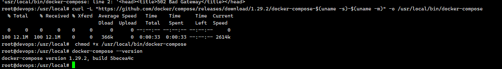

# Ubuntu安装Docker环境

1.安装docker-compose

```shell
sudo curl -L https://get.daocloud.io/docker/compose/releases/download/1.25.1/docker-compose-`uname -s`-`uname -m` -o /usr/local/bin/docker-compose
```

2.添加可执行权限

```
sudo chmod +x /usr/local/bin/docker-compose
```

3.测试安装结果

```
docker-compose --version
```

4.docker-compose使用

```
sudo docker-compose -f docker-compose-env.yml up -d  
```

卡顿了

```
curl -sSL https://get.daocloud.io/daotools/set_mirror.sh | sh -s http://f1361db2.m.daocloud.io
```


5.报错

```
/usr/local/bin/docker-compose: line 1: html: No such file or directory
/usr/local/bin/docker-compose: line 2: syntax error near unexpected token `<'
'usr/local/bin/docker-compose: line 2: `<head><title>502 Bad Gateway</title></head>

```

使用下面的命令解决

```
curl -L "https://github.com/docker/compose/releases/download/1.29.2/docker-compose-$(uname -s)-$(uname -m)" -o /usr/local/bin/docker-compose 
```

```
 chmod +x /usr/local/bin/docker-compose
```

最后查看版本




