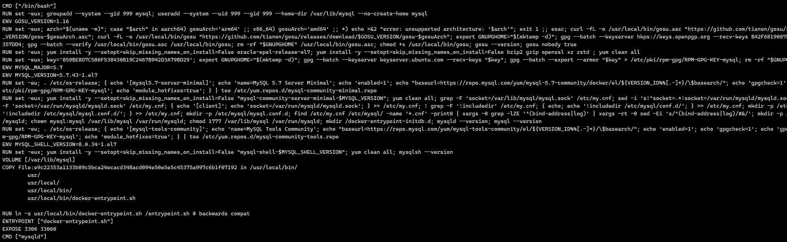

# Dockerfile理解

**先来执行一个springboot的Dockerfile脚本文件**

```
FROM openjdk:8-jdk-slim
LABEL maintainer=yangsan

COPY target/*.jar   /app.jar

ENTRYPOINT ["java","-jar","/app.jar"]
```

```
docker build -t java-demo:v1.0 .
```

```
docker run -d -p 80:8889 --name myjava-app java-demo:v1.0
```

portainer

```
docker run -d -p 8000:8000 -p 9000:9000 --name=portainer --restart=always -v /var/run/docker.sock:/var/run/docker.sock -v portainer_data:/data portainer/portainer-ce
```


访问:服务器ip+test    Hello, world! 

## 1.组成

Dockerfile由一行行命令语句组成，并且支持以#开头的注释行。一般而言，Dockerfile可以分为四部分

**基础镜像信息** **维护者信息** **镜像操作指令** **启动时执行指令**

|    指令     |                             说明                             |
| :---------: | :----------------------------------------------------------: |
|    FROM     |                         指定基础镜像                         |
| MAINTAINER  | 指定维护者信息，已经过时，可以使用LABEL maintainer=xxx 来替代 |
|     RUN     |                          运行命令 v                          |
|     CMD     |                  指定启动容器时默认的命令 v                  |
| ENTRYPOINT  |                指定镜像的默认入口.运行命令 v                 |
|   EXPOSE    |                  声明镜像内服务监听的端口 v                  |
|     ENV     | 指定环境变量，可以在docker run的时候使用-e改变 v，会被固话到image的config里面 |
|     ADD     | 复制指定的src路径下的内容到容器中的dest路径下，src可以为url会自动下载，可以为tar文件，会自动解压 |
|    COPY     | 复制本地主机的src路径下的内容到镜像中的dest路径下，但不会自动解压等 |
|    LABEL    |                 指定生成镜像的元数据标签信息                 |
|   VOLUME    |                       创建数据卷挂载点                       |
|    USER     |                 指定运行容器时的用户名或UID                  |
|   WORKDIR   |  配置工作目录，为后续的RUN、CMD、ENTRYPOINT指令配置工作目录  |
|     ARG     | 指定镜像内使用的参数（如版本号信息等），可以在build的时候，使用--build-args改变 v |
|   OBBUILD   | 配置当创建的镜像作为其他镜像的基础镜像是，所指定的创建操作指令 |
| STOPSIGNAL  |                       容器退出的信号值                       |
| HEALTHCHECK |                           健康检查                           |
|    SHELL    |                指定使用shell时的默认shell类型                |
|             |                                                              |

## 2.FROM

FROM 指定基础镜像，最好挑一些apline，slim之类的基础小镜像.
scratch镜像是一个空镜像，常用于多阶段构建
如何确定我需要什么要的基础镜像？
Java应用当然是java基础镜像（SpringBoot应用）或者Tomcat基础镜像（War应用）
JS模块化应用一般用nodejs基础镜像
其他各种语言用自己的服务器或者基础环境镜像，如python、golang、java、php等

## 3.LABEL

标注镜像的一些说明信息

## 4.RUN

RUN指令在当前镜像层顶部的新层执行任何命令，并提交结果，生成新的镜像层。
生成的提交映像将用于Dockerfile中的下一步。 分层运行RUN指令并生成提交符合Docker的核心概
念，就像源代码控制一样。
exec形式可以避免破坏shell字符串，并使用不包含指定shell可执行文件的基本映像运行RUN命令。
可以使用SHELL命令更改shell形式的默认shell。 在shell形式中，您可以使用\（反斜杠）将一条
RUN指令继续到下一行。

```
RUN <command> ( shell 形式, /bin/sh -c 的方式运行，避免破坏shell字符串)

RUN ["executable", "param1", "param2"] ( exec 形式)
```


```
RUN /bin/bash -c 'source $HOME/.bashrc; \
echo $HOME'
#上面等于下面这种写法
RUN /bin/bash -c 'source $HOME/.bashrc; echo $HOME'
RUN ["/bin/bash", "-c", "echo hello"]
```

测速案例

```
# 测试案例
FROM alpine
LABEL maintainer=yangsang
ENV msg='hello world'
RUN echo $msg
RUN ["echo","$msg"]
RUN /bin/sh -c 'echo $msg'
RUN ["/bin/sh","-c","echo $msg"]
CMD sleep 10000
#总结； 由于[]不是shell形式，所以不能输出变量信息，而是输出$msg。其他任何/bin/sh -c 的形式都
可以输出变量信息
```

总结：什么是shell和exec形式

```
1. shell 是 /bin/sh -c <command>的方式，
2. exec ["/bin/sh","-c",command] 的方式== shell方式
也就是exec 默认方式不会进行变量替换
```


## 5.CMD和ENTRYPOINT

### 0、都可以作为容器启动入口

```
CMD 的三种写法：
    CMD ["executable","param1","param2"] ( exec 方式, 首选方式)
    CMD ["param1","param2"] (为ENTRYPOINT提供默认参数)
    CMD command param1 param2 ( shell 形式)
ENTRYPOINT 的两种写法：
    ENTRYPOINT ["executable", "param1", "param2"] ( exec 方式, 首选方式)
    ENTRYPOINT command param1 param2 (shell 形式)
```

示例：

```
# 一个示例
FROM alpine
LABEL maintainer=yangsang
CMD ["1111"]
CMD ["2222"]
ENTRYPOINT ["echo"]
#构建出如上镜像后测试
docker run xxxx：效果 echo 1111
```

### 1、只能有一个CMD

Dockerfile中只能有一条CMD指令。 如果您列出多个CMD，则只有最后一个CMD才会生效。
CMD的主要目的是为执行中的容器提供默认值。 这些默认值可以包含可执行文件，也可以省略可
执行文件，在这种情况下，您还必须指定ENTRYPOINT指令。
2、CMD为ENTRYPOINT提供默认参数
如果使用CMD为ENTRYPOINT指令提供默认参数，则CMD和ENTRYPOINT指令均应使用JSON数组格
式指定。

### 2、docker run启动参数会覆盖CMD内容

```
# 一个示例
FROM alpine
LABEL maintainer=yangsang
CMD ["1111"]
ENTRYPOINT ["echo"]
#构建出如上镜像后测试
docker run xxxx：什么都不传则 echo 1111
docker run xxx arg1：传入arg1 则echo arg1
```


>
>
>总结起来 `CMD`和 `ENTRYPOINT` 有几处不同之处
>
>​	1.CMD为镜像提供默认值，且这个默认值会被容器启动时候覆盖掉，ENTRYPOINT则是拼接
>
>​	2.CMD指令。 如果您列出多个CMD，则只有最后一个CMD才会生效
>
>​	3.ENTRYPOINT: 用于指定固定的命令，启动容器时一般不被覆盖，除非显式使用 --entrypoint 参数。

## 6.ARG和ENV

```
1、ARG
ARG指令定义了一个变量，用户可以在构建时使用--build-arg = 传递，docker build命令会将其传递
给构建器。
--build-arg 指定参数会覆盖Dockerfile 中指定的同名参数
如果用户指定了 未在Dockerfile中定义的构建参数 ，则构建会输出 警告 。
ARG只在构建期有效，运行期无效

2、ENV
在构建阶段中所有后续指令的环境中使用，并且在许多情况下也可以内联替换。
引号和反斜杠可用于在值中包含空格。
ENV 可以使用key value的写法，但是这种不建议使用了，后续版本可能会删除
```

```
ENV MY_MSG hello
ENV MY_NAME="John Doe"
ENV MY_DOG=Rex\ The\ Dog
ENV MY_CAT=fluffy
#多行写法如下
ENV MY_NAME="John Doe" MY_DOG=Rex\ The\ Dog \
 MY_CAT=fluffy
```

docker run --env 可以修改这些值
容器运行时ENV值可以生效
ENV在image阶段就会被解析并持久化（docker inspect image查看），参照下面示例。

```
FROM alpine
ENV arg=1111111
ENV runcmd=$arg
RUN echo $runcmd
CMD echo $runcmd
# 改变arg，会不会改变 echo的值，会改变哪些值，如果修改这些值?
```

综合测试示例

```
FROM alpine
ARG arg1=22222
ENV arg2=1111111
ENV runcmd=$arg1
RUN echo $arg1 $arg2 $runcmd
CMD echo $arg1 $arg2 $runcmd
```

## 7.ADD和COPY

### 1、COPY

COPY的两种写法

```
COPY [--chown=<user>:<group>] <src>... <dest>
COPY [--chown=<user>:<group>] ["<src>",... "<dest>"]
```

--chown功能仅在用于构建Linux容器的Dockerfiles上受支持，而在Windows容器上不起作用
COPY指令从 src 复制新文件或目录，并将它们添加到容器的文件系统中，路径为 dest 。
可以指定多个 src 资源，但是文件和目录的路径将被解释为相对于构建上下文的源。
每个 src 都可以包含通配符，并且匹配将使用Go的filepath.Match规则进行。


```
COPY hom* /mydir/ #当前上下文，以home开始的所有资源
COPY hom?.txt /mydir/ # ?匹配单个字符
COPY test.txt relativeDir/ # 目标路径如果设置为相对路径，则相对与 WORKDIR 开始
# 把 “test.txt” 添加到 <WORKDIR>/relativeDir/
COPY test.txt /absoluteDir/ #也可以使用绝对路径，复制到容器指定位置
#所有复制的新文件都是uid(0)/gid(0)的用户，可以使用--chown改变
COPY --chown=55:mygroup files* /somedir/
COPY --chown=bin files* /somedir/
COPY --chown=1 files* /somedir/
COPY --chown=10:11 files* /somedir/
```

### 2、ADD

同COPY用法，不过 ADD拥有自动下载远程文件和解压的功能。
注意：

​        src 路径必须在构建的上下文中； 不能使用 ../something /something 这种方式，因为docker
构建的第一步是将上下文目录（和子目录）发送到docker守护程序。
​        如果 src 是URL，并且 dest 不以斜杠结尾，则从URL下载文件并将其复制到 dest 。
​        如果 dest 以斜杠结尾，将自动推断出url的名字（保留最后一部分），保存到 dest
​        如果 src 是目录，则将复制目录的整个内容，包括文件系统元数据。

## 8.WORKDIR和VOLUME

### 1、WORKDIR

WORKDIR指令为Dockerfile中跟随它的所有 RUN，CMD，ENTRYPOINT，COPY，ADD 指令设置工作目
录。 如果WORKDIR不存在，即使以后的Dockerfile指令中未使用它也将被创建。
WORKDIR指令可在Dockerfile中多次使用。 如果提供了相对路径，则它将相对于上一个WORKDIR指
令的路径。 例如：

```
WORKDIR /a
WORKDIR b
WORKDIR c
RUN pwd
#结果 /a/b/c
```

也可以用到环境变量

```
ENV DIRPATH=/path
WORKDIR $DIRPATH/$DIRNAME
RUN pwd
#结果 /path/$DIRNAME
```

### 2、VOLUME

作用：把容器的某些文件夹映射到主机外部
写法:

```
VOLUME ["/var/log/"]  #可以是JSON数组
VOLUME /var/log  #可以直接写
VOLUME /var/log /var/db #可以空格分割多个
```

**注意：**
**用 VOLUME 声明了卷，那么以后对于卷内容的修改会被丢弃，所以， 一定在volume声明之前修改内容 ；**

## 9.USER

写法：

```
USER <user>[:<group>]
USER <UID>[:<GID>]
```

USER指令设置运行映像时要使用的用户名（或UID）以及可选的用户组（或GID），以及Dockerfile
中USER后面所有RUN，CMD和ENTRYPOINT指令。

## 10.EXPOSE

EXPOSE指令通知Docker容器在运行时在指定的网络端口上进行侦听。 可以指定端口是侦听TCP还
是UDP，如果未指定协议，则默认值为TCP。
EXPOSE指令实际上不会发布端口。 它充当构建映像的人员和运行容器的人员之间的一种文档，即
有关打算发布哪些端口的信息。 要在运行容器时实际发布端口，请在docker run上使用-p标志发布
并映射一个或多个端口，或使用-P标志发布所有公开的端口并将其映射到高阶端口


```
EXPOSE <port> [<port>/<protocol>...]
EXPOSE [80,443]
EXPOSE 80/tcp
EXPOSE 80/udp
```

## 11.multi-stage builds

**多阶段构建:**

### 1、使用

https://docs.docker.com/build/building/multi-stage/

解决：如何让一个镜像变得更小; 多阶段构建的典型示例

```
### 我们如何打包一个Java镜像
FROM maven
WORKDIR /app
COPY . .
RUN mvn clean package
COPY /app/target/*.jar /app/app.jar
ENTRYPOINT java -jar app.jar
## 这样的镜像有多大？
## 我们最小做到多大？？
```

### 2、生产示例

```
#以下所有前提 保证Dockerfile和项目在同一个文件夹 
# 第一阶段：环境构建;
FROM maven:3.5.0-jdk-8-alpine AS builder
WORKDIR /app
ADD ./ /app
RUN mvn clean package -Dmaven.test.skip=true
# 第二阶段，最小运行时环境，只需要jre
FROM openjdk:8-jre-alpine
# 修改时区
RUN ln -sf /usr/share/zoneinfo/Asia/Shanghai /etc/localtime && echo
'Asia/Shanghai' >/etc/timezone
LABEL maintainer="534096094@qq.com"
# 从上一个阶段复制内容
COPY --from=builder /app/target/*.jar /app.jar
ENV JAVA_OPTS=""
ENV PARAMS=""
# 运行jar包
ENTRYPOINT [ "sh", "-c", "java -Djava.security.egd=file:/dev/./urandom $JAVA_OPTS
-jar /app.jar $PARAMS" ]

<!--为了加速下载需要在pom文件中复制如下 -->
  <repositories>
    <repository>
      <id>aliyun</id>
      <name>Nexus Snapshot Repository</name>
      <url>https://maven.aliyun.com/repository/public</url>
      <layout>default</layout>
      <releases>
        <enabled>true</enabled>
      </releases>
      <!--snapshots默认是关闭的,需要开启 -->
      <snapshots>
        <enabled>true</enabled>
      </snapshots>
    </repository>
  </repositories>
  <pluginRepositories>
    <pluginRepository>
      <id>aliyun</id>
      <name>Nexus Snapshot Repository</name>
      <url>https://maven.aliyun.com/repository/public</url>
      <layout>default</layout>
      <releases>
        <enabled>true</enabled>
      </releases>
      <snapshots>
        <enabled>true</enabled>
      </snapshots>
    </pluginRepository>
  </pluginRepositories>
```

## Images瘦身实践

选择最小的基础镜像
合并RUN环节的所有指令，少生成一些层
RUN期间可能安装其他程序会生成临时缓存，要自行删除。如：

```
RUN apt-get update && apt-get install -y \
bzr \
cvs \
git \
mercurial \
subversion \
&& rm -rf /var/lib/apt/lists/*
```

使用 .dockerignore 文件，排除上下文中无需参与构建的资源
使用多阶段构建
合理使用构建缓存加速构建。--no-cache

## 12.额外补充

如何通过镜像查看Dockerfile的制作

```
docker pull alpine/dfimage
docker pull alpine/dfimage
alias dfimage="docker run -v /var/run/docker.sock:/var/run/docker.sock --rm alpine/dfimage"
dfimage java-demo:v1.0(镜像id)
dfimage java-demo:v1.0 >demo.text  (输出到指定的文件上面)
```


