# Jenkins整合ruoyi-cloud流水线

## 1.安装环境与工具的准备

jdk11

jenkins

nodejs16

maven

gitlab(代码托管)，可以选择gitee,或者github代码托管工具替代

sonarqb(代码检测)，可以不装

nginx

## 2.代码仓库gitlab上传好前后端项目

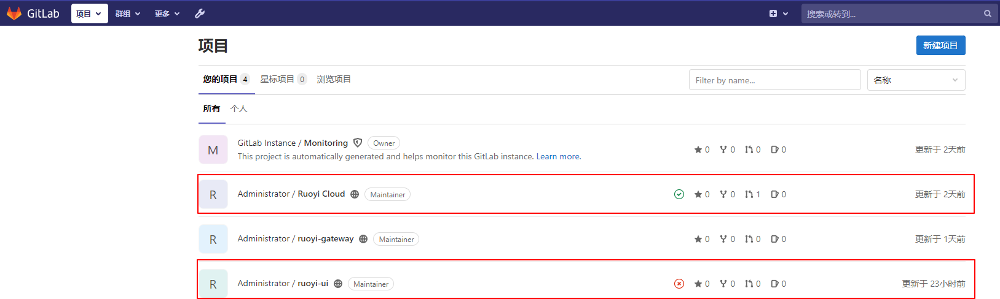

后端:

```
http://192.168.1.205:9000/root/ruoyi-cloud.git
```

前端:

```
http://192.168.1.205:9000/root/ruoyi-ui.git
```

记录下来后面用到

## 3.项目运行需要的中间件

```
nacos2.1.1
mysql
redis
```

mysql安装

````
docker run -p 3306:3306 --name mysql-01 \
-v /mydata/mysql/log:/var/log/mysql \
-v /mydata/mysql/data:/var/lib/mysql \
-v /mydata/mysql/conf:/etc/mysql/conf.d \
-e MYSQL_ROOT_PASSWORD=root \
--restart=always \
-d mysql:5.7 
````

redis安装

```
#创建配置文件
## 1、准备redis配置文件内容
mkdir -p /mydata/redis/conf && vim /mydata/redis/conf/redis.conf


##配置示例
appendonly yes
port 6379
bind 0.0.0.0


#docker启动redis
docker run -d -p 6379:6379 --restart=always \
-v /mydata/redis/conf/redis.conf:/etc/redis/redis.conf \
-v  /mydata/redis-01/data:/data \
 --name redis-01 redis:6.2.5 \
 redis-server /etc/redis/redis.conf
```

nacos安装

```shell
下载tar.gz包
https://github.com/alibaba/nacos/tags
解压
tar -zxvf ****.tar.gz
./start.sh -m standalone
修改nacos的配置配置文件和引入项目需要的sql文件到mysql就不过多赘述了
```

## 4.配置流水线

### 4.1新建ruoyi-parent任务

源码管理

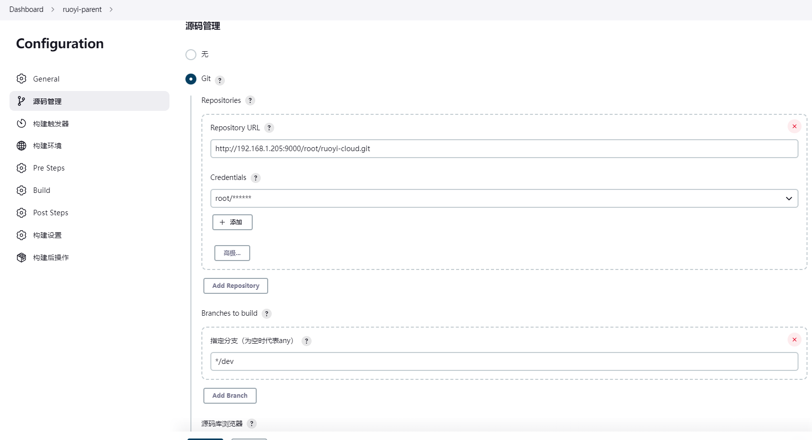


Build 

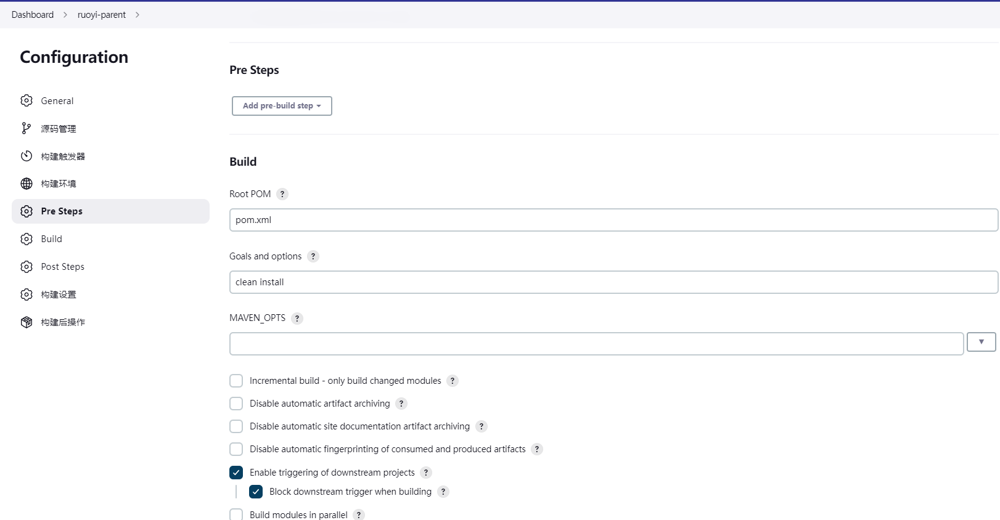

### 4.2新建子模块的ruoyi-gateway任务,其余的类似

build

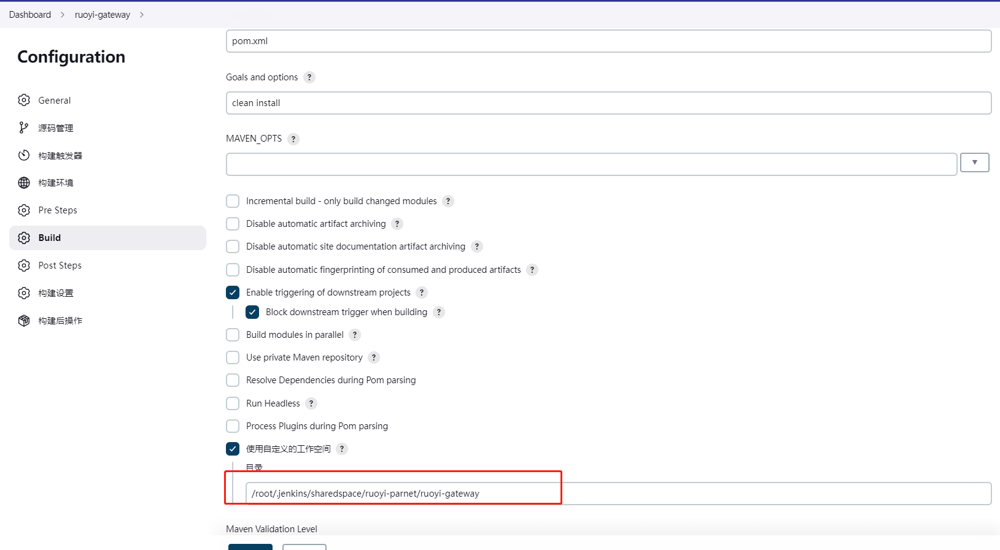

ssh远程配置

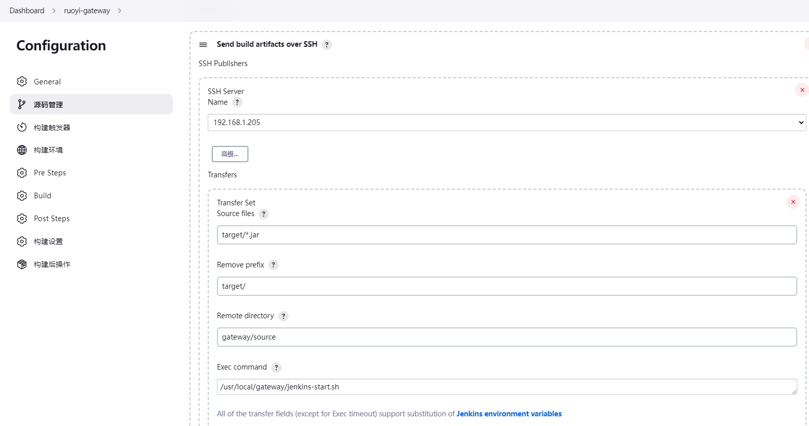

### 4.3配置前端

源码管理

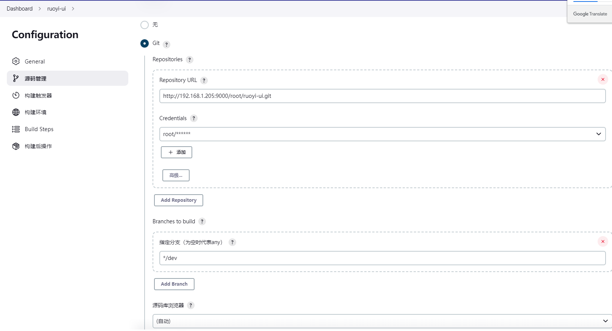

build steps

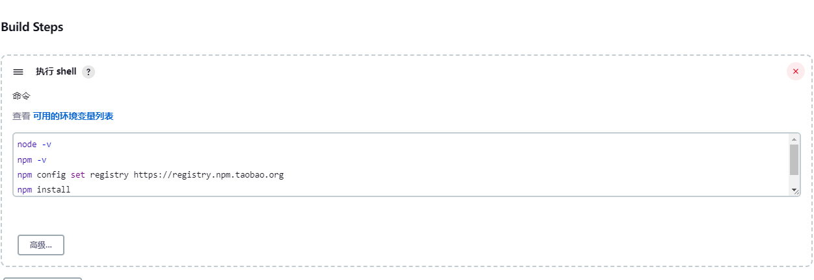


ssh

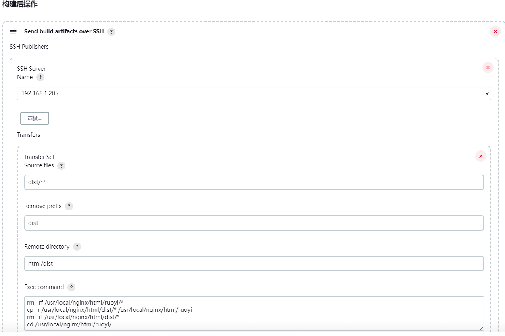

## 5.安装nginx并且配置

```
worker_processes  1;

events {
    worker_connections  1024;
}

http {
    include       mime.types;
    default_type  application/octet-stream;
    sendfile        on;
    keepalive_timeout  65;

    server {
        listen       80;
        server_name  _;

		location / {
		##前端打包的地址
            root   /usr/local/nginx/html/ruoyi;
			try_files $uri $uri/ /index.html;
            index  index.html index.htm;
        }
		
		location /prod-api/{
			proxy_set_header Host $http_host;
			proxy_set_header X-Real-IP $remote_addr;
			proxy_set_header REMOTE-HOST $remote_addr;
			proxy_set_header X-Forwarded-For $proxy_add_x_forwarded_for;
			##后端网关的地址
			proxy_pass http://192.168.1.205:8081/;
		}

        error_page   500 502 503 504  /50x.html;
        location = /50x.html {
            root   html;
        }
    }
}# requirepass 123456
```

## 6.最终效果

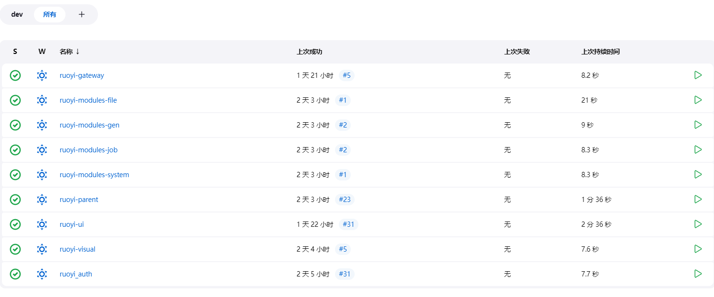


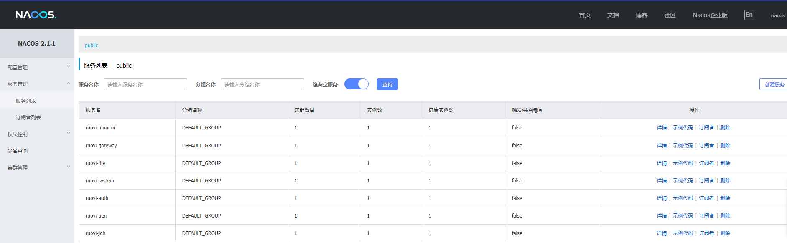


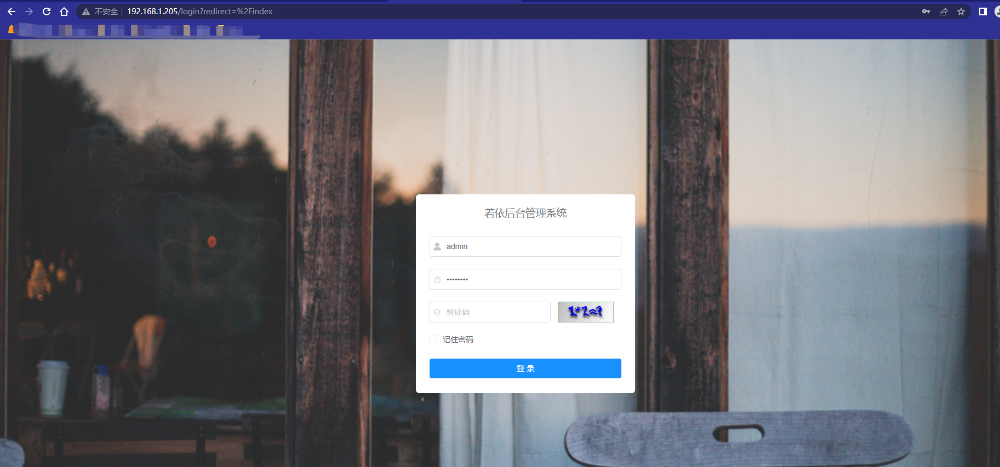


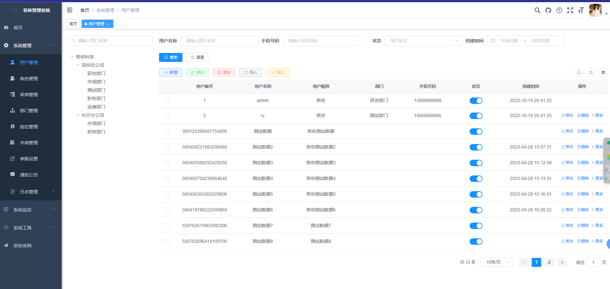


参考链接:

https://www.yuque.com/leifengyang/oncloud/vgf9wk

[docker+jenkins+gitee+shell 自动化部署微服务（基于若依）【详细完整版】_jenkins 若依微服务_菠萝仔丨叶的博客-CSDN博客](https://blog.csdn.net/qq_40966238/article/details/128113539) 

[Jenkins + SpringCloud（多模块）+ Vue系统详细构建配置 - 三石破天 - 博客园 (cnblogs.com)](https://www.cnblogs.com/hardrockwu/p/16638974.html) 

[Jenkins利用nodejs插件实现vue项目构建（若依前端） – 染卷'blog (ranjuan.cn)](https://ranjuan.cn/jenkins-nodejs-build/) 