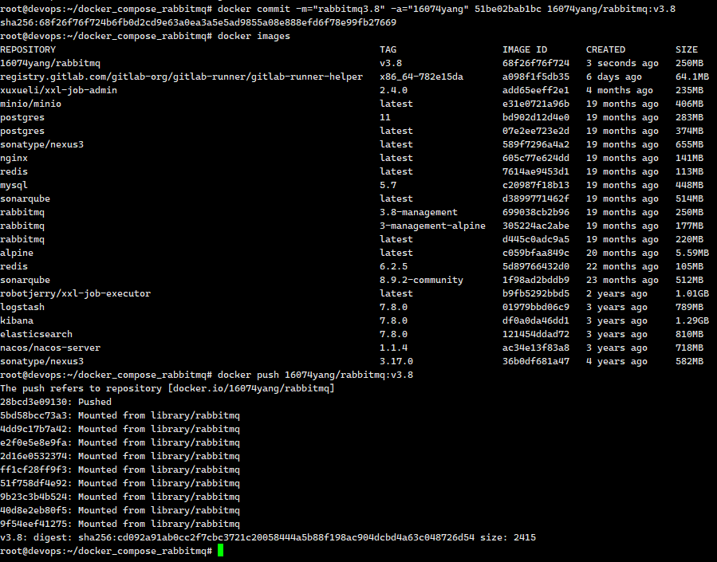

# Docker基本命令

## 一：镜像相关

### 1.查看镜像

```
# 查看所有
docker images
# 查看某个镜像
docker search redis:latest(默认不加版本信息就是最新版本，redis可以替换成为其他的镜像名字)

```

### 2.拉取镜像

```
docker pull 镜像名
docker pull 镜像名:Tag
```

### 3.删除镜像

```
docker rmi -f 镜像名/镜像ID
# 删除所有的镜像
docker rmi -f $(docker images -aq)
```

`悬空镜像` 这些镜像似乎是未被标记（tagged）或没有名称的镜像，通常被称为“悬空镜像”（dangling images）。这些镜像可能是由于构建镜像过程中的中间层，或者由于重新构建镜像时产生的。您可以使用以下命令删除这些悬空镜像

docker rmi -f $(docker images -f "dangling=true" -q)   #加强制
如果您只想删除特定的悬空镜像，可以首先列出它们，然后使用 docker rmi 命令删除它们。您可以使用以下命令列出所有悬空镜像：

docker images -f "dangling=true"
然后，您可以使用 docker rmi 命令删除特定的悬空镜像。例如：

docker rmi ae3216c23a37 e5bbbd13b4b9 4a9f3de9f8f2


### 4.保存镜像

将我们的镜像 保存为tar 压缩文件 这样方便镜像转移和保存 ,然后 可以在任何一台安装了docker的服务器上 加载这个镜像 

```
docker save 镜像名/镜像ID -o 镜像保存在哪个位置与名字
```

### 5.加载镜像

```
docker load -i 镜像保存文件位置
docker load -i flanneld-v0.20.2-amd64.docker
```

### 6.镜像重命名并且推送镜像

```
docker tag local-image:tagname new-repo:tagname
docker push new-repo:tagname
```

```
# 把旧镜像的名字，改成仓库要求的新版名字
docker tag quay.io/coreos/flannel:v0.20.2-amd64 16074yang/flannel:v1

# 登录到docker hub
docker login       


docker logout（推送完成镜像后退出）

# 推送
docker push 16074yang/flannel:v1


# 别的机器下载
docker pull 16074yang/flannel:v1
```

### 7.查看命令镜像的详细信息

```
docker image inspect java-demo:v1.0
```


## 二：容器相关

### 1.查询容器

```
#所有的
docker ps
#运行和停止的
docker ps -a
```

### 2.创建容器

比如这个是gitlab容器的创建命令

```
docker run \
-d \
-p 20180:80 \
-p 20122:22 \
--restart always \
-v /data/gitlab/config:/etc/gitlab \
-v /data/var/log/gitlab:/var/log/gitlab \
-v /data/gitlab/data:/var/opt/gitlab \
--name gitlab \
gitlab/gitlab-ce:8.16.7-ce.0

```

```
-d：容器在后台运行。容器平台都是以后台的形式来运行容器，所以本参数不需要在容器控制台指定。
-p：指定端口映射。这里映射了两个端口，容器端口分别是80和22，对外暴露的端口分别是20180和20122
--restart：本参数用于指定在容器退出时，是否重启容器。容器平台创建的所有容器退出时，都会重启容器，所以本参数不需要在容器控制台指定
-v 将容器内的指定文件夹挂载到宿主机对应位置
--name 给要运行的容器 起的名字
```

**docker 资源配额** 

Docker 通过 cgroup 来控制容器使用的资源限制，可以对 docker 限制的资源包括 CPU、内存、磁盘

查看配置份额的帮助命令

```sh
docker run --help | grep cpu-shares
#指定 docker10 只能在 cpu0 和 cpu1 上运行，而且 docker10 的使用 cpu 的份额 512
docker run -itd --name docker10 --cpuset-cpus 0,1 --cpu-shares 1024 centos /bin/bash
```

可以结合`stress`脚本相关命令使用

**docker 容器控制内存**

Docker 提供参数-m, --memory=""限制容器的内存使用量。

```sh
 #允许容器使用的内存上限为 128M：
 docker run -it -m 128m centos
```

### 3.网络模式

docker run 创建 docker 容器时，可以用--net 选项指定容器的网络模式，Docker 有以下 4 种网络模式：

```
 bridge 模式：使--net =bridge 指定，默认设置； 
 host 模式：使--net =host 指定； 共享主机网络
 none 模式：使--net =none 指定； 
 container 模式：使用--net =container:NAME orID 指定
```

### 4.停止容器

```
docker stop 容器名/容器ID
```

> 停止所有的容器: docker stop $(docker ps -aq)

### 5.删除容器

````
#删除一个容器
docker rm -f 容器名/容器ID
#删除多个容器 空格隔开要删除的容器名或容器ID
docker rm -f 容器名/容器ID 容器名/容器ID 容器名/容器ID
#删除全部容器
docker rm -f $(docker ps -aq)
#删除死掉的容器
docker rm $(docker ps -a -q -f status=exited)

````

### 6.进入容器

````
docker attach 容器ID/容器名
# 进入容器内部的系统，修改容器内容
docker exec -it 容器id  /bin/bash
````

### 7.查看容器相关的日志

```
docker logs 容器名/id   排错
```

### 8.容器与服务器之间拷贝

```
#把容器指定位置的东西复制出来 
docker cp 5eff66eec7e1:/etc/nginx/nginx.conf  /data/conf/nginx.conf
#把外面的内容复制到容器里面
docker cp  /data/conf/nginx.conf  5eff66eec7e1:/etc/nginx/nginx.conf
```

### 9.怎么将正在运行的容器做成镜像

```
# 将容器打包成镜像的命令，:TAG可有可无
docker commit -m="commit信息" -a="作者名" 容器ID 你的镜像名:TAG
docker commit -m="rabbitmq3.8" -a="16074yang" 51be02bab1bc 16074yang/rabbitmq:v3.8
```


