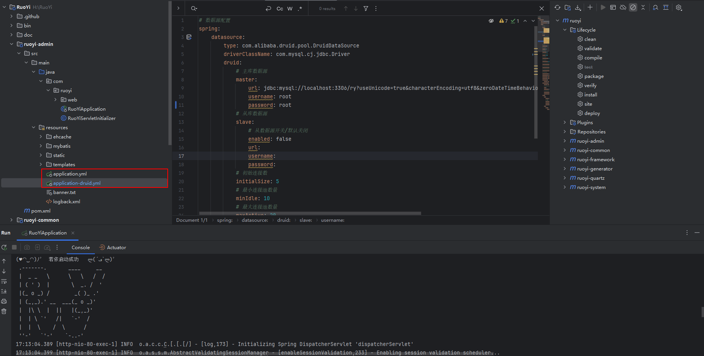
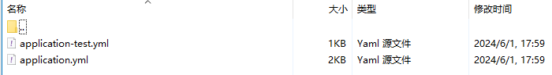

# Dockerfile自定义脚本

## 环境准备：

**Docker**: Docker version 24.0.2, build cb74dfc

**Docker-compose**:Docker Compose version v2.26.0

## 项目准备：[若依单体项目](https://gitee.com/y_project/RuoYi)



分析得到需要挂载的配置文件有 `application.yml` 以及 `application-druid.yml`

## 脚本准备

### Dockerfile

```dockerfile
# 使用官方的 OpenJDK 作为基础镜像
FROM openjdk:8-jdk-alpine 

LABEL maintainer=zhangsan

# 将本地的JAR文件添加到容器中
COPY ./*.jar /app/ruoyi-admin.jar

# 安装所需的字体包
RUN apk add --no-cache \
    ttf-dejavu \
    fontconfig

# 将start.sh脚本添加到容器中
COPY docker-entrypoint.sh /app/docker-entrypoint.sh
RUN chmod +x /app/docker-entrypoint.sh

# 指定工作目录
WORKDIR /app

# 启动应用
CMD ["/app/docker-entrypoint.sh"]

```

### docker-entrypoint.sh

```shell
#!/bin/bash

# 赋予脚本执行权限
chmod +x /app/docker-entrypoint.sh

# 确保挂载的目录存在，并且在宿主机上生成 application.yml 文件（如果不存在）
if [ ! -f /app/conf/application.yml ]; then
  cat <<EOL > /app/conf/application.yml
# 项目相关配置
ruoyi:
  name: RuoYi
  version: 4.7.8
  copyrightYear: 2024
  demoEnabled: true
  profile: D:/ruoyi/uploadPath
  addressEnabled: false

# 开发环境配置
server:
  port: 80
  servlet:
    context-path: /
  tomcat:
    uri-encoding: UTF-8
    accept-count: 1000
    threads:
      max: 800
      min-spare: 100

# 日志配置
logging:
  level:
    com.ruoyi: debug
    org.springframework: warn

# 用户配置
user:
  password:
    maxRetryCount: 5

# Spring配置
spring:
  thymeleaf:
    mode: HTML
    encoding: utf-8
    cache: false
  messages:
    basename: static/i18n/messages
  jackson:
    time-zone: GMT+8
    date-format: yyyy-MM-dd HH:mm:ss
  profiles:
    active: test
  servlet:
    multipart:
      max-file-size: 10MB
      max-request-size: 20MB
  devtools:
    restart:
      enabled: true

# MyBatis
mybatis:
  typeAliasesPackage: com.ruoyi.**.domain
  mapperLocations: classpath*:mapper/**/*Mapper.xml
  configLocation: classpath:mybatis/mybatis-config.xml

# PageHelper分页插件
pagehelper:
  helperDialect: mysql
  supportMethodsArguments: true
  params: count=countSql

# Shiro
shiro:
  user:
    loginUrl: /login
    unauthorizedUrl: /unauth
    indexUrl: /index
    captchaEnabled: true
    captchaType: math
  cookie:
    domain:
    path: /
    httpOnly: true
    maxAge: 30
    cipherKey:
  session:
    expireTime: 30
    dbSyncPeriod: 1
    validationInterval: 10
    maxSession: -1
    kickoutAfter: false
  rememberMe:
    enabled: true

# 防止XSS攻击
xss:
  enabled: true
  excludes: /system/notice/*
  urlPatterns: /system/*,/monitor/*,/tool/*

# Swagger配置
swagger:
  enabled: true
EOL
fi

# 确保挂载的目录存在，并且在宿主机上生成 application-druid.yml 文件（如果不存在）
if [ ! -f /app/conf/application-test.yml ]; then
  cat <<EOL > /app/conf/application-test.yml
# 数据源配置
spring:
  datasource:
    type: com.alibaba.druid.pool.DruidDataSource
    driverClassName: com.mysql.cj.jdbc.Driver
    druid:
      master:
        url: jdbc:mysql://xx.xx.xx.xx:3306/ry?useUnicode=true&characterEncoding=utf8&zeroDateTimeBehavior=convertToNull&useSSL=true&serverTimezone=GMT%2B8
        username: root
        password: yXf8u%2b@Iz&FaEa
      slave:
        enabled: false
        url: 
        username: 
        password: 
      initialSize: 5
      minIdle: 10
      maxActive: 20
      maxWait: 60000
      connectTimeout: 30000
      socketTimeout: 60000
      timeBetweenEvictionRunsMillis: 60000
      minEvictableIdleTimeMillis: 300000
      maxEvictableIdleTimeMillis: 900000
      validationQuery: SELECT 1 FROM DUAL
      testWhileIdle: true
      testOnBorrow: false
      testOnReturn: false
      webStatFilter: 
        enabled: true
      statViewServlet:
        enabled: true
        allow:
        url-pattern: /druid/*
        login-username: ruoyi
        login-password: 123456
      filter:
        stat:
          enabled: true
          log-slow-sql: true
          slow-sql-millis: 1000
          merge-sql: true
        wall:
          config:
            multi-statement-allow: true
EOL
fi

# 打印配置文件内容以便调试
#echo "Using configuration files:"
cat /app/conf/application.yml
cat /app/conf/application-test.yml

# 启动Java应用，指定外部配置文件路径
#java -jar ruoyi-admin.jar -Dspring.config.location=/app/conf/application.yml
java -jar ruoyi-admin.jar --spring.config.location=/app/conf/application.yml,/app/conf/application-test.yml

```

### 构建镜像

构建自定义镜像, `镜像名字自己取`，如果想方便推送到远程仓库，则按照相应规则创建即可

```shell
docker build -t xxx:v1 .
```

耐心等待构建的过程，字体是我添加进去的，否则构建运行起来，会存在验证码无法刷新出来!

### docker-compose

```dockerfile
version: '3'
services:
  mysql:
    image: mysql:8.0.36
    container_name: mysql
    restart: always
    environment:
      MYSQL_ROOT_PASSWORD: ${MYSQL_PASSWORD}
    ports:
      - "3306:3306"
    volumes:
      - ./mysql/data:/var/lib/mysql
      - ./mysql/conf/my.cnf:/etc/mysql/my.cnf
      - ./mysql/log:/var/log/mysql
      - ./init:/docker-entrypoint-initdb.d
      - /etc/timezone:/etc/timezone:ro
      - /etc/localtime:/etc/localtime:ro
    command:
      - --default-authentication-plugin=caching_sha2_password
      - --character-set-server=utf8mb4
      - --collation-server=utf8mb4_general_ci
      - --explicit_defaults_for_timestamp=true
      - --lower_case_table_names=1
  ruoyi:
    image: xxx:v1
    container_name: springboot_app
    volumes:
      - ./conf:/app/conf
      
    ports:
      - "80:80"
    command: ["sh","/app/docker-entrypoint.sh"]
    depends_on:
      - mysql

```

### start_stop.sh

```sh
#!/bin/bash
# 临时环境docker-compose
# mysql账号root密码
export MYSQL_PASSWORD="yXf8u%2b@Iz&FaEa"
# 容器端口
export MYSQL_PORT_HTTP=3306


# 定义 Docker Compose 文件路径
DOCKER_COMPOSE_FILE="docker-compose.yml"


# 创建 Mysql的配置文件和目录
create_config_mysql() {
    echo "创建 Mysql的配置文件和目录..."
    mkdir -p ./mysql/conf/
    cat > ./mysql/conf/my.cnf << EOF
[mysqld]
max_connections=10000
EOF
}


# 启动函数
start() {
 
    # 检查配置文件是否存在，如果不存在，则创建
    if [ ! -f "./mysql/conf/my.cnf" ]; then
        create_config_mysql
    fi

    echo "Starting Docker Compose..."
    docker-compose -f $DOCKER_COMPOSE_FILE up -d
}

# 停止函数
stop() {
    echo "Stopping Docker Compose..."
    docker-compose -f $DOCKER_COMPOSE_FILE down
}

# 根据命令行参数选择执行启动、停止或重新启动函数
case "$1" in
    start)
        start
        ;;
    stop)
        stop
        ;;
    restart)
        stop
        start
        ;;
    *)
        echo "Usage: $0 {start|stop|restart}"
        exit 1
        ;;
esac

exit 0


```

### 运行sh

```shell
./start_stop.sh start|stop|restart
```

## 效果

最终实现自动生成配置文件，并且跟挂载的路径保持一致




## 查阅博客以及相关文档：

[docker部署验证码项目报错：at sun.awt.FontConfiguration.getVersion(FontConfiguration.java:1264) - yvioo - 博客园 (cnblogs.com)](https://www.cnblogs.com/pxblog/p/15189127.html)