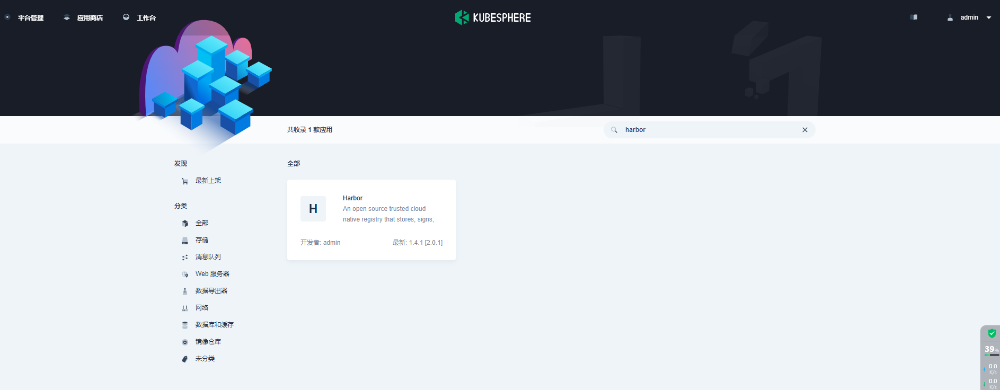
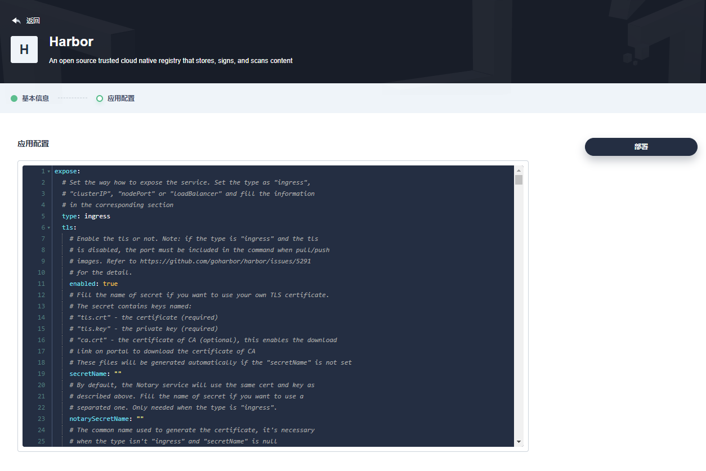
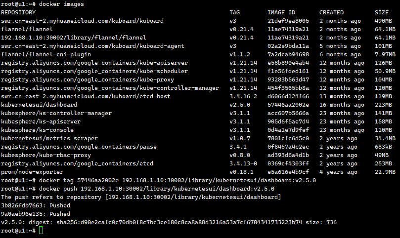

# Kubesphere使用Helm搭建Harbor仓库

## 1.开启应用商店

```sh
openpitrix:
  store:
    enabled: true # 将“false”更改为“true”。
```

## 2.创建一个叫harbor的企业空间和项目

访问控制-创建企业空间-进入项目创建项目



一直点击下一步





## 3.修改配置文件

```
expose:
  type: nodePort # 将 type 更改成 nodePort。
  tls:
    enabled: false # 关闭 tls。
    certSource: auto
    auto:
      commonName: "192.168.1.10" # 将 commonName 更改成您自己的值。
    secret:
      secretName: ""
      notarySecretName: ""
  nodePort:
    # NodePort 服务的名称。
    name: harbor
    ports:
      http:
        # 使用 HTTP 服务时，Harbor 监听的服务端口。
        port: 80
        # 使用 HTTP 服务时，Harbor 监听的节点端口。
        nodePort: 30002
      https:
        # 使用 HTTPS 服务时，Harbor 监听的服务端口。
        port: 443
        # 使用 HTTPS 服务时，Harbor 监听的服务端口。
        nodePort: 30003
      # 仅在 notary.enabled 设置为 true 时需要此配置。
      notary:
        # Notary 监听的服务端口。
        port: 4443
        # The node port Notary listens on
        nodePort: 30004
externalURL: http://192.168.1.10:30002 # 使用您自己的 IP 地址。

# The internal TLS used for harbor components secure communicating. In order to enable https
# in each components tls cert files need to provided in advance.

```


## 4.修改Docker配置并且重启启动docker

```sh
# 修改docker配置文件添加harbor地址
# vim /etc/docker/daemon.json
{
"insecure-registries": ["192.168.1.10:30002"]
}
sudo systemctl daemon-reload
sudo systemctl restart docker
```


初始账号密码 Account: admin Password: Harbor12345 

## 5.尝试推送镜像

```sh
# docker tag SOURCE_IMAGE[:TAG] 192.168.1.10:30002/library/REPOSITORY[:TAG]
docker tag 57446aa2002e 192.168.1.10:30002/library/kubernetesui/dashboard:v2.5.0

#docker push 192.168.1.10:30002/library/REPOSITORY[:TAG]
docker push 192.168.1.10:30002/library/kubernetesui/dashboard:v2.5.0
```

推送过程




