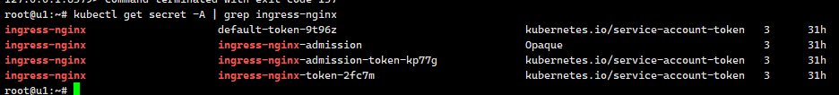
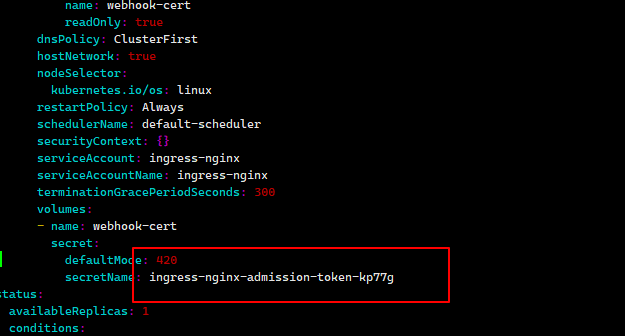
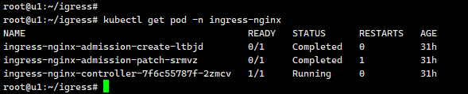
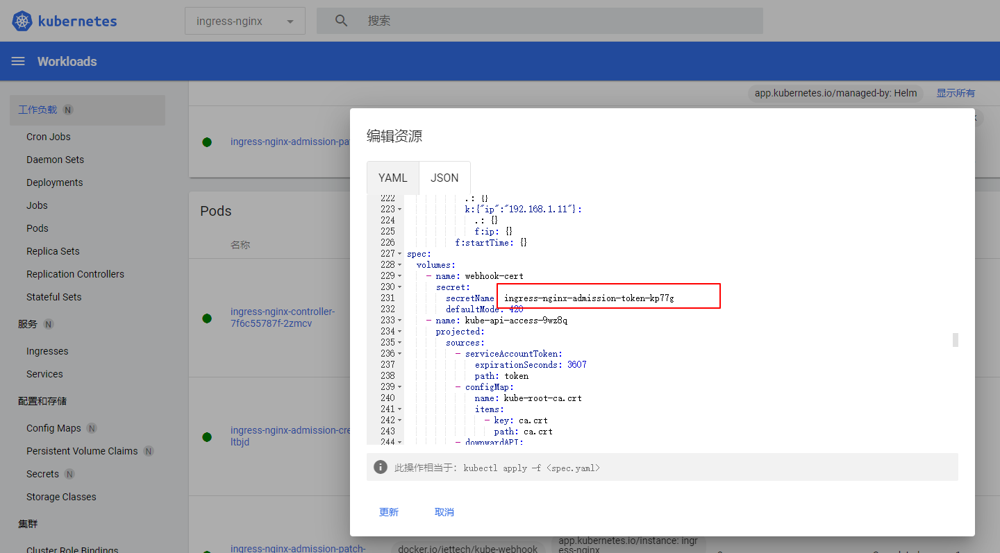
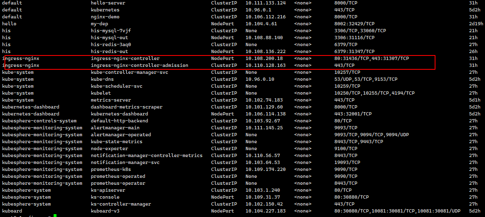

Kubernetes常用操作

1.资源创建方式

- 命令行
- YAML 

2.Namespace 

2.1名称空间用来隔离资源 

```
kubectl create ns hello
kubectl delete ns hello
```

2.2 hello.yaml

```
apiVersion: v1
kind: Namespace
metadata:
  name: hello
```

```
kubectl apply -f hello.yaml
kubectl get ns
```

3.Pod 

运行中的一组容器，Pod是kubernetes中应用的最小单位. 

```
kubectl run mynginx --image=nginx -n hello

# 查看default名称空间的Pod
kubectl get pod -n hello 
# 描述
kubectl describe pod -n hello你自己的Pod名字
# 删除
kubectl delete pod Pod -n hello名字
# 查看Pod的运行日志
kubectl logs Pod -n hello名字

# 每个Pod - k8s都会分配一个ip
kubectl get pod -owide -n hello
# 使用Pod的ip+pod里面运行容器的端口
curl 10.244.1.26

# 集群中的任意一个机器以及任意的应用都能通过Pod分配的ip来访问这个Pod

```

```
apiVersion: v1
kind: Pod
metadata:
  labels:
    run: mynginx
  name: mynginx
  namespace: hello
#  namespace: default
spec:
  containers:
  - image: nginx
    name: mynginx
```

pod.yaml

```
apiVersion: v1
kind: Pod
metadata:
  labels:
    run: myapp
  name: myapp
  namespace: hello
spec:
  containers:
  - image: nginx
    name: nginx
  - image: tomcat:8.5.68
    name: tomcat
```

```
kubectl get pod -n hello

NAME      READY   STATUS    RESTARTS   AGE
myapp     2/2     Running   0          87s
mynginx   1/1     Running   0          6m49s

kubectl get pod -owide -n hello
NAME      READY   STATUS    RESTARTS   AGE    IP            NODE   NOMINATED NODE   READINESS GATES
myapp     2/2     Running   0          100s   10.244.1.27   u2     <none>           <none>
mynginx   1/1     Running   0          7m2s   10.244.1.26   u2     <none>           <none>

#访问nginx
curl 10.244.1.27
#访问tomcat
curl 10.244.1.27:8080 
```

4.Deployment 

4.0进入pod

```
kubectl exec -ti pod名字 -n kubesphere-system -- /bin/sh
```


4.1.控制Pod，使Pod拥有多副本，自愈，扩缩容等能力 

```
# 清除所有Pod，比较下面两个命令有何不同效果？
kubectl run mynginx--image=nginx -n hello

kubectl create deployment mytomcat --image=tomcat:8.5.68   -n hello
# 自愈能力
即使你删除了由deployment生成的pod，他还是会自己生成一份pod

```

4.2 多副本

```
kubectl create deployment my-dep --image=nginx --replicas=3 -n hello
```


delpyment.yaml

```
apiVersion: apps/v1
kind: Deployment
metadata:
  labels:
    app: my-dep
  name: my-dep
  namespace: hello
spec:
  replicas: 3
  selector:
    matchLabels:
      app: my-dep
  template:
    metadata:
      labels:
        app: my-dep
    spec:
      containers:
      - image: nginx
        name: nginx
```

4.3 扩缩容 

```
kubectl scale --replicas=5 deployment/my-dep
```


```
kubectl edit deployment my-dep

#修改 replicas
```

4.4 自愈&故障转移 

- 停机
- 删除Pod
- 容器崩溃

4.5 滚动更新 

```
kubectl set image deployment/my-dep nginx=nginx:1.16.1 --record -n hello
kubectl rollout status deployment/my-dep -n hello

# 修改 kubectl edit deployment/my-dep
```


4.6 版本回退 

```
#历史记录
kubectl rollout history deployment/my-dep -n hello 


#查看某个历史详情
kubectl rollout history deployment/my-dep --revision=2 -n hello

#回滚(回到上次)
kubectl rollout undo deployment/my-dep -n hello

#回滚(回到指定版本)
kubectl rollout undo deployment/my-dep --to-revision=2 -n hello
```

更多：

除了Deployment，k8s还有 `StatefulSet` 、`DaemonSet` 、`Job`  等 类型资源。我们都称为 `工作负载`。

有状态应用使用  `StatefulSet`  部署，无状态应用使用 `Deployment` 部署

参考官方文档: [StatefulSet | Kubernetes](https://kubernetes.io/zh-cn/docs/concepts/workloads/controllers/statefulset/) 

5.Service 

将一组 [Pods](https://kubernetes.io/docs/concepts/workloads/pods/pod-overview/) 公开为网络服务的抽象方法。 

```
#暴露Deploy
kubectl expose deployment my-dep --port=8000 --target-port=80 -n hello 

#使用标签检索Pod
kubectl get pod -l app=my-dep -n hello 
```


```
apiVersion: v1
kind: Service
metadata:
  labels:
    app: my-dep
  name: my-dep
  namespace: hello
spec:
  selector:
    app: my-dep
  ports:
  - port: 8000
    protocol: TCP
    targetPort: 80
```

5.1ClusterIP 

```
# 等同于没有--type的
kubectl expose deployment my-dep --port=8000 --target-port=80 --type=ClusterIP -n hello
```

5.2 NodePort 

```
kubectl expose deployment my-dep --port=8002 --target-port=80 --type=NodePort -n hello
```


```
apiVersion: v1
kind: Service
metadata:
  labels:
    app: my-dep
  name: my-dep
spec:
  ports:
  - port: 8002
    protocol: TCP
    targetPort: 80
  selector:
    app: my-dep
  type: NodePort

```

**NodePort范围在 30000-32767 之间** 

6.Ingress 

6.1.安装 

```
wget https://raw.githubusercontent.com/kubernetes/ingress-nginx/controller-v0.47.0/deploy/static/provider/baremetal/deploy.yaml

#修改镜像
vi deploy.yaml
#1.将image的值改为如下值：
registry.cn-hangzhou.aliyuncs.com/lfy_k8s_images/ingress-nginx-controller:v0.46.0
#2、在修改了image的上一层增加 hostNetwork: true，如图下所示
#3、找到secretName将ingress-nginx-admission改为ingress-nginx-admission-token

# 安装
kubectl apply -f deploy.yaml
# 检查安装的结果
kubectl get pod,svc -n ingress-nginx

```


6.2 查看状态

```
kubectl get pod -n ingress-nginx 
```

如果ingress-nginx-controller-7f6c55787f-2zmcv容器处于ContainerCreating，我们需要修改

```
kubectl get secret -A | grep ingress-nginx
```



6.3命令行修改方式

```
# 复制 （自己的）-kp77g ,将下图对应的位置，加上-kp77g
kubectl edit deployment ingress-nginx-controller -n ingress-nginx
```



6.4查看状态已经可以了 

```
kubectl get pod -n ingress-nginx
```




6.5或者界面进行修改也是可以的



6.6验证

```
kubectl get svc -A
```




访问节点http://ip+31436或者https://ip+31307都是可以的


6.7域名访问

应用如下yaml，准备好测试环境 

```yaml
apiVersion: apps/v1
kind: Deployment
metadata:
  name: hello-server
spec:
  replicas: 2
  selector:
    matchLabels:
      app: hello-server
  template:
    metadata:
      labels:
        app: hello-server
    spec:
      containers:
      - name: hello-server
        image: registry.cn-hangzhou.aliyuncs.com/lfy_k8s_images/hello-server
        ports:
        - containerPort: 9000
---
apiVersion: apps/v1
kind: Deployment
metadata:
  labels:
    app: nginx-demo
  name: nginx-demo
spec:
  replicas: 2
  selector:
    matchLabels:
      app: nginx-demo
  template:
    metadata:
      labels:
        app: nginx-demo
    spec:
      containers:
      - image: nginx
        name: nginx
---
apiVersion: v1
kind: Service
metadata:
  labels:
    app: nginx-demo
  name: nginx-demo
spec:
  selector:
    app: nginx-demo
  ports:
  - port: 8000
    protocol: TCP
    targetPort: 80
---
apiVersion: v1
kind: Service
metadata:
  labels:
    app: hello-server
  name: hello-server
spec:
  selector:
    app: hello-server
  ports:
  - port: 8000
    protocol: TCP
    targetPort: 9000
```


域名访问 

```yaml
apiVersion: networking.k8s.io/v1
kind: Ingress  
metadata:
  name: ingress-host-bar
spec:
  ingressClassName: nginx
  rules:
  - host: "hello.atguigu.com"
    http:
      paths:
      - pathType: Prefix
        path: "/"
        backend:
          service:
            name: hello-server
            port:
              number: 8000
  - host: "demo.atguigu.com"
    http:
      paths:
      - pathType: Prefix
        path: "/nginx"  # 把请求会转给下面的服务，下面的服务一定要能处理这个路径，不能处理就是404
        backend:
          service:
            name: nginx-demo  ## java，比如使用路径重写，去掉前缀nginx
            port:
              number: 8000
```

路径重写 

```
apiVersion: networking.k8s.io/v1
kind: Ingress  
metadata:
  annotations:
    nginx.ingress.kubernetes.io/rewrite-target: /$2
  name: ingress-host-bar
spec:
  ingressClassName: nginx
  rules:
  - host: "hello.atguigu.com"
    http:
      paths:
      - pathType: Prefix
        path: "/"
        backend:
          service:
            name: hello-server
            port:
              number: 8000
  - host: "demo.atguigu.com"
    http:
      paths:
      - pathType: Prefix
        path: "/nginx(/|$)(.*)"  # 把请求会转给下面的服务，下面的服务一定要能处理这个路径，不能处理就是404
        backend:
          service:
            name: nginx-demo  ## java，比如使用路径重写，去掉前缀nginx
            port:
              number: 8000
```

流量限制 

```
apiVersion: networking.k8s.io/v1
kind: Ingress
metadata:
  name: ingress-limit-rate
  annotations:
    nginx.ingress.kubernetes.io/limit-rps: "1"
spec:
  ingressClassName: nginx
  rules:
  - host: "haha.atguigu.com"
    http:
      paths:
      - pathType: Exact
        path: "/"
        backend:
          service:
            name: nginx-demo
            port:
              number: 8000
```

