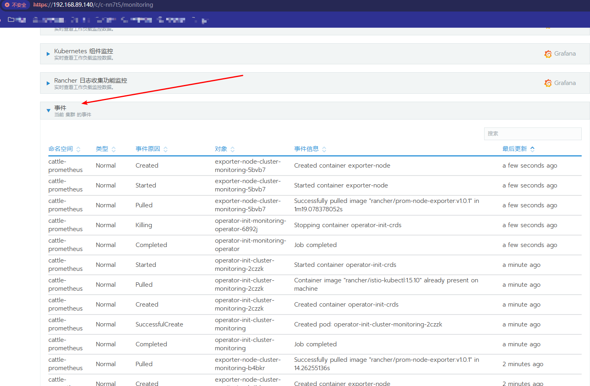
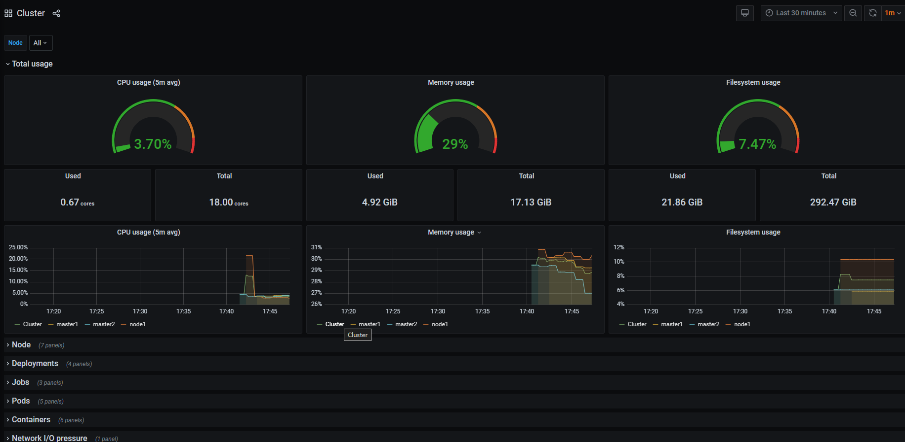

# Rancher安装以及使用

## 1.环境准备

### 已经存在的 K8s 实验环境：

| 角色     | Ip             | 主机名  |
| -------- | -------------- | ------- |
| rancher  | 192.168.89.140 | rancher |
| 控制节点 | 192.168.89.131 | master1 |
| 工作节点 | 192.168.89.133 | node1   |

### 配置主机名：

在 192.168.40.140上执行如下：

```sh
hostnamectl set-hostname rancher&&bash
```

### 配置 hosts 文件： `vim /etc/hosts`

```sh
#在 master1、node1、rancher 上操作： 

192.168.89.180 master1 
192.168.89.181 node1 
192.168.89.140 rancher 

```

### 配置 rancher 到 k8s 主机互信

```sh
生成 ssh 密钥对
[root@rancher ~]# ssh-keygen #一路回车，不输入密码
把本地的 ssh 公钥文件安装到远程主机对应的账户
[root@rancher ~]# ssh-copy-id master1
[root@rancher ~]# ssh-copy-id rancher
[root@rancher ~]# ssh-copy-id node1
```

### 关闭防火墙

```sh
[root@rancher ~]# systemctl stop firewalld ; systemctl disable firewalld
```

### 关闭 selinux

```sh
[root@rancher ~]# setenforce 0
[root@rancher ~]# sed -i 's/SELINUX=enforcing/SELINUX=disabled/g' /etc/selinux/config
注意：修改 selinux 配置文件之后，重启机器，selinux 才能永久生效
```

### 关闭 swap 分区。

```sh
[root@rancher ~]# swapoff -a
[root@rancher ~]# free -m #可以看到 swap 分区的大小，已经变为 0
[root@rancher ~]# sed -ri 's/.*swap.*/#&/' /etc/fstab
```

>
>
>内核参数修改：br_netfilter 模块用于将桥接流量转发至 iptables 链，br_netfilter 内核参数需要 

### 开启转发。

```sh
[root@rancher ~]# modprobe br_netfilter
[root@rancher ~]# echo "modprobe br_netfilter" >> /etc/profile
[root@rancher ~]# cat > /etc/sysctl.d/k8s.conf <<EOF
net.bridge.bridge-nf-call-ip6tables = 1
net.bridge.bridge-nf-call-iptables = 1
net.ipv4.ip_forward = 1
EOF
[root@rancher ~]# sysctl -p /etc/sysctl.d/k8s.conf
```

### 在 rancher 上配置阿里云镜像源：

```sh
[root@rancher ~]# mv /etc/yum.repos.d/CentOS-Base.repo /etc/yum.repos.d/CentOS-Base.repo.backup
[root@rancher ~]# wget -O /etc/yum.repos.d/CentOS-Base.repo http://mirrors.aliyun.com/repo/Centos-7.repo
```

### 安装docker

```sh
sudo yum install -y yum-utils
sudo yum-config-manager \
--add-repo \
http://mirrors.aliyun.com/docker-ce/linux/centos/docker-ce.repo

sudo yum install -y docker-ce docker-ce-cli containerd.io


#以下是在安装k8s的时候使用
yum install -y docker-ce-20.10.7 docker-ce-cli-20.10.7  containerd.io-1.4.6
```

### 启动

```sh
systemctl enable docker --now
```

### 配置加速

```sh
sudo mkdir -p /etc/docker
sudo tee /etc/docker/daemon.json <<-'EOF'
{
  "registry-mirrors": ["https://docker.m.daocloud.io"],
  "exec-opts": ["native.cgroupdriver=systemd"],
  "log-driver": "json-file",
  "log-opts": {
    "max-size": "100m"
  },
  "storage-driver": "overlay2"
}
EOF
sudo systemctl daemon-reload
sudo systemctl restart docker
```

## 2.安装Rancher

### Rancher2.5.7 支持导入已经存在的 k8s1.20.6 集群，所以我们安装 rancher2.5.7 版本，

```sh
在 rancher 上操作如下命令：
导入rancher-2-5-7.tar.gz包
[root@node1 ~]# ntpdate cn.pool.ntp.org
[root@rancher ~]# docker load -i rancher-2-5-7.tar.gz 
[root@rancher ~]# docker run -d --restart=unless-stopped -p 80:80 -p 443:443 --privileged rancher/rancher:v2.5.7
注：unless-stopped，在容器退出时总是重启容器，但是不考虑在 Docker 守护进程启动时就已经停
止了的容器
```

### 验证 rancher 是否启动：

```
docker ps | grep rancher
```

### 登录rancher平台访问,并且设置新密码为1方便测试

```sh
http://192.168.89.140或者https://192.168.89.140
```


### 继续下一步


### 切换中文


### 通过Rancher管理k8s集群


### 写上管理的名字


### 点击创建之后出现如下提示：


### 执行最下面的命令

```sh
curl --insecure -sfL https://192.168.89.140/v3/import/6tstl5gbhkg7t4zbfn2f7lqqh65fn2ssv68d25bdh7jmcx8nqjchbw_c-nn7t5.yaml | kubectl apply -f -
```

显示 pending 状态 

### 在 k8s 的控制节点和工作节点执行如下: 

```sh
docker load -i rancher-agent-2-5-7.tar.gz 
```

在回到主页面可以看到 rancher 已经成功导入 k8s1.20.6 版本了 


## 3.通过 Rancher 部署监控系统

### 启用 Rancher 集群级别监控 

把 prometheus-grafana.tar.gz 镜像压缩包上传到 node1 机器上，手动解压

```sh
docker load -i prometheus-grafana.tar.gz
```

\#在开启监控的时候默认会拉取一些镜像，速度较慢，所以大家先把安装监控需要的镜像解压 

启动监控时间可能比较长，需要等 10-20 分钟 

在 rancher 主页面，点击集群名称 k8s-test,启动监控并查看实时监控指标


### 监控组件版本选择 0.2.1,其他的默认就可以了，点最后：启用监控点：集群


显示监控 API 未就绪，需要等待 10-20 分钟，才能就绪

### 具体事件信息如下：



过 10-20 分钟后，监控 API 已经就绪了，那就刷新当前页面，监控部署完成后就可以看到我们的监控信息 了。


### 点开集群监控-选择 Grafana


### 然后会跳转到Grafana界面


### 查看 Grafana 监控

在 https://192.168.89.140/c/c-5xw59/monitoring 页面可以看到所有监控项：


我们可以点击每个项目上的 Grafana 图标即可跳转到 Grafana 监控页面。 

### 选择集群监控→点击右侧 Grafana 图标 




### 跳转到如下：


Kubernetes 组件监控—点击右侧 Grafana

跳转到如下：


### 点击 Rancher 日志收集功能监控—点击右侧 Grafana

跳转到如下界面：


## 4.通过 Rncher 仪表盘管理 k8s 集群：部署 tomcat 服务


### \#把 tomcat.tar.gz 镜像压缩包上传到 node1 节点，手动解压: 

```sh
[root@node1 ~]# docker load -i tomcat.tar.gz 
```

### 1、创建名称空间 namespace 

打开 rancher 主页面，点击仪表盘

出现如下：


点击 Namespace，出现如下：


### 2、创建 Deployment 资源

添加标签,容器配置 ,指定镜像


点击创建：


给 pod 打上标签（打标签的值要跟service的值对应）


容器配置完成，点击创建


查看资源是否创建成功： 

点击左侧的 deployment，找到 k8s-test 名称空间，可以看到 tomcat 


查看 tomcat 详细信息


### 3、创建 Service 资源，把 k8s 集群内部的 tomcat 暴露出来


选择节点端口 


\#定义服务端口


定义选择器


创建 

查看 service 是否创建成功


### 任意节点访问


