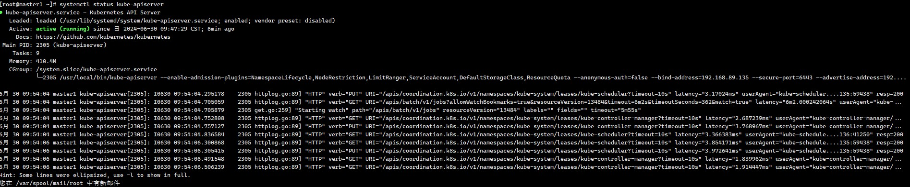

# 二进制安装k8s

## 1.环境准备

| 角色     | Ip             | 主机名  | 规划安装组件                                                 |
| -------- | -------------- | ------- | ------------------------------------------------------------ |
| 控制节点 | 192.168.89.135 | master1 | apiserver、controller-manager、scheduler、etcd、 docker、keepalived、nginx |
| 控制节点 | 192.168.89.136 | master2 | apiserver、controller-manager、scheduler、etcd、docker、keepalived、nginx |
| 控制节点 | 192.168.89.137 | master3 | apiserver、controller-manager、scheduler、etcd、 docker      |
| 工作节点 | 192.168.89.138 | node1   | kubelet、kube-proxy、docker、calico、coredns                 |
| vip      | 192.168.89.139 | vip     |                                                              |

## 2.架构图


## 3.初始化

### 3.1配置静态IP

```sh
vi /etc/sysconfig/network-scripts/ifcfg-ens33
```

内容

```sh
TYPE=Ethernet
PROXY_METHOD=none
BROWSER_ONLY=no
BOOTPROTO=static
IPADDR=192.168.89.135
NETMASK=255.255.255.0
GATEWAY=192.168.89.2
DNS1=8.8.8.8
DEFROUTE=yes
IPV4_FAILURE_FATAL=no
IPV6INIT=yes
IPV6_AUTOCONF=yes
IPV6_DEFROUTE=yes
IPV6_FAILURE_FATAL=no
IPV6_ADDR_GEN_MODE=stable-privacy
NAME=ens33
DEVICE=ens33
ONBOOT=yes
```

修改配置文件之后需要重启网络服务才能使配置生效，重启网络服务命令如下：

```sh
service network restart
```

> 注：/etc/sysconfig/network-scripts/ifcfg-ens33 文件里的配置说明： 
>
> NAME=ens33 #网卡名字，跟 DEVICE 名字保持一致即可 
>
> DEVICE=ens33 #网卡设备名，大家 ip addr 可看到自己的这个网卡设备名，每个人的机器可能这个名字不一样，需要写自己的 
>
> BOOTPROTO=static #static 表示静态 ip 地址 
>
> ONBOOT=yes #开机自启动网络，必须是 yes 
>
> IPADDR=192.168.89.135 #ip 地址，需要跟自己电脑所在网段一致 
>
> NETMASK=255.255.255.0 #子网掩码，需要跟自己电脑所在网段一致 
>
> GATEWAY=192.168.89.2 #网关，在自己电脑打开 cmd，输入 ipconfig /all 可看到 
>
> DNS1=8.8.8.8 #DNS，8.8.8.8，或者114.114.114.114都可以

### 3.2配置主机名字

````sh
#配置主机名：
#在 192.168.89.135 上执行如下：
hostnamectl set-hostname master1 &&bash
#在 192.168.89.136 上执行如下：
hostnamectl set-hostname master2 &&bash
#在 192.168.89.137 上执行如下：
hostnamectl set-hostname master3 &&bash
#在 192.168.89.138 上执行如下：
hostnamectl set-hostname node1   &&bash
#在 192.168.89.139 上执行如下：
hostnamectl set-hostname vip     &&bash
````

### 3.3 配置hosts文件

没有特殊情况，下面命令在每个服务器都需要重复执行在 `master1`，`master2`，`master3`，`node1`上

```sh
#修改 master1、master2、master3、node1 机器的/etc/hosts 文件，增加如下四行：
vi /etc/hosts
192.168.89.135 master1
192.168.89.136 master2
192.168.89.137 master3
192.168.89.138 node1
```

### 3.4 配置主机之间无密码登录

```sh
#生成 ssh 密钥对
ssh-keygen -t rsa #一路回车，不输入密码
把本地的 ssh 公钥文件安装到远程主机对应的账户
ssh-copy-id -i .ssh/id_rsa.pub master1
ssh-copy-id -i .ssh/id_rsa.pub master2
ssh-copy-id -i .ssh/id_rsa.pub master3
ssh-copy-id -i .ssh/id_rsa.pub node1
```

>如果报错如下：
>
>[root@master1 ~]# ssh-copy-id -i .ssh/id_rsa.pub master3
>/usr/bin/ssh-copy-id: INFO: Source of key(s) to be installed: ".ssh/id_rsa.pub"
>/usr/bin/ssh-copy-id: INFO: attempting to log in with the new key(s), to filter out any that are already installed
>
>/usr/bin/ssh-copy-id: ERROR: @@@@@@@@@@@@@@@@@@@@@@@@@@@@@@@@@@@@@@@@@@@@@@@@@@@@@@@@@@@
>ERROR: @    WARNING: REMOTE HOST IDENTIFICATION HAS CHANGED!     @
>ERROR: @@@@@@@@@@@@@@@@@@@@@@@@@@@@@@@@@@@@@@@@@@@@@@@@@@@@@@@@@@@
>ERROR: IT IS POSSIBLE THAT SOMEONE IS DOING SOMETHING NASTY!
>ERROR: Someone could be eavesdropping on you right now (man-in-the-middle attack)!
>ERROR: It is also possible that a host key has just been changed.
>ERROR: The fingerprint for the ECDSA key sent by the remote host is
>ERROR: SHA256:H4Q2zsjP81n8vjQqWSgun9toX5oM4HzCrHKLS0xcd2c.
>ERROR: Please contact your system administrator.
>ERROR: Add correct host key in /root/.ssh/known_hosts to get rid of this message.
>ERROR: Offending ECDSA key in /root/.ssh/known_hosts:3
>ERROR: ECDSA host key for master3 has changed and you have requested strict checking.
>ERROR: Host key verification failed.
>
>你在尝试将 SSH 公钥复制到名为 master3 的远程主机时，遇到了一个错误。错误信息显示，远程主机的身份发生了变化，这可能是由于远程主机的主机密钥发生了变化，或者是因为有人在进行中间人攻击（MITM 攻击）。具体的错误信息如下：
>
>为了解决这个问题，你可以按照以下步骤操作：
>
>1. **查看并确认问题：** 首先，你需要确认远程主机的主机密钥是否真的发生了变化。你可以联系系统管理员或使用其他安全渠道验证远程主机的密钥指纹。
>
>2. **更新已知主机文件：** 如果你确认远程主机的主机密钥确实发生了变化，你可以手动更新已知主机文件（`~/.ssh/known_hosts`），移除旧的主机密钥记录，然后重新连接以添加新的主机密钥。你可以使用以下命令移除已知主机文件中的特定条目：
>
>   ```bash
>   ssh-keygen -R master3
>   ```
>
>3. **重新连接并接受新的主机密钥：**
>   移除旧的主机密钥后，再次尝试连接远程主机，将提示你接受新的主机密钥：
>
>   ```bash
>   ssh master3
>   ```
>
>4. **重新执行 ssh-copy-id：**
>   确认并接受新的主机密钥后，你可以重新执行 `ssh-copy-id` 命令，将公钥复制到远程主机：
>
>   ```bash
>   ssh-copy-id -i .ssh/id_rsa.pub master3
>   ```

### 3.5关闭 firewalld 防火墙

```sh
systemctl stop firewalld ; systemctl disable firewalld
```

### 3.6关闭 selinux

```sh
sed -i 's/SELINUX=enforcing/SELINUX=disabled/g' /etc/selinux/config
#修改 selinux 配置文件之后，重启机器，selinux 配置才能永久生效
重启之后登录机器验证是否修改成功：
getenforce
#显示 Disabled 说明 selinux 已经关闭
```

### 3.7关闭交换分区 swap,在 master1、master2、master3、 node1 上操作

```sh
#临时关闭
swapoff -a
#永久关闭：注释 swap 挂载，给 swap 这行开头加一下注释
vim /etc/fstab
#/dev/mapper/centos-swap swap swap defaults 0 0
```

### 3.8修改内核参数

```sh
#加载 br_netfilter 模块
modprobe br_netfilter
#验证模块是否加载成功：
lsmod |grep br_netfilter

[root@master1 ~]# lsmod |grep br_netfilter
br_netfilter           22256  0 
bridge                151336  1 br_netfilter

#修改内核参数
cat > /etc/sysctl.d/k8s.conf <<EOF
net.bridge.bridge-nf-call-ip6tables = 1
net.bridge.bridge-nf-call-iptables = 1
net.ipv4.ip_forward = 1
EOF

#使刚才修改的内核参数生效
sysctl -p /etc/sysctl.d/k8s.conf
```

> 问题 1：sysctl 是做什么的？ 
>
> 在运行时配置内核参数 
>
> -p 从指定的文件加载系统参数，如不指定即从/etc/sysctl.conf 中加载 
>
> 问题 2：为什么要执行 modprobe br_netfilter？ 
>
> 修改/etc/sysctl.d/k8s.conf 文件，增加如下三行参数：
>
> net.bridge.bridge-nf-call-ip6tables = 1 
>
> net.bridge.bridge-nf-call-iptables = 1 
>
> net.ipv4.ip_forward = 1 
>
> sysctl -p /etc/sysctl.d/k8s.conf 出现报错： 
>
> sysctl: cannot stat /proc/sys/net/bridge/bridge-nf-call-ip6tables: No such file or  
>
> directory 
>
> sysctl: cannot stat /proc/sys/net/bridge/bridge-nf-call-iptables: No such file or directory 
>
> 解决方法： 
>
> modprobe br_netfilter
>
> 问题 3：为什么开启 net.bridge.bridge-nf-call-iptables 内核参数？ 
>
> 在 centos 下安装 docker，执行 docker info 出现如下警告： 
>
> WARNING: bridge-nf-call-iptables is disabled 
>
> WARNING: bridge-nf-call-ip6tables is disabled 
>
> 解决办法： 
>
> vim /etc/sysctl.d/k8s.conf 
>
> net.bridge.bridge-nf-call-ip6tables = 1 
>
> net.bridge.bridge-nf-call-iptables = 1
>
> 问题 4：为什么要开启 net.ipv4.ip_forward = 1 参数？ 
>
> kubeadm 初始化 k8s 如果报错： 
>
> ERROR FileContent--proc-sys-net-ipv4-ip_forward):/proc/sys/net/ipv4/ip_forward contents are not set to 1
>
> 就表示没有开启 ip_forward，需要开启。
>
> net.ipv4.ip_forward 是数据包转发： 
>
> 出于安全考虑，Linux 系统默认是禁止数据包转发的。所谓转发即当主机拥有多于一块的网卡时， 
>
> 其中一块收到数据包，根据数据包的目的 ip 地址将数据包发往本机另一块网卡，该网卡根据路由表继续 
>
> 发送数据包。这通常是路由器所要实现的功能。 
>
> 要让 Linux 系统具有路由转发功能，需要配置一个 Linux 的内核参数 net.ipv4.ip_forward。这个 
>
> 参数指定了 Linux 系统当前对路由转发功能的支持情况；其值为 0 时表示禁止进行 IP 转发；如果是 1, 
>
> 则说明 IP 转发功能已经打开。

### 3.9配置阿里云 repo 源

```sh
#安装 rzsz 命令
yum install lrzsz -y
#安装 scp
yum install openssh-clients
#备份基础 repo 源
mkdir /root/repo.bak&& cd /etc/yum.repos.d/ &&mv * /root/repo.bak/
#下载阿里云的 repo 源
把 CentOS-Base.repo 文件上传到 master1 主机的/etc/yum.repos.d/目录下
#配置国内阿里云 docker 的 repo 源
sudo yum install -y yum-utils
sudo yum-config-manager \
--add-repo \
http://mirrors.aliyun.com/docker-ce/linux/centos/docker-ce.repo

```

### 3.10配置时间同步

```sh
#安装 ntpdate 命令，
yum install ntpdate -y
#跟网络源做同步
ntpdate cn.pool.ntp.org
#把时间同步做成计划任务
crontab -e
* */1 * * * /usr/sbin/ntpdate cn.pool.ntp.org
#重启 crond 服务
service crond restart
```

3.11安装 iptables

如果用 firewalld 不习惯，在 master1、master2、master3、 node1 上操作

```sh
#安装 iptables
yum install iptables-services -y
#禁用 iptables
service iptables stop && systemctl disable iptables
#清空防火墙规则
iptables -F
```

### 3.12开启 ipvs

不开启 `ipvs` 将会使用` iptables` 进行数据包转发，但是效率低，所以官网推荐需要开通 `ipvs`。 

把 ipvs.modules 上传到机器的/etc/sysconfig/modules/目录下，以master1为例：

```sh
[root@master1 modules]# chmod 755 /etc/sysconfig/modules/ipvs.modules && bash /etc/sysconfig/modules/ipvs.modules && lsmod | grep ip_vs
ip_vs_ftp              13079  0 
nf_nat                 26583  1 ip_vs_ftp
ip_vs_sed              12519  0 
ip_vs_nq               12516  0 
ip_vs_sh               12688  0 
ip_vs_dh               12688  0 
ip_vs_lblcr            12922  0 
ip_vs_lblc             12819  0 
ip_vs_wrr              12697  0 
ip_vs_rr               12600  0 
ip_vs_wlc              12519  0 
ip_vs_lc               12516  0 
ip_vs                 145458  22 ip_vs_dh,ip_vs_lc,ip_vs_nq,ip_vs_rr,ip_vs_sh,ip_vs_ftp,ip_vs_sed,ip_vs_wlc,ip_vs_wrr,ip_vs_lblcr,ip_vs_lblc
nf_conntrack          139264  2 ip_vs,nf_nat
libcrc32c              12644  4 xfs,ip_vs,nf_nat,nf_conntrack


[root@master1~]# scp /etc/sysconfig/modules/ipvs.modules master2:/etc/sysconfig/modules/
[root@master1~]# scp /etc/sysconfig/modules/ipvs.modules master3:/etc/sysconfig/modules/
[root@master1~]# scp /etc/sysconfig/modules/ipvs.modules node1:/etc/sysconfig/modules/

[root@master2]# chmod 755 /etc/sysconfig/modules/ipvs.modules && bash /etc/sysconfig/modules/ipvs.modules && lsmod | grep ip_vs
ip_vs_ftp              13079  0 
nf_nat                 26583  1 ip_vs_ftp
ip_vs_sed              12519  0 
ip_vs_nq               12516  0 
ip_vs_sh               12688  0 
ip_vs_dh               12688  0 
ip_vs_lblcr            12922  0 
ip_vs_lblc             12819  0 
ip_vs_wrr              12697  0 
ip_vs_rr               12600  0 
ip_vs_wlc              12519  0 
ip_vs_lc               12516  0 
ip_vs                 145458  22 ip_vs_dh,ip_vs_lc,ip_vs_nq,ip_vs_rr,ip_vs_sh,ip_vs_ftp,ip_vs_sed,ip_vs_wlc,ip_vs_wrr,ip_vs_lblcr,ip_vs_lblc
nf_conntrack          139264  2 ip_vs,nf_nat
libcrc32c              12644  4 xfs,ip_vs,nf_nat,nf_conntrack

[root@master3]# chmod 755 /etc/sysconfig/modules/ipvs.modules && bash /etc/sysconfig/modules/ipvs.modules && lsmod | grep ip_vs
ip_vs_ftp              13079  0 
nf_nat                 26583  1 ip_vs_ftp
ip_vs_sed              12519  0 
ip_vs_nq               12516  0 
ip_vs_sh               12688  0 
ip_vs_dh               12688  0 
ip_vs_lblcr            12922  0 
ip_vs_lblc             12819  0 
ip_vs_wrr              12697  0 
ip_vs_rr               12600  0 
ip_vs_wlc              12519  0 
ip_vs_lc               12516  0 
ip_vs                 145458  22 ip_vs_dh,ip_vs_lc,ip_vs_nq,ip_vs_rr,ip_vs_sh,ip_vs_ftp,ip_vs_sed,ip_vs_wlc,ip_vs_wrr,ip_vs_lblcr,ip_vs_lblc
nf_conntrack          139264  2 ip_vs,nf_nat
libcrc32c              12644  4 xfs,ip_vs,nf_nat,nf_conntrack

[root@node1]# chmod 755 /etc/sysconfig/modules/ipvs.modules && bash /etc/sysconfig/modules/ipvs.modules && lsmod | grep ip_vs
ip_vs_ftp              13079  0 
nf_nat                 26583  1 ip_vs_ftp
ip_vs_sed              12519  0 
ip_vs_nq               12516  0 
ip_vs_sh               12688  0 
ip_vs_dh               12688  0 
ip_vs_lblcr            12922  0 
ip_vs_lblc             12819  0 
ip_vs_wrr              12697  0 
ip_vs_rr               12600  0 
ip_vs_wlc              12519  0 
ip_vs_lc               12516  0 
ip_vs                 145458  22 ip_vs_dh,ip_vs_lc,ip_vs_nq,ip_vs_rr,ip_vs_sh,ip_vs_ftp,ip_vs_sed,ip_vs_wlc,ip_vs_wrr,ip_vs_lblcr,ip_vs_lblc
nf_conntrack          139264  2 ip_vs,nf_nat
libcrc32c              12644  4 xfs,ip_vs,nf_nat,nf_conntrack
```

### 3.13安装基础软件包

```sh
sudo yum install -y yum-utils \
    device-mapper-persistent-data \
    lvm2 \
    wget \
    net-tools \
    nfs-utils \
    lrzsz \
    gcc \
    gcc-c++ \
    make \
    cmake \
    libxml2-devel \
    openssl-devel \
    curl \
    curl-devel \
    unzip \
    sudo \
    ntp \
    libaio-devel \
    wget \
    vim \
    ncurses-devel \
    autoconf \
    automake \
    zlib-devel \
    python-devel \
    epel-release \
    openssh-server \
    socat \
    ipvsadm \
    conntrack \
    ntpdate \
    telnet \
    ipvsadm \
    rsync
```

### 3.14 安装docker-ce

```sh
sudo yum install -y docker-ce docker-ce-cli containerd.io
```

启动

```bash
systemctl enable docker --now
```

3.15配置加速

> 这里额外添加了docker的生产环境核心配置cgroup

```bash
sudo mkdir -p /etc/docker
sudo tee /etc/docker/daemon.json <<-'EOF'
{
  "registry-mirrors": ["https://docker.m.daocloud.io"],
  "exec-opts": ["native.cgroupdriver=systemd"],
  "log-driver": "json-file",
  "log-opts": {
    "max-size": "100m"
  },
  "storage-driver": "overlay2"
}
EOF
sudo systemctl daemon-reload
sudo systemctl restart docker
```

## 4.搭建etcd集群

### 4.1配置 etcd 工作目录

```bash
#创建配置文件和证书文件存放目录
[root@master1 ~]# mkdir -p /etc/etcd/ssl
[root@master2 ~]# mkdir -p /etc/etcd/ssl
[root@master3 ~]# mkdir -p /etc/etcd/ssl
```

### 4.2安装签发证书工具 cfssl

```bash
[root@master1 ~]# mkdir /data/work -p
[root@master1 ~]# cd /data/work/
#cfssl-certinfo_linux-amd64 、cfssljson_linux-amd64 、cfssl_linux-amd64 上传到
/data/work/目录下
[root@master1 work]# ls
cfssl-certinfo_linux-amd64 cfssljson_linux-amd64 cfssl_linux-amd64
#把文件变成可执行权限
[root@master1 work]# chmod +x *
[root@master1 work]# mv cfssl_linux-amd64 /usr/local/bin/cfssl
[root@master1 work]# mv cfssljson_linux-amd64 /usr/local/bin/cfssljson
[root@master1 work]# mv cfssl-certinfo_linux-amd64 /usr/local/bin/cfssl-certinfo
```

### 4.3配置 ca 证书

```bash
#生成 ca 证书请求文件
[root@master1 work]# vim ca-csr.json
{
 "CN": "kubernetes",
 "key": {
 "algo": "rsa",
 "size": 2048
 },
 "names": [
 {
 "C": "CN",
 "ST": "Jangsu",
 "L": "Suzhou",
 "O": "k8s",
 "OU": "system"
 }
 ],
 "ca": {
 "expiry": "87600h"
 }
}
[root@master1 work]# cfssl gencert -initca ca-csr.json | cfssljson -bare ca

[root@master1 work]# cfssl gencert -initca ca-csr.json | cfssljson -bare ca


2024/06/28 22:50:27 [INFO] generating a new CA key and certificate from CSR
2024/06/28 22:50:27 [INFO] generate received request
2024/06/28 22:50:27 [INFO] received CSR
2024/06/28 22:50:27 [INFO] generating key: rsa-2048
2024/06/28 22:50:27 [INFO] encoded CSR
2024/06/28 22:50:27 [INFO] signed certificate with serial number 394330221059969628522798921678606080360347930970
```


>
>
>注： 
>
>CN：Common Name（公用名称），kube-apiserver 从证书中提取该字段作为请求的用户名 (User Name)； 
>
>浏览器使用该字段验证网站是否合法；对于 SSL 证书，一般为网站域名；而对于代码签名证书则为申请 
>
>单位名称；而对于客户端证书则为证书申请者的姓名。 
>
>O：Organization（单位名称），kube-apiserver 从证书中提取该字段作为请求用户所属的组 (Group)； 
>
>对于 SSL 证书，一般为网站域名；而对于代码签名证书则为申请单位名称；而对于客户端单位证书则为 
>
>证书申请者所在单位名称。 
>
>L 字段：所在城市 
>
>S 字段：所在省份 
>
>C 字段：只能是国家字母缩写，如中国：CN 

### 4.4生成ca证书文件

```sh
[root@master1 work]# vim ca-config.json 
{
 "signing": {
 "default": {
 "expiry": "87600h"
 },
 "profiles": {
 "kubernetes": {
 "usages": [
 "signing",
 "key encipherment",
 "server auth",
 "client auth"
 ],
 "expiry": "87600h"
 }
 }
 }
}
```

### 4.5 生成 etcd 证书 

 配置 etcd 证书请求，hosts 的 ip 变成自己 etcd 所在节点的 ip 

```bash
[root@master1 work]# vim etcd-csr.json 

{
 "CN": "etcd",
 "hosts": [
 "127.0.0.1",
 "192.168.89.135",
 "192.168.89.136",
 "192.168.89.137",
 "192.168.89.138"
 ],
 "key": {
 "algo": "rsa",
 "size": 2048
 },
 "names": [{
 "C": "CN",
 "ST": "Jangsu",
 "L": "Suzhou",
 "O": "k8s",
 "OU": "system"
 }]
}
#上述文件 hosts 字段中 IP 为所有 etcd 节点的集群内部通信 IP，可以预留几个，做扩容用。


[root@master1 work]# ls etcd*.pem
etcd-key.pem etcd.pem
```

签发证书

```
[root@master1 work]#  cfssl gencert -ca=ca.pem -ca-key=ca-key.pem -config=ca-config.json -profile=kubernetes etcd-csr.json | cfssljson -bare etcd
```


### 4.6部署 etcd 集群

```bash
把 etcd-v3.4.13-linux-amd64.tar.gz 上传到/data/work 目录下
[root@master1 work]# pwd
/data/work
[root@master1 work]# tar -xf etcd-v3.4.13-linux-amd64.tar.gz
[root@master1 work]# cp -p etcd-v3.4.13-linux-amd64/etcd* /usr/local/bin/
[root@master1 work]# scp -r etcd-v3.4.13-linux-amd64/etcd* master2:/usr/local/bin/
[root@master1 work]# scp -r etcd-v3.4.13-linux-amd64/etcd* master3:/usr/local/bin/
#创建配置文件
[root@master1 work]# vim etcd.conf

#[Member]
ETCD_NAME="etcd1"
ETCD_DATA_DIR="/var/lib/etcd/default.etcd"
ETCD_LISTEN_PEER_URLS="https://192.168.89.135:2380"
ETCD_LISTEN_CLIENT_URLS="https://192.168.89.135:2379,http://127.0.0.1:2379"
#[Clustering]
ETCD_INITIAL_ADVERTISE_PEER_URLS="https://192.168.89.135:2380"
ETCD_ADVERTISE_CLIENT_URLS="https://192.168.89.135:2379"
ETCD_INITIAL_CLUSTER="etcd1=https://192.168.89.135:2380,etcd2=https://192.168.89.136:2380,etcd3=https://192.168.89.137:2380"
ETCD_INITIAL_CLUSTER_TOKEN="etcd-cluster"
ETCD_INITIAL_CLUSTER_STATE="new"
```


>
>
>\#注： 
>
>ETCD_NAME：节点名称，集群中唯一 
>
>ETCD_DATA_DIR：数据目录 
>
>ETCD_LISTEN_PEER_URLS：集群通信监听地址 
>
>ETCD_LISTEN_CLIENT_URLS：客户端访问监听地址 
>
>ETCD_INITIAL_ADVERTISE_PEER_URLS：集群通告地址 
>
>ETCD_ADVERTISE_CLIENT_URLS：客户端通告地址 
>
>ETCD_INITIAL_CLUSTER：集群节点地址 
>
>ETCD_INITIAL_CLUSTER_TOKEN：集群 Token 
>
>ETCD_INITIAL_CLUSTER_STATE：加入集群的当前状态，new 是新集群，existing 表示加入已有集群

### 4.7创建启动服务文件

```bash
[root@master1 work]# vim etcd.service 
[Unit]
Description=Etcd Server
After=network.target
After=network-online.target
Wants=network-online.target

[Service]
Type=notify
EnvironmentFile=-/etc/etcd/etcd.conf
WorkingDirectory=/var/lib/etcd/
ExecStart=/usr/local/bin/etcd \
 --cert-file=/etc/etcd/ssl/etcd.pem \
 --key-file=/etc/etcd/ssl/etcd-key.pem \
 --trusted-ca-file=/etc/etcd/ssl/ca.pem \
 --peer-cert-file=/etc/etcd/ssl/etcd.pem \
 --peer-key-file=/etc/etcd/ssl/etcd-key.pem \
 --peer-trusted-ca-file=/etc/etcd/ssl/ca.pem \
 --peer-client-cert-auth \
 --client-cert-auth
Restart=on-failure
RestartSec=5
LimitNOFILE=65536
[Install]
WantedBy=multi-user.target
```

### 4.8拷贝证书

```sh
[root@master1 work]# cp ca*.pem /etc/etcd/ssl/
[root@master1 work]# cp etcd*.pem /etc/etcd/ssl/
[root@master1 work]# cp etcd.conf /etc/etcd/
[root@master1 work]# cp etcd.service /usr/lib/systemd/system/
[root@master1 work]# for i in master2 master3; do
    rsync -vaz etcd.conf $i:/etc/etcd/
    rsync -vaz etcd*.pem ca*.pem $i:/etc/etcd/ssl/
    rsync -vaz etcd.service $i:/usr/lib/systemd/system/
done
```

### 4.9依次启动etcd1，etcd2，etcd3

```sh
#启动 etcd 集群
[root@master1 work]# mkdir -p /var/lib/etcd/default.etcd
[root@master2 work]# mkdir -p /var/lib/etcd/default.etcd
[root@master3 work]# mkdir -p /var/lib/etcd/default.etcd
[root@master2 ~]# vim /etc/etcd/etcd.conf
#[Member]
ETCD_NAME="etcd2"
ETCD_DATA_DIR="/var/lib/etcd/default.etcd"
ETCD_LISTEN_PEER_URLS="https://192.168.89.136:2380"
ETCD_LISTEN_CLIENT_URLS="https://192.168.89.136:2379,http://127.0.0.1:2379"
#[Clustering]
ETCD_INITIAL_ADVERTISE_PEER_URLS="https://192.168.89.136:2380"
ETCD_ADVERTISE_CLIENT_URLS="https://192.168.89.136:2379"
ETCD_INITIAL_CLUSTER="etcd1=https://192.168.89.135:2380,etcd2=https://192.168.89.136:2380,etcd3=https://192.168.89.137:2380"
ETCD_INITIAL_CLUSTER_TOKEN="etcd-cluster"
ETCD_INITIAL_CLUSTER_STATE="new"
```

```sh
[root@master3 ~]# vim /etc/etcd/etcd.conf
#[Member]
ETCD_NAME="etcd3"
ETCD_DATA_DIR="/var/lib/etcd/default.etcd"
ETCD_LISTEN_PEER_URLS="https://192.168.89.137:2380"
ETCD_LISTEN_CLIENT_URLS="https://192.168.89.137:2379,http://127.0.0.1:2379"
#[Clustering]
ETCD_INITIAL_ADVERTISE_PEER_URLS="https://192.168.89.137:2380"
ETCD_ADVERTISE_CLIENT_URLS="https://192.168.89.137:2379"
ETCD_INITIAL_CLUSTER="etcd1=https://192.168.89.135:2380,etcd2=https://192.168.89.136:2380,etcd3=https://192.168.89.137:2380"
ETCD_INITIAL_CLUSTER_TOKEN="etcd-cluster"
ETCD_INITIAL_CLUSTER_STATE="new"
```

查看状态

````sh

[root@master1 work]# systemctl daemon-reload
[root@master1 work]# systemctl enable etcd.service
[root@master1 work]# systemctl start etcd.service

[root@master2 work]# systemctl daemon-reload
[root@master2 work]# systemctl enable etcd.service
[root@master2 work]# systemctl start etcd.service
启动 etcd 的时候，先启动 master1 的 etcd 服务，会一直卡住在启动的状态，然后接着再启动 master2 的etcd，这样 master1 这个节点 etcd 才会正常起来
[root@master3 work]# systemctl daemon-reload
[root@master3 work]# systemctl enable etcd.service
[root@master3 work]# systemctl start etcd.service
[root@master1]# systemctl status etcd
[root@master2]# systemctl status etcd
[root@master3]# systemctl status etcd
````

### 4.10查看 etcd 集群

```bash
[root@master1 work]# ETCDCTL_API=3
[root@master1 ~]# /usr/local/bin/etcdctl --write-out=table --cacert=/etc/etcd/ssl/ca.pem --cert=/etc/etcd/ssl/etcd.pem --key=/etc/etcd/ssl/etcd-key.pem --endpoints=https://192.168.89.135:2379,https://192.168.89.136:2379,https://192.168.89.137:2379 endpoint health

```


## 5安装 kubernetes 组件

### 5.1下载安装包

二进制包所在的 github 地址如下：

https://github.com/kubernetes/kubernetes/blob/master/CHANGELOG/

把 kubernetes-server-linux-amd64.tar.gz 上传到 master1 上的/data/work 目录下,并且解压:

```sh
[root@master1 work]#tar zxvf kubernetes-server-linux-amd64.tar.gz
[root@master1 work]#cd kubernetes/server/bin/
[root@master1 bin]#cp kube-apiserver kube-controller-manager kube-scheduler kubectl /usr/local/bin/
```

分发到master2和master3

```sh
[root@master1 bin]#rsync -vaz kube-apiserver kube-controller-manager kube-scheduler kubectl master2:/usr/local/bin/
```

```sh
[root@master1 bin]#rsync -vaz kube-apiserver kube-controller-manager kube-scheduler kubectl master3:/usr/local/bin/
```

node1

```sh
[root@master1 bin]# scp kubelet kube-proxy node1:/usr/local/bin/
```

ssl文件夹准备

```sh
[root@master1 bin]# cd /data/work/
[root@master1 work]# mkdir -p /etc/kubernetes/ 
[root@master1 work]# mkdir -p /etc/kubernetes/ssl
[root@master1 work]# mkdir /var/log/kubernetes
```

### 5.2 部署 apiserver 组件

\#启动 TLS Bootstrapping 机制 :

Master apiserver 启用 TLS 认证后，每个节点的 kubelet 组件都要使用由 apiserver 使用的 CA 签 发的有效证书才能与 apiserver 通讯，当 Node 节点很多时，这种客户端证书颁发需要大量工作，同样 也会增加集群扩展复杂度。 

为了简化流程，Kubernetes 引入了 TLS bootstraping 机制来自动颁发客户端证书，kubelet 会以一 个低权限用户自动向 apiserver 申请证书，kubelet 的证书由 apiserver 动态签署。 

Bootstrap 是很多系统中都存在的程序，比如 Linux 的 bootstrap，bootstrap 一般都是作为预先配 置在开启或者系统启动的时候加载，这可以用来生成一个指定环境。Kubernetes 的 kubelet 在启动时同 样可以加载一个这样的配置文件，这个文件的内容类似如下形式： 

```yaml
apiVersion: v1
kind: Config
clusters:
- cluster:
    certificate-authority: /path/to/ca.crt  # CA 证书的路径
    server: https://<api-server>:6443  # Kubernetes API 服务器的地址
  name: kubernetes
contexts:
- context:
    cluster: kubernetes
    user: kubelet-bootstrap
  name: default
current-context: default
users:
- name: kubelet-bootstrap
  user:
    token: <your-bootstrap-token>  # 用于身份验证的 token

```

\#TLS bootstrapping 具体引导过程 

1.TLS 作用 

TLS 的作用就是对通讯加密，防止中间人窃听；同时如果证书不信任的话根本就无法与 apiserver  建立连接，更不用提有没有权限向 apiserver 请求指定内容。 

2.RBAC 作用 

当 TLS 解决了通讯问题后，那么权限问题就应由 RBAC 解决(可以使用其他权限模型，如 ABAC)； RBAC 中规定了一个用户或者用户组(subject)具有请求哪些 api 的权限；在配合 TLS 加密的时候， 实际上 apiserver 读取客户端证书的 CN 字段作为用户名，读取 O 字段作为用户组. 以上说明：第一，想要与 apiserver 通讯就必须采用由 apiserver CA 签发的证书，这样才能形成 信任关系，建立 TLS 连接；第二，可以通过证书的 CN、O 字段来提供 RBAC 所需的用户与用户组。 

\#kubelet 首次启动流程 

TLS bootstrapping 功能是让 kubelet 组件去 apiserver 申请证书，然后用于连接 apiserver； 那么第一次启动时没有证书如何连接 apiserver ? 

在 apiserver 配置中指定了一个 token.csv 文件，该文件中是一个预设的用户配置；同时该用 户的 Token 和 由apiserver 的 CA 签发的用户被写入了 kubelet 所使用 的 bootstrap.kubeconfig 配置文件中；这样在首次请求时，kubelet 使 用 bootstrap.kubeconfig 中被 apiserver CA 签发证书时信任的用户来与 apiserver 建立 TLS 通讯，使用 bootstrap.kubeconfig 中的用户 Token 来向 apiserver 声明自己的 RBAC 授 权身份. 

token.csv 格式: 

3940fd7fbb391d1b4d861ad17a1f0613,kubelet-bootstrap,10001,"system:kubelet-bootstrap" 首次启动时，可能与遇到 kubelet 报 401 无权访问 apiserver 的错误；这是因为在默认情况 下，kubelet 通过 bootstrap.kubeconfig 中的预设用户 Token 声明了自己的身份，然后创建 CSR 请求；但是不要忘记这个用户在我们不处理的情况下他没任何权限的，包括创建 CSR 请求； 

所以需要创建一个 ClusterRoleBinding，将预设用户 kubelet-bootstrap 与内置的ClusterRole system:node-bootstrapper 绑定到一起，使其能够发起 CSR 请求。稍后安装 kubelet 的时候演示。

```sh
#创建 token.csv 文件
[root@master1 work]# cat > token.csv << EOF
$(head -c 16 /dev/urandom | od -An -t x | tr -d ' '),kubelet-bootstrap,10001,"system:kubelet-bootstrap"
EOF
#格式：token，用户名，UID，用户组

#创建 csr 请求文件，替换为自己机器的 IP
[root@master1 work]# vim kube-apiserver-csr.json 
{
    "CN": "kubernetes",
    "hosts": [
        "127.0.0.1",
        "192.168.89.135",
        "192.168.89.136",
        "192.168.89.137",
        "192.168.89.138",
        "192.168.89.139",
        "10.255.0.1",
        "kubernetes",
        "kubernetes.default",
        "kubernetes.default.svc",
        "kubernetes.default.svc.cluster",
        "kubernetes.default.svc.cluster.local"
    ],
    "key": {
        "algo": "rsa",
        "size": 2048
    },
    "names": [
        {
            "C": "CN",
            "ST": "Jangsu",
            "L": "Suzhou",
            "O": "k8s",
            "OU": "system"
        }
    ]
}
```

>
>
>\#注： 如果 hosts 字段不为空则需要指定授权使用该证书的 IP 或域名列表。 由于该证书后续被 
>
>kubernetes master 集群使用，需要将 master 节点的 IP 都填上，同时还需要填写 service 网络的首个 
>
>IP。(一般是 kube-apiserver 指定的 service-cluster-ip-range 网段的第一个 IP，如 10.255.0.1) 

### 5.3生成api-server 证书

```sh
[root@master1 work]# cfssl gencert -ca=ca.pem -ca-key=ca-key.pem -config=ca-config.json -profile=kubernetes kube-apiserver-csr.json | cfssljson -bare kube-apiserver
```


### 5.4创建 api-server 的配置文件，替换成自己的 ip

```sh
[root@master1 work]# vim kube-apiserver.conf 
KUBE_APISERVER_OPTS="--enable-admission-plugins=NamespaceLifecycle,NodeRestriction,LimitRanger,ServiceAccount,DefaultStorageClass,ResourceQuota \
  --anonymous-auth=false \
  --bind-address=192.168.89.135 \
  --secure-port=6443 \
  --advertise-address=192.168.89.135 \
  --insecure-port=0 \
  --authorization-mode=Node,RBAC \
  --runtime-config=api/all=true \
  --enable-bootstrap-token-auth \
  --service-cluster-ip-range=10.255.0.0/16 \
  --token-auth-file=/etc/kubernetes/token.csv \
  --service-node-port-range=30000-50000 \
  --tls-cert-file=/etc/kubernetes/ssl/kube-apiserver.pem  \
  --tls-private-key-file=/etc/kubernetes/ssl/kube-apiserver-key.pem \
  --client-ca-file=/etc/kubernetes/ssl/ca.pem \
  --kubelet-client-certificate=/etc/kubernetes/ssl/kube-apiserver.pem \
  --kubelet-client-key=/etc/kubernetes/ssl/kube-apiserver-key.pem \
  --service-account-key-file=/etc/kubernetes/ssl/ca-key.pem \
  --service-account-signing-key-file=/etc/kubernetes/ssl/ca-key.pem  \
  --service-account-issuer=https://kubernetes.default.svc.cluster.local \
  --etcd-cafile=/etc/etcd/ssl/ca.pem \
  --etcd-certfile=/etc/etcd/ssl/etcd.pem \
  --etcd-keyfile=/etc/etcd/ssl/etcd-key.pem \
  --etcd-servers=https://192.168.89.135:2379,https://192.168.89.136:2379,https://192.168.89.137:2379 \
  --enable-swagger-ui=true \
  --allow-privileged=true \
  --apiserver-count=3 \
  --audit-log-maxage=30 \
  --audit-log-maxbackup=3 \
  --audit-log-maxsize=100 \
  --audit-log-path=/var/log/kube-apiserver-audit.log \
  --event-ttl=1h \
  --alsologtostderr=true \
  --logtostderr=false \
  --log-dir=/var/log/kubernetes \
  --v=4"
```

>
>
>\#注： 
>
>--logtostderr：启用日志 
>
>--v：日志等级 
>
>--log-dir：日志目录 
>
>--etcd-servers：etcd 集群地址 
>
>--bind-address：监听地址 
>
>--secure-port：https 安全端口 
>
>--advertise-address：集群通告地址 
>
>--allow-privileged：启用授权 
>
>--service-cluster-ip-range：Service 虚拟 IP 地址段 
>
>--enable-admission-plugins：准入控制模块 
>
>--authorization-mode：认证授权，启用 RBAC 授权和节点自管理 
>
>--enable-bootstrap-token-auth：启用 TLS bootstrap 机制 
>
>--token-auth-file：bootstrap token 文件 
>
>--service-node-port-range：Service nodeport 类型默认分配端口范围 
>
>--kubelet-client-xxx：apiserver 访问 kubelet 客户端证书 
>
>--tls-xxx-file：apiserver https 证书 
>
>--etcd-xxxfile：连接 Etcd 集群证书 – 
>
>-audit-log-xxx：审计日志 

### 5.5创建服务启动文件

```sh
[root@master1 work]# vim kube-apiserver.service 
[Unit]
Description=Kubernetes API Server
Documentation=https://github.com/kubernetes/kubernetes
After=etcd.service
Wants=etcd.service
[Service]
EnvironmentFile=-/etc/kubernetes/kube-apiserver.conf
ExecStart=/usr/local/bin/kube-apiserver $KUBE_APISERVER_OPTS
Restart=on-failure
RestartSec=5
Type=notify
LimitNOFILE=65536
[Install]
WantedBy=multi-user.target

[root@master1 work]# cp ca*.pem /etc/kubernetes/ssl
[root@master1 work]# cp kube-apiserver*.pem /etc/kubernetes/ssl/
[root@master1 work]# cp token.csv /etc/kubernetes/
[root@master1 work]# cp kube-apiserver.conf /etc/kubernetes/
[root@master1 work]# cp kube-apiserver.service /usr/lib/systemd/system/
[root@master1 work]# rsync -vaz token.csv master2:/etc/kubernetes/
[root@master1 work]# rsync -vaz token.csv master3:/etc/kubernetes/
[root@master1 work]# rsync -vaz kube-apiserver*.pem master2:/etc/kubernetes/ssl/
[root@master1 work]# rsync -vaz kube-apiserver*.pem master3:/etc/kubernetes/ssl/
[root@master1 work]# rsync -vaz ca*.pem master2:/etc/kubernetes/ssl/
[root@master1 work]# rsync -vaz ca*.pem master3:/etc/kubernetes/ssl/
[root@master1 work]# rsync -vaz kube-apiserver.conf master2:/etc/kubernetes/
[root@master1 work]# rsync -vaz kube-apiserver.conf master3:/etc/kubernetes/
[root@master1 work]# rsync -vaz kube-apiserver.service master2:/usr/lib/systemd/system/
[root@master1 work]# rsync -vaz kube-apiserver.service master3:/usr/lib/systemd/system/

```

>
>
>注：master2 和 master3 配置文件 kube-apiserver.conf 的 IP 地址修改为实际的 本机 IP，
>
>别忘记改了work目录下的kube-apiserver.conf，也要修改/etc/kubernetes/的文件

```sh
[root@master2 ~]# cat /etc/kubernetes/kube-apiserver.conf 
KUBE_APISERVER_OPTS="--enable-admission-plugins=NamespaceLifecycle,NodeRestriction,LimitRanger,ServiceAccount,DefaultStorageClass,ResourceQuota \
  --anonymous-auth=false \
  --bind-address=192.168.89.136 \
  --secure-port=6443 \
  --advertise-address=192.168.89.136 \
  --insecure-port=0 \
  --authorization-mode=Node,RBAC \
  --runtime-config=api/all=true \
  --enable-bootstrap-token-auth \
  --service-cluster-ip-range=10.255.0.0/16 \
  --token-auth-file=/etc/kubernetes/token.csv \
  --service-node-port-range=30000-50000 \
  --tls-cert-file=/etc/kubernetes/ssl/kube-apiserver.pem  \
  --tls-private-key-file=/etc/kubernetes/ssl/kube-apiserver-key.pem \
  --client-ca-file=/etc/kubernetes/ssl/ca.pem \
  --kubelet-client-certificate=/etc/kubernetes/ssl/kube-apiserver.pem \
  --kubelet-client-key=/etc/kubernetes/ssl/kube-apiserver-key.pem \
  --service-account-key-file=/etc/kubernetes/ssl/ca-key.pem \
  --service-account-signing-key-file=/etc/kubernetes/ssl/ca-key.pem  \
  --service-account-issuer=https://kubernetes.default.svc.cluster.local \
  --etcd-cafile=/etc/etcd/ssl/ca.pem \
  --etcd-certfile=/etc/etcd/ssl/etcd.pem \
  --etcd-keyfile=/etc/etcd/ssl/etcd-key.pem \
  --etcd-servers=https://192.168.89.135:2379,https://192.168.89.136:2379,https://192.168.89.137:2379 \
  --enable-swagger-ui=true \
  --allow-privileged=true \
  --apiserver-count=3 \
  --audit-log-maxage=30 \
  --audit-log-maxbackup=3 \
  --audit-log-maxsize=100 \
  --audit-log-path=/var/log/kube-apiserver-audit.log \
  --event-ttl=1h \
  --alsologtostderr=true \
  --logtostderr=false \
  --log-dir=/var/log/kubernetes \
  --v=4"
```

```sh
[root@master3 ~]# cat /etc/kubernetes/kube-apiserver.conf 
KUBE_APISERVER_OPTS="--enable-admission-plugins=NamespaceLifecycle,NodeRestriction,LimitRanger,ServiceAccount,DefaultStorageClass,ResourceQuota \
  --anonymous-auth=false \
  --bind-address=192.168.89.137 \
  --secure-port=6443 \
  --advertise-address=192.168.89.137 \
  --insecure-port=0 \
  --authorization-mode=Node,RBAC \
  --runtime-config=api/all=true \
  --enable-bootstrap-token-auth \
  --service-cluster-ip-range=10.255.0.0/16 \
  --token-auth-file=/etc/kubernetes/token.csv \
  --service-node-port-range=30000-50000 \
  --tls-cert-file=/etc/kubernetes/ssl/kube-apiserver.pem  \
  --tls-private-key-file=/etc/kubernetes/ssl/kube-apiserver-key.pem \
  --client-ca-file=/etc/kubernetes/ssl/ca.pem \
  --kubelet-client-certificate=/etc/kubernetes/ssl/kube-apiserver.pem \
  --kubelet-client-key=/etc/kubernetes/ssl/kube-apiserver-key.pem \
  --service-account-key-file=/etc/kubernetes/ssl/ca-key.pem \
  --service-account-signing-key-file=/etc/kubernetes/ssl/ca-key.pem  \
  --service-account-issuer=https://kubernetes.default.svc.cluster.local \
  --etcd-cafile=/etc/etcd/ssl/ca.pem \
  --etcd-certfile=/etc/etcd/ssl/etcd.pem \
  --etcd-keyfile=/etc/etcd/ssl/etcd-key.pem \
  --etcd-servers=https://192.168.89.135:2379,https://192.168.89.136:2379,https://192.168.89.137:2379 \
  --enable-swagger-ui=true \
  --allow-privileged=true \
  --apiserver-count=3 \
  --audit-log-maxage=30 \
  --audit-log-maxbackup=3 \
  --audit-log-maxsize=100 \
  --audit-log-path=/var/log/kube-apiserver-audit.log \
  --event-ttl=1h \
  --alsologtostderr=true \
  --logtostderr=false \
  --log-dir=/var/log/kubernetes \
  --v=4"
```

### 5.6启动kube-apiserver

```sh
#重新加载配置文件
[root@master1 work]# systemctl daemon-reload
[root@master2 work]# systemctl daemon-reload
[root@master3 work]# systemctl daemon-reload
#kube-apiserver服务自启动
[root@master1 work]# systemctl enable kube-apiserver
[root@master2 work]# systemctl enable kube-apiserver
[root@master3 work]# systemctl enable kube-apiserver
#kube-apiserver服务启动
[root@master1 work]# systemctl start kube-apiserver
[root@master2 work]# systemctl start kube-apiserver
[root@master3 work]# systemctl start kube-apiserver

[root@master1 work]# systemctl status kube-apiserver

 Active: active (running) since Wed
 [root@master2 work]# systemctl status kube-apiserver
 Active: active (running) since Wed 
[root@master3 work]# systemctl status kube-apiserver
 Active: active (running) since Wed 
 

```



验证

```sh
[root@master1 work]# curl --insecure https://192.168.89.135:6443/
{
 "kind": "Status",
 "apiVersion": "v1",
 "metadata": {
 
 },
 "status": "Failure",
 "message": "Unauthorized",
 "reason": "Unauthorized",
 "code": 401
}
上面看到 401，这个是正常的的状态，还没认证
```


### 5.7部署 kubectl 组件

Kubectl 是客户端工具，操作 k8s 资源的，如增删改查等。 

Kubectl 操作资源的时候，怎么知道连接到哪个集群，需要一个文件/etc/kubernetes/admin.conf

kubectl 会根据这个文件的配置，去访问 k8s 资源。/etc/kubernetes/admin.con 文件记录了访问的 k8s 集群和用到的证书。 可以设置一个环境变量 KUBECONFIG

`[root@ master1 ~]# export KUBECONFIG=/etc/kubernetes/admin.conf`

这样在操作 kubectl，就会自动加载 KUBECONFIG 来操作要管理哪个集群的 k8s 资源了 ,

也可以按照下面方法，这个是在 kubeadm 初始化 k8s 的时候会告诉我们要用的一个方法

`[root@ master1 ~]# cp /etc/kubernetes/admin.conf /root/.kube/config`

这样我们在执行 kubectl，就会加载/root/.kube/config 文件，去操作 k8s 资源了 

如果设置了 KUBECONFIG，那就会先找到 KUBECONFIG 去操作 k8s，如果没有 KUBECONFIG 变量，那就会使用 

/root/.kube/config 文件决定管理哪个 k8s 集群的资源

创建 csr 请求文件

```sh
[root@master1 work]# vim admin-csr.json
{
    "CN": "admin",
    "hosts": [],
    "key": {
        "algo": "rsa",
        "size": 2048
    },
    "names": [
        {
            "C": "CN",
            "ST": "Jangsu",
            "L": "Suzhou",
            "O": "system:masters",
            "OU": "system"
        }
    ]
}
```


>
>
>\#说明： 后续 kube-apiserver 使用 RBAC 对客户端(如 kubelet、kube-proxy、Pod)请求进行授权； 
>
>kube-apiserver 预 定 义 了 一 些 RBAC 使 用 的 RoleBindings ， 如 cluster-admin 将 Group system:masters 与 Role cluster-admin 绑定，该 Role 授予了调用 kube-apiserver 的所有 API 的权 限； 
>
>O 指定该证书的 Group 为 system:masters，
>
>kubelet 使用该证书访问 kube-apiserver 时 ，由于 证书被 CA 签名，所以认证通过，同时由于证书用户组为经过预授权的 system:masters，所以被授予访 问所有 API 的权限； 
>
>注： 这个 admin 证书，是将来生成管理员用的 kube config 配置文件用的，现在我们一般建议使用 RBAC  
>
>来对 kubernetes 进行角色权限控制，kubernetes 将证书中的 CN 字段 作为 User，O 字段作为 Group； 
>
>"O": "system:masters", 必须是 system:masters，否则后面 kubectl create clusterrolebinding 报 
>
>错。

\#证书 O 配置为 system:masters 在集群内部 cluster-admin 的 clusterrolebinding 将 system:masters 组和 cluster-admin clusterrole 绑定在一起 

### 5.8生成kubectl 证书 

````sh
[root@master1 work]# cfssl gencert -ca=ca.pem -ca-key=ca-key.pem -config=ca-config.json -profile=kubernetes admin-csr.json | cfssljson -bare admin 

[root@master1 work]# cp admin*.pem /etc/kubernetes/ssl/

````

配置安全上下文 

\#创建 kubeconfig 配置文件，比较重要 kubeconfig 为 kubectl 的配置文件，包含访问 apiserver 的所有信息，如 apiserver 地址、CA  证书和自身使用的证书（这里如果报错找不到 kubeconfig 路径，请手动复制到相应路径下，没有则忽略） 

1.设置集群参数

```sh
[root@master1 work]# kubectl config set-cluster kubernetes --certificate-authority=ca.pem --embed-certs=true --server=https://192.168.89.135:6443 --kubeconfig=kube.config
```

### 5.9查看 kube.config 内容

```sh
[root@master1 work]# cat kube.config 
apiVersion: v1
clusters:
- cluster:
    certificate-authority-data: LS0tLS1CRUdJTiBDRVJUSUZJQ0FURS0tLS0tCk1JSUR1akNDQXFLZ0F3SUJBZ0lVUlJKZzhBbEhYMmc0MlJGK2k3UkpKNVpaRVZvd0RRWUpLb1pJaHZjTkFRRUwKQlFBd1l6RUxNQWtHQTFVRUJoTUNRMDR4RHpBTkJnTlZCQWdUQmtwaGJtZHpkVEVQTUEwR0ExVUVCeE1HVTNWNgphRzkxTVF3d0NnWURWUVFLRXdOck9ITXhEekFOQmdOVkJBc1RCbk41YzNSbGJURVRNQkVHQTFVRUF4TUthM1ZpClpYSnVaWFJsY3pBZUZ3MHlOREEyTWpneE5EUTFNREJhRncwek5EQTJNall4TkRRMU1EQmFNR014Q3pBSkJnTlYKQkFZVEFrTk9NUTh3RFFZRFZRUUlFd1pLWVc1bmMzVXhEekFOQmdOVkJBY1RCbE4xZW1odmRURU1NQW9HQTFVRQpDaE1EYXpoek1ROHdEUVlEVlFRTEV3WnplWE4wWlcweEV6QVJCZ05WQkFNVENtdDFZbVZ5Ym1WMFpYTXdnZ0VpCk1BMEdDU3FHU0liM0RRRUJBUVVBQTRJQkR3QXdnZ0VLQW9JQkFRREpwejZjbEpQbkdMVEd2dEc2QVRWejUxbHoKcFJmQ3ZmSDIraWhLdjdNbnBGR2ZGUlJ6M1RnaU5Qcks4MVIremZPRS9JV1FCSXl4ZUVLR2JvNTU1cjVLUU1zUQoxa3hUWmo1RVJYczFFRHgzcDBxUG13bFNiVy9rS0xvSmx4TGZBV1FxaHJxd1ZpWTVHd0kzT29zSFZQVVQvamJFCnpGdGJxM20wcmxneVRKVG5OQ3hwSi9ma3hiZ1Q2QktCN3BVV0NwcFZEdmJZS0piU3pEc2lHNU1BdkFIUTNRUWcKUGFPRVJFUFN6ZnRIeXZqMStmMmJTOVN6UlpvblIydko2Rjg2TU9YUVpSVGJvdll3K3RLcW0xNnppbmUvSTBOTAp2UnRadFBHdDRvZXd5SW1kR0U0L0YrNlI1VGkvV3ZWeEEzK3lyQ0pZYjhaaHV4L053ekl1YWEzanNsajVBZ01CCkFBR2paakJrTUE0R0ExVWREd0VCL3dRRUF3SUJCakFTQmdOVkhSTUJBZjhFQ0RBR0FRSC9BZ0VDTUIwR0ExVWQKRGdRV0JCUjFNZUlzU0kxeFhIUTJjYmVXUVdueGF6MHNHREFmQmdOVkhTTUVHREFXZ0JSMU1lSXNTSTF4WEhRMgpjYmVXUVdueGF6MHNHREFOQmdrcWhraUc5dzBCQVFzRkFBT0NBUUVBdHEraTZaY3ZYcStQLy9RRnJOdGM2eFV4ClBSbTBueVovamVIMXFGSmgxaDFydXlXMkwvaE1TejV6M3dlUzdtUUNJWmJabEx0V3JHbDVCcitRZ1BuYkwwMUMKM3AzOXFBREVHMEtONkdCZFdVL2hyYk1wR2JSWjJuQko3K2lNZFFNWTBIQnFrcC9rY2pZdHN1Q1cwRmw4SnFvegptZTVpRDc5Nk1UTk5oTGtZN3d2VzZGQjlMaG9IUFVVOTdudjRIVCtTWFJVdmNEdzBsb0QveFpsOERGbzZYNkxqCjFKWW5LdWRrODlsRTMrK2FNWFVBUHhXb0xKaXVEMzlyQ0xFWGhEOEtYRFJ4VHgwOXFUZkZOQ09mNWJwWVNzZngKYnpHcGJxRnFPVngwUkV1Z0tuQ2FUN0dRdks4cStSdGlUTlZGLzdjMWZGV0JqaVpxcGpsNm5EZUx5S3BneUE9PQotLS0tLUVORCBDRVJUSUZJQ0FURS0tLS0tCg==
    server: https://192.168.89.135:6443
  name: kubernetes
contexts: null
current-context: ""
kind: Config
preferences: {}
users: null

```

### 5.10设置客户端认证参数

```sh
[root@master1 work]# kubectl config set-credentials admin --client-certificate=admin.pem --client-key=admin-key.pem --embed-certs=true --kubeconfig=kube.config
```

### 5.11设置上下文参数

```sh
[root@master1 work]# kubectl config set-context kubernetes --cluster=kubernetes --user=admin --kubeconfig=kube.config
```

### 5.12.设置当前上下文

```sh
[root@master1 work]# kubectl config use-context kubernetes --kubeconfig=kube.config
[root@master1 work]# mkdir ~/.kube -p
[root@master1 work]# cp kube.config ~/.kube/kube.config
[root@master1 work]# cp kube.config /etc/kubernetes/kube.config
[root@master1 work]# export KUBECONFIG=/etc/kubernetes/kube.config
```

### 5.13授权 kubernetes 证书访问 kubelet api 权限

```sh
[root@master1 work]# kubectl create clusterrolebinding kube-apiserver:kubelet-apis --clusterrole=system:kubelet-api-admin --user kubernetes --kubeconfig=/etc/kubernetes/kube.config
```


>
>
>删除现有的 ClusterRoleBinding 并重新创建
>
>```sh
>kubectl delete clusterrolebinding kube-apiserver:kubelet-apis
>kubectl create clusterrolebinding kube-apiserver:kubelet-apis --clusterrole=system:kubelet-api-admin --user kubernetes
>```
>
>查看现有的 ClusterRoleBinding
>
>```sh
>kubectl get clusterrolebinding kube-apiserver:kubelet-apis -o yaml
>```

### 5.14查看集群组件状态

```sh
#查询clusterinfo信息
[root@master1 work]# kubectl cluster-info
Kubernetes control plane is running at https://192.168.89.135:6443
#查询组件状态
[root@master1 work]# kubectl get componentstatuses
Warning: v1 ComponentStatus is deprecated in v1.19+
NAME                 STATUS      MESSAGE                                                                                       ERROR
controller-manager   Unhealthy   Get "http://127.0.0.1:10252/healthz": dial tcp 127.0.0.1:10252: connect: connection refused   
scheduler            Unhealthy   Get "http://127.0.0.1:10251/healthz": dial tcp 127.0.0.1:10251: connect: connection refused   
etcd-0               Healthy     {"health":"true"}                                                                             
etcd-2               Healthy     {"health":"true"}                                                                             
etcd-1               Healthy     {"health":"true"} 

#查询所有namespaces
[root@master1 work]# kubectl get all --all-namespaces
NAMESPACE   NAME                 TYPE        CLUSTER-IP   EXTERNAL-IP   PORT(S)   AGE
default     service/kubernetes   ClusterIP   10.255.0.1   <none>        443/TCP   95m

#同步 kubectl 文件到其他节点
[root@master2 ~]# mkdir /root/.kube/
[root@master3 ~]# mkdir /root/.kube/
[root@master1 work]# rsync -vaz /root/.kube/kube.config master2:/root/.kube/
[root@master1 work]# rsync -vaz /root/.kube/kube.config master3:/root/.kube/
 
#配置 kubectl 子命令补全
[root@master1 work]# yum install -y bash-completion
[root@master1 work]# source /usr/share/bash-completion/bash_completion
[root@master1 work]# source <(kubectl completion bash)
[root@master1 work]# kubectl completion bash > ~/.kube/completion.bash.inc
[root@master1 work]# source '/root/.kube/completion.bash.inc'
[root@master1 work]# source $HOME/.bash_profile
```

>
>
>Kubectl 官方备忘单： 
>
>https://kubernetes.io/zh/docs/reference/kubectl/cheatsheet/

### 5.15部署 kube-controller-manager 组件

```sh
#创建 csr 请求文件
[root@master1 work]# vim kube-controller-manager-csr.json 
{
    "CN": "system:kube-controller-manager",
    "key": {
        "algo": "rsa",
        "size": 2048
    },
    "hosts": [
        "127.0.0.1",
        "192.168.89.135",
        "192.168.89.136",
        "192.168.89.137",
        "192.168.89.138"
    ],
    "names": [
        {
            "C": "CN",
            "ST": "Jangsu",
            "L": "Suzhou",
            "O": "system:kube-controller-manager",
            "OU": "system"
        }
    ]
}
注： hosts 列表包含所有 kube-controller-manager 节点 IP； 
CN 为 system:kube-controller-manager、
O 为 system:kube-controller-manager，
kubernetes 内置的 ClusterRoleBindings 
system:kube-controller-manager 赋予 kube-controller-manager 工作所需的权限

#生成证书
[root@master1 work]# cfssl gencert -ca=ca.pem -ca-key=ca-key.pem -config=ca-config.json -profile=kubernetes kube-controller-manager-csr.json | cfssljson -bare kube-controller-manager

#创建 kube-controller-manager 的 kubeconfig
1.设置集群参数
[root@master1 work]# kubectl config set-cluster kubernetes --certificate-authority=ca.pem --embed-certs=true --server=https://192.168.89.135:6443 --kubeconfig=kube-controller-manager.kubeconfig

2.设置客户端认证参数
[root@master1 work]# kubectl config set-credentials system:kube-controller-manager --client-certificate=kube-controller-manager.pem --client-key=kube-controller-manager-key.pem --embed-certs=true --kubeconfig=kube-controller-manager.kubeconfig

3.设置上下文参数
[root@master1 work]# kubectl config set-context system:kube-controller-manager --cluster=kubernetes --user=system:kube-controller-manager --kubeconfig=kube-controller-manager.kubeconfig

4.设置当前上下文
[root@master1 work]# kubectl config use-context system:kube-controller-manager --kubeconfig=kube-controller-manager.kubeconfig

#创建配置文件 kube-controller-manager.conf
[root@master1 work]# cat > kube-controller-manager.conf << "EOF"
KUBE_CONTROLLER_MANAGER_OPTS=" \
  --secure-port=10257 \
  --bind-address=127.0.0.1 \
  --kubeconfig=/etc/kubernetes/kube-controller-manager.kubeconfig \
  --service-cluster-ip-range=10.255.0.0/16 \
  --cluster-name=kubernetes \
  --cluster-signing-cert-file=/etc/kubernetes/ssl/ca.pem \
  --cluster-signing-key-file=/etc/kubernetes/ssl/ca-key.pem \
  --allocate-node-cidrs=true \
  --cluster-cidr=10.0.0.0/16 \
  --root-ca-file=/etc/kubernetes/ssl/ca.pem \
  --service-account-private-key-file=/etc/kubernetes/ssl/ca-key.pem \
  --leader-elect=true \
  --feature-gates=RotateKubeletServerCertificate=true \
  --controllers=*,bootstrapsigner,tokencleaner \
  --horizontal-pod-autoscaler-sync-period=10s \
  --tls-cert-file=/etc/kubernetes/ssl/kube-controller-manager.pem \
  --tls-private-key-file=/etc/kubernetes/ssl/kube-controller-manager-key.pem \
  --use-service-account-credentials=true \
  --alsologtostderr=true \
  --logtostderr=false \
  --log-dir=/var/log/kubernetes \
  --v=2"
EOF

 
#创建启动文件
[root@master1 work]# cat > /usr/lib/systemd/system/kube-controller-manager.service << "EOF"
[Unit]
Description=Kubernetes Controller Manager
Documentation=https://github.com/kubernetes/kubernetes
 
[Service]
EnvironmentFile=-/etc/kubernetes/kube-controller-manager.conf
ExecStart=/usr/local/bin/kube-controller-manager $KUBE_CONTROLLER_MANAGER_OPTS
Restart=on-failure
RestartSec=5
 
[Install]
WantedBy=multi-user.target
EOF
```

### 5.16启动服务

```sh
[root@master1 work]# cp kube-controller-manager*.pem /etc/kubernetes/ssl/
[root@master1 work]# cp kube-controller-manager.kubeconfig /etc/kubernetes/
[root@master1 work]# cp kube-controller-manager.conf /etc/kubernetes/
 
[root@master1 work]# scp  kube-controller-manager*.pem master2:/etc/kubernetes/ssl/
[root@master1 work]# scp  kube-controller-manager*.pem master3:/etc/kubernetes/ssl/
 
[root@master1 work]# scp  kube-controller-manager.kubeconfig kube-controller-manager.conf master2:/etc/kubernetes/
[root@master1 work]# scp  kube-controller-manager.kubeconfig kube-controller-manager.conf master3:/etc/kubernetes/
 
[root@master1 work]# scp  /usr/lib/systemd/system/kube-controller-manager.service master2:/usr/lib/systemd/system/
[root@master1 work]# scp  /usr/lib/systemd/system/kube-controller-manager.service master3:/usr/lib/systemd/system/

#加载并且启动
systemctl daemon-reload 
systemctl enable --now kube-controller-manager
systemctl status kube-controller-manager
 
[root@master1 work]# kubectl get componentstatuses 
Warning: v1 ComponentStatus is deprecated in v1.19+
NAME                 STATUS    MESSAGE             ERROR
scheduler            Healthy   ok                  
controller-manager   Healthy   ok                  
etcd-1               Healthy   {"health":"true"}   
etcd-2               Healthy   {"health":"true"}   
etcd-0               Healthy   {"health":"true"} 
```

### 5.17部署 kube-scheduler 组件

```sh
#创建 csr 请求
[root@master1 work]# vim kube-scheduler-csr.json 
{
    "CN": "system:kube-scheduler",
    "hosts": [
        "127.0.0.1",
        "192.168.89.135",
        "192.168.89.136",
        "192.168.89.137",
        "192.168.89.138"
    ],
    "key": {
        "algo": "rsa",
        "size": 2048
    },
    "names": [
        {
            "C": "CN",
            "ST": "Jangsu",
            "L": "Suzhou",
            "O": "system:kube-scheduler",
            "OU": "system"
        }
    ]
}
```


>
>
>注： hosts 列表包含所有 kube-scheduler 节点 IP； 
>
>CN 为 system:kube-scheduler、
>
>O 为 system:kube-scheduler，kubernetes 内置的 ClusterRoleBindings system:kube-scheduler 将赋予 
>
>kube-scheduler 工作所需的权限。

### 5.18生成kube-scheduler证书 

```sh
[root@master1 work]# cfssl gencert -ca=ca.pem -ca-key=ca-key.pem -config=ca-config.json -profile=kubernetes kube-scheduler-csr.json | cfssljson -bare kube-scheduler 
```

### 5.19生成kube-scheduler配置文件

```sh
#创建 kube-scheduler 的 kubeconfig
#1.设置集群参数
[root@master1 work]# kubectl config set-cluster kubernetes --certificate-authority=ca.pem --embed-certs=true --server=https://192.168.89.135:6443 --kubeconfig=kube-scheduler.kubeconfig

#2.设置客户端认证参数
[root@master1 work]# kubectl config set-credentials system:kube-scheduler --client-certificate=kube-scheduler.pem --client-key=kube-scheduler-key.pem --embed-certs=true --kubeconfig=kube-scheduler.kubeconfig

#3.设置上下文参数
[root@master1 work]# kubectl config set-context system:kube-scheduler --cluster=kubernetes --user=system:kube-scheduler --kubeconfig=kube-scheduler.kubeconfig

#4.设置当前上下文
[root@master1 work]# kubectl config use-context system:kube-scheduler --kubeconfig=kube-scheduler.kubeconfig

#创建配置文件 kube-scheduler.conf
[root@master1 work]# vim kube-scheduler.conf 
KUBE_SCHEDULER_OPTS="--address=127.0.0.1 \
--kubeconfig=/etc/kubernetes/kube-scheduler.kubeconfig \
--leader-elect=true \
--alsologtostderr=true \
--logtostderr=false \
--log-dir=/var/log/kubernetes \
--v=2"

#创建服务启动文件
[root@master1 work]# vim kube-scheduler.service 
[Unit]
Description=Kubernetes Scheduler
Documentation=https://github.com/kubernetes/kubernetes
[Service]
EnvironmentFile=-/etc/kubernetes/kube-scheduler.conf
ExecStart=/usr/local/bin/kube-scheduler $KUBE_SCHEDULER_OPTS
Restart=on-failure
RestartSec=5
[Install]
WantedBy=multi-user.target

#启动服务
[root@master1 work]# cp kube-scheduler*.pem /etc/kubernetes/ssl/
[root@master1 work]# cp kube-scheduler.kubeconfig /etc/kubernetes/
[root@master1 work]# cp kube-scheduler.conf /etc/kubernetes/
[root@master1 work]# cp kube-scheduler.service /usr/lib/systemd/system/
[root@master1 work]# rsync -vaz kube-scheduler*.pem master2:/etc/kubernetes/ssl/
[root@master1 work]# rsync -vaz kube-scheduler*.pem master3:/etc/kubernetes/ssl/
[root@master1 work]# rsync -vaz kube-scheduler.kubeconfig kube-scheduler.conf master2:/etc/kubernetes/
[root@master1 work]# rsync -vaz kube-scheduler.kubeconfig kube-scheduler.conf master3:/etc/kubernetes/
[root@master1 work]# rsync -vaz kube-scheduler.service master2:/usr/lib/systemd/system/
[root@master1 work]# rsync -vaz kube-scheduler.service master3:/usr/lib/systemd/system/
[root@master1 work]# systemctl daemon-reload
[root@master1 work]# systemctl enable kube-scheduler
[root@master1 work]# systemctl start kube-scheduler
[root@master1 work]# systemctl status kube-scheduler
● kube-scheduler.service - Kubernetes Scheduler
 Active: active (running) since Wed
[root@master2]# systemctl daemon-reload
[root@master2]# systemctl enable kube-scheduler
[root@master2]# systemctl start kube-scheduler
[root@master2]# systemctl status kube-scheduler
● kube-scheduler.service - Kubernetes Scheduler
 Active: active (running) since Wed
[root@master3]# systemctl daemon-reload
[root@master3]# systemctl enable kube-scheduler
[root@master3]# systemctl start kube-scheduler
[root@master3]# systemctl status kube-scheduler
● kube-scheduler.service - Kubernetes Scheduler
 Active: active (running) since Wed
```

### 5.20导入离线镜像压缩包

```
#把 pause-cordns.tar.gz 上传到 node1 节点，手动解压
[root@node1 ~]# docker load -i pause-cordns.tar.gz
```

### 5.21部署 kubelet 组件

kubelet： 每个 Node 节点上的 kubelet 定期就会调用 API Server 的 REST 接口报告自身状态，API Server 接收这些信息后，将节点状态信息更新到 etcd 中。kubelet 也通过 API Server 监听 Pod 信息，从而对 Node 机器上的 POD 进行管理，如创建、删除、更新 Pod 

```sh
以下操作在 master1 上操作
创建 kubelet-bootstrap.kubeconfig
[root@master1 work]# cd /data/work/
[root@master1 work]# BOOTSTRAP_TOKEN=$(awk -F "," '{print $1}' /etc/kubernetes/token.csv)
[root@master1 work]# rm -r kubelet-bootstrap.kubeconfig
[root@master1 work]# kubectl config set-cluster kubernetes --certificate-authority=ca.pem --embed-certs=true --server=https://192.168.89.135:6443 --kubeconfig=kubelet-bootstrap.kubeconfig
[root@master1 work]# kubectl config set-credentials kubelet-bootstrap --token=${BOOTSTRAP_TOKEN} --kubeconfig=kubelet-bootstrap.kubeconfig
[root@master1 work]# kubectl config set-context default --cluster=kubernetes --user=kubelet-bootstrap --kubeconfig=kubelet-bootstrap.kubeconfig
[root@master1 work]# kubectl config use-context default --kubeconfig=kubelet-bootstrap.kubeconfig
[root@master1 work]# kubectl create clusterrolebinding kubelet-bootstrap --clusterrole=system:node-bootstrapper --user=kubelet-bootstrap

#创建配置文件 kubelet.json
"cgroupDriver": "systemd"要和 docker 的驱动一致。
address 替换为自己 node1 的 IP 地址。


[root@master1 work]# vim kubelet.json 
{
    "kind": "KubeletConfiguration",
    "apiVersion": "kubelet.config.k8s.io/v1beta1",
    "authentication": {
        "x509": {
            "clientCAFile": "/etc/kubernetes/ssl/ca.pem"
        },
        "webhook": {
            "enabled": true,
            "cacheTTL": "2m0s"
        },
        "anonymous": {
            "enabled": false
        }
    },
    "authorization": {
        "mode": "Webhook",
        "webhook": {
            "cacheAuthorizedTTL": "5m0s",
            "cacheUnauthorizedTTL": "30s"
        }
    },
    "address": "192.168.89.135",
    "port": 10250,
    "readOnlyPort": 10255,
    "cgroupDriver": "systemd",
    "hairpinMode": "promiscuous-bridge",
    "serializeImagePulls": false,
    "featureGates": {
        "RotateKubeletClientCertificate": true,
        "RotateKubeletServerCertificate": true
    },
    "clusterDomain": "cluster.local.",
    "clusterDNS": [
        "10.255.0.2"
    ]
}

[root@master1 work]# vim kubelet.service 
[Unit]
Description=Kubernetes Kubelet
Documentation=https://github.com/kubernetes/kubernetes
After=docker.service
Requires=docker.service
[Service]
WorkingDirectory=/var/lib/kubelet
ExecStart=/usr/local/bin/kubelet \
 --bootstrap-kubeconfig=/etc/kubernetes/kubelet-bootstrap.kubeconfig \
 --cert-dir=/etc/kubernetes/ssl \
 --kubeconfig=/etc/kubernetes/kubelet.kubeconfig \
 --config=/etc/kubernetes/kubelet.json \
 --network-plugin=cni \
 --pod-infra-container-image=k8s.gcr.io/pause:3.2 \
 --alsologtostderr=true \
 --logtostderr=false \
 --log-dir=/var/log/kubernetes \
 --v=2
Restart=on-failure
RestartSec=5
[Install]
WantedBy=multi-user.target
```


>
>
>\#注： –hostname-override：显示名称，集群中唯一 
>
>–network-plugin：启用 CNI  
>
>–kubeconfig：空路径，会自动生成，后面用于连接 apiserver  
>
>–bootstrap-kubeconfig：首次启动向 apiserver 申请证书 
>
>–config：配置参数文件 
>
>–cert-dir：kubelet 证书生成目录 
>
>–pod-infra-container-image：管理 Pod 网络容器的镜像 
>
>\#注：kubelete.json 配置文件 address 改为各个节点的 ip 地址，在各个 work 节点上启动服务

### 5.22启动kubelet服务

```sh
[root@node1 ~]# mkdir /etc/kubernetes/ssl -p
[root@master1 work]# scp kubelet-bootstrap.kubeconfig kubelet.json node1:/etc/kubernetes/
[root@master1 work]# scp ca.pem node1:/etc/kubernetes/ssl/
[root@master1 work]# scp kubelet.service node1:/usr/lib/systemd/system/

#启动 kubelet 服务
[root@node1 ~]# mkdir /var/lib/kubelet
[root@node1 ~]# mkdir /var/log/kubernetes
[root@node1 ~]# systemctl daemon-reload
[root@node1 ~]# systemctl enable kubelet
[root@node1 ~]# systemctl start kubelet
[root@node1 ~]# systemctl status kubelet
 Active: active (running) since 
确认 kubelet 服务启动成功后，接着到 master1 节点上 Approve 一下 bootstrap 请求。
```

### 5.23执行如下命令可以看到一个 worker 节点发送了一个 CSR 请求：

```sh
[root@master1 work]# kubectl get csr

NAME                                                   AGE   SIGNERNAME                                    REQUESTOR           CONDITION
node-csr-2KM3qwReLUVee3mXwr6RMKYT39n0hDHZbSLTW2JmvsY   61s   kubernetes.io/kube-apiserver-client-kubelet   kubelet-bootstrap   Pending


[root@master1 work]#  kubectl certificate approve node-csr-2KM3qwReLUVee3mXwr6RMKYT39n0hDHZbSLTW2JmvsY

certificatesigningrequest.certificates.k8s.io/node-csr-2KM3qwReLUVee3mXwr6RMKYT39n0hDHZbSLTW2JmvsY approved

#再次执行kubectl get csr发现Approved了
[root@master1 work]# kubectl get csr
NAME                                                   AGE     SIGNERNAME                                    REQUESTOR           CONDITION
node-csr-2KM3qwReLUVee3mXwr6RMKYT39n0hDHZbSLTW2JmvsY   3m37s   kubernetes.io/kube-apiserver-client-kubelet   kubelet-bootstrap   Approved,Issued

#注意：STATUS 是 NotReady 表示还没有安装网络插件
[root@master1 work]# kubectl get nodes
NAME    STATUS     ROLES    AGE   VERSION
node1   NotReady   <none>   75s   v1.20.7
```

### 5.24部署 kube-proxy 组件

创建 csr 请求

```sh
[root@master1 work]# vim kube-proxy-csr.json 
{
    "CN": "system:kube-proxy",
    "key": {
        "algo": "rsa",
        "size": 2048
    },
    "names": [
        {
            "C": "CN",
            "ST": "Jangsu",
            "L": "Suzhou",
            "O": "k8s",
            "OU": "system"
        }
    ]
}

#生成证书
[root@master1 work]# cfssl gencert -ca=ca.pem -ca-key=ca-key.pem -config=ca-config.json -profile=kubernetes kube-proxy-csr.json | cfssljson -bare kube-proxy
#创建 kubeconfig 文件
[root@master1 work]# kubectl config set-cluster kubernetes --certificate-authority=ca.pem --embed-certs=true --server=https://192.168.89.135:6443 --kubeconfig=kube-proxy.kubeconfig
[root@master1 work]# kubectl config set-credentials kube-proxy --client-certificate=kube-proxy.pem --client-key=kube-proxy-key.pem --embed-certs=true --kubeconfig=kube-proxy.kubeconfig

[root@master1 work]# kubectl config set-context default --cluster=kubernetes --user=kube-proxy --kubeconfig=kube-proxy.kubeconfig
[root@master1 work]# kubectl config use-context default --kubeconfig=kube-proxy.kubeconfig

#创建 kube-proxy 配置文件
[root@master1 work]# vim kube-proxy.yaml

apiVersion: kubeproxy.config.k8s.io/v1alpha1
bindAddress: 192.168.89.137
clientConnection:
 kubeconfig: /etc/kubernetes/kube-proxy.kubeconfig
clusterCIDR: 192.168.40.0/24
healthzBindAddress: 192.168.89.137:10256
kind: KubeProxyConfiguration
metricsBindAddress: 192.168.89.137:10249
mode: "ipvs"
```

### 5.20创建服务启动文件

```sh
[root@master1 work]# vim kube-proxy.service 
[Unit]
Description=Kubernetes Kube-Proxy Server
Documentation=https://github.com/kubernetes/kubernetes
After=network.target
[Service]
WorkingDirectory=/var/lib/kube-proxy
ExecStart=/usr/local/bin/kube-proxy \
 --config=/etc/kubernetes/kube-proxy.yaml \
 --alsologtostderr=true \
 --logtostderr=false \
 --log-dir=/var/log/kubernetes \
 --v=2
Restart=on-failure
RestartSec=5
LimitNOFILE=65536
[Install]
WantedBy=multi-user.target
[root@master1 work]# scp kube-proxy.kubeconfig kube-proxy.yaml node1:/etc/kubernetes/
[root@master1 work]#scp kube-proxy.service node1:/usr/lib/systemd/system/
#启动服务
[root@node1 ~]# mkdir -p /var/lib/kube-proxy
[root@node1 ~]# systemctl daemon-reload
[root@node1 ~]# systemctl enable kube-proxy
[root@node1 ~]# systemctl start kube-proxy
[root@node1 ~]# systemctl status kube-proxy
 Active: active (running) since Wed
```

### 5.21部署 calico 组件

```sh
#解压离线镜像压缩包
#把 calico.tar.gz 上传到 node1 节点，手动解压
[root@node1 ~]# docker load -i calico.tar.gz
#把 calico.yaml 文件上传到 master1 上的的/data/work 目录
[root@master1 work]# kubectl apply -f calico.yaml
[root@master1 ~]# kubectl get pods -n kube-system
calico-kube-controllers-6949477b58-xmmsk   1/1     Running   0          17s
calico-node-qgkft                          0/1     Running   0          17s
[root@master1 work]# kubectl get nodes
NAME    STATUS   ROLES    AGE   VERSION
node1   Ready    <none>   10m   v1.20.7
```

### 5.22部署 coredns 组件

```sh
#把 coredns.yaml 文件上传到 master1 上的的/data/work 目录
[root@master1 ~]# kubectl apply -f coredns.yaml

[root@master1 work]# kubectl get pods -n kube-system
NAME                                       READY   STATUS    RESTARTS   AGE
calico-kube-controllers-6949477b58-xmmsk   1/1     Running   0          88s
calico-node-qgkft                          1/1     Running   0          88s
coredns-7bf4bd64bd-9l4lk                   0/1     Running   0          6s


[root@master1 work]# kubectl get svc -n kube-system
NAME       TYPE        CLUSTER-IP   EXTERNAL-IP   PORT(S)                  AGE
kube-dns   ClusterIP   10.255.0.2   <none>        53/UDP,53/TCP,9153/TCP   32s

```

**查看集群状态** 

```sh
[root@master1 work]# kubectl get nodes
NAME    STATUS   ROLES    AGE   VERSION
node1   Ready    <none>   12m   v1.20.7
```

**测试 k8s 集群部署 tomcat 服务**

```sh
#把 tomcat.tar.gz 和 busybox-1-28.tar.gz 上传到 node1，手动解压
[root@node1 ~]# docker load -i tomcat.tar.gz
[root@node1 ~]# docker load -i busybox-1-28.tar.gz 

[root@master1 ~]# kubectl apply -f tomcat.yaml
[root@master1 work]#  kubectl get pods
NAME       READY   STATUS    RESTARTS   AGE
demo-pod   2/2     Running   0          28s

[root@master1 ~]# kubectl apply -f tomcat-service.yaml
[root@master1 work]# kubectl get svc
NAME         TYPE        CLUSTER-IP     EXTERNAL-IP   PORT(S)          AGE
kubernetes   ClusterIP   10.255.0.1     <none>        443/TCP          3h14m
tomcat       NodePort    10.255.62.116   <none>        8080:30080/TCP   25s


```

**验证 cordns 是否正常** 

```sh
[root@master1 ~]# kubectl run busybox --image busybox:1.28 --restart=Never --rm -it busybox -- sh
/ # ping www.baidu.com
PING www.baidu.com (36.155.132.76): 56 data bytes
64 bytes from 36.155.132.76: seq=0 ttl=127 time=7.792 ms
#通过上面可以看到能访问网络
/ # nslookup kubernetes.default.svc.cluster.local
Server:    10.255.0.2
Address 1: 10.255.0.2 kube-dns.kube-system.svc.cluster.local

Name:      kubernetes.default.svc.cluster.local
Address 1: 10.255.0.1 kubernetes.default.svc.cluster.local

/ # nslookup tomcat.default.svc.cluster.local
Server:    10.255.0.2
Address 1: 10.255.0.2 kube-dns.kube-system.svc.cluster.local

Name:      tomcat.default.svc.cluster.local
Address 1: 10.255.62.116 tomcat.default.svc.cluster.local
```


>
>
>\#注意： 
>
>busybox 要用指定的 1.28 版本，不能用最新版本，最新版本，nslookup 会解析不到 dns 和 ip，报 
>
>错如下： 
>
>/ # nslookup kubernetes.default.svc.cluster.local 
>
>Server: 
>
>10.255.0.2 
>
>Address: 10.255.0.2:53 
>
>*** Can't find kubernetes.default.svc.cluster.local: No answer 
>
>*** Can't find kubernetes.default.svc.cluster.local: No answer 
>
>10.255.0.2 就是我们 coreDNS 的 clusterIP，说明 coreDNS 配置好了。 
>
>解析内部 Service 的名称，是通过 coreDNS 去解析的。 

## 6.安装 keepalived+nginx 实现 k8s apiserver 高可用

```sh
把 epel.repo 上传到 master1 的/etc/yum.repos.d 目录下，这样才能安装 keepalived 和nginx
把 epel.repo 传到 master2、master3、node1 上
[root@master1 ~]# scp /etc/yum.repos.d/epel.repo master2:/etc/yum.repos.d/
[root@master1 ~]# scp /etc/yum.repos.d/epel.repo master3:/etc/yum.repos.d/
[root@master1 ~]# scp /etc/yum.repos.d/epel.repo node1:/etc/yum.repos.d/


1、安装 nginx 主备：
在 master1 和 master2 上做 nginx 主备安装
[root@master1 ~]# yum install nginx keepalived nginx-mod-stream -y
[root@master2 ~]# yum install nginx keepalived nginx-mod-stream -y

2、修改 nginx 配置文件。主备一样
[root@master1 ~]# cat /etc/nginx/nginx.conf
upstream k8s-apiserver {
       server 192.168.89.135:6443;   # Master1 APISERVER IP:PORT
       server 192.168.89.136:6443;   # Master2 APISERVER IP:PORT
       server 192.168.89.137:6443;   # Master3 APISERVER IP:PORT
    }


3、keepalive 配置
主 keepalived
[root@master1 ~]# cat /etc/keepalived/keepalived.conf 
global_defs { 
 notification_email { 
 acassen@firewall.loc 
 failover@firewall.loc 
 sysadmin@firewall.loc 
 } 
 notification_email_from Alexandre.Cassen@firewall.loc 
 smtp_server 127.0.0.1 
 smtp_connect_timeout 30
 router_id NGINX_MASTER
} 
vrrp_script check_nginx {
 script "/etc/keepalived/check_nginx.sh"
}
vrrp_instance VI_1 { 
 state MASTER 
 interface ens32 # 修改为实际网卡名
 virtual_router_id 51 # VRRP 路由 ID 实例，每个实例是唯一的
 priority 100 # 优先级，备服务器设置 90 
 advert_int 1 # 指定 VRRP 心跳包通告间隔时间，默认 1 秒
 authentication { 
 auth_type PASS 
 auth_pass 1111 
 } 
 # 虚拟 IP
 virtual_ipaddress { 
 192.168.89.139/24
 } 
 track_script {
 check_nginx
 } 
}
#vrrp_script：指定检查 nginx 工作状态脚本（根据 nginx 状态判断是否故障转移）
#virtual_ipaddress：虚拟 IP（VIP）
#上传check_nginx.sh
[root@master1 ~]# cat /etc/keepalived/check_nginx.sh 
#!/bin/bash
count=$(ps -ef |grep nginx | grep sbin | egrep -cv "grep|$$")
if [ "$count" -eq 0 ];then
 systemctl stop keepalived
fi
[root@master1 ~]# chmod +x /etc/keepalived/check_nginx.sh
备 keepalive
[root@master2 ~]# cat /etc/keepalived/keepalived.conf 
global_defs { 
 notification_email { 
 acassen@firewall.loc
 failover@firewall.loc 
 sysadmin@firewall.loc 
 } 
 notification_email_from Alexandre.Cassen@firewall.loc 
 smtp_server 127.0.0.1 
 smtp_connect_timeout 30 
 router_id NGINX_BACKUP
} 
vrrp_script check_nginx {
 script "/etc/keepalived/check_nginx.sh"
}
vrrp_instance VI_1 { 
 state BACKUP 
 interface ens32
 virtual_router_id 51 # VRRP 路由 ID 实例，每个实例是唯一的
 priority 90
 advert_int 1
 authentication { 
 auth_type PASS 
 auth_pass 1111 
 } 
 virtual_ipaddress { 
 192.168.89.139/24
 } 
 track_script {
 check_nginx
 } 
}
[root@master2 ~]# cat /etc/keepalived/check_nginx.sh 
#!/bin/bash
#1、判断Nginx是否存活
counter=`ps -C nginx --no-header | wc -l`
if [ $counter -eq 0 ]; then
    #2、如果不存活则尝试启动Nginx
    service nginx start
    sleep 2
    #3、等待2秒后再次获取一次Nginx状态
    counter=`ps -C nginx --no-header | wc -l`
    #4、再次进行判断，如Nginx还不存活则停止Keepalived，让地址进行漂移
    if [ $counter -eq 0 ]; then
        service  keepalived stop
    fi
fi


[root@master2 ~]# chmod +x /etc/keepalived/check_nginx.sh
#注：keepalived 根据脚本返回状态码（0 为工作正常，非 0 不正常）判断是否故障转移。
```

### 6.1启动服务

```
[root@master1 ~]# systemctl daemon-reload
[root@master1 ~]# yum install nginx-mod-stream -y
[root@master1 ~]# systemctl start nginx
[root@master1 ~]# systemctl start keepalived
[root@master1 ~]# systemctl enable nginx keepalived
[root@master2 ~]# systemctl daemon-reload
[root@master2 ~]# yum install nginx-mod-stream -y
[root@master2 ~]# systemctl start nginx
[root@master2 ~]# systemctl start keepalived
[root@master2 ~]# systemctl enable nginx keepalived
```

### 6.2测试 vip 是否绑定成功

```sh
[root@master1 keepalived]# ip addr
1: lo: <LOOPBACK,UP,LOWER_UP> mtu 65536 qdisc noqueue state UNKNOWN group default qlen 1000
    link/loopback 00:00:00:00:00:00 brd 00:00:00:00:00:00
    inet 127.0.0.1/8 scope host lo
       valid_lft forever preferred_lft forever
    inet6 ::1/128 scope host 
       valid_lft forever preferred_lft forever
2: ens32: <BROADCAST,MULTICAST,UP,LOWER_UP> mtu 1500 qdisc pfifo_fast state UP group default qlen 1000
    link/ether 00:0c:29:5d:dc:c1 brd ff:ff:ff:ff:ff:ff
    inet 192.168.89.135/24 brd 192.168.89.255 scope global noprefixroute ens32
       valid_lft forever preferred_lft forever
    inet 192.168.89.139/24 scope global secondary ens32
       valid_lft forever preferred_lft forever
    inet6 fe80::8bb9:7a97:8e87:1b8e/64 scope link noprefixroute 
       valid_lft forever preferred_lft forever
3: docker0: <NO-CARRIER,BROADCAST,MULTICAST,UP> mtu 1500 qdisc noqueue state DOWN group default 
    link/ether 02:42:38:a3:52:d5 brd ff:ff:ff:ff:ff:ff
    inet 172.17.0.1/16 brd 172.17.255.255 scope global docker0
       valid_lft forever preferred_lft forever
```

### 6.3测试 keepalived：

停掉 master1 上的 nginx,vip 不会漂移到 master2，因为`check_nginx.sh `会启动，

要想测试漂移ip，停keepalived进程

```sh
[root@master1 ~]# service keepalived stop
```

目前所有的 Worker Node 组件连接都还是 master1 Node，如果不改为连接 VIP 走负载均衡 器，那么 Master 还是单点故障。 

因此接下来就是要改所有 Worker Node（kubectl get node 命令查看到的节点）组件配置文件，

由 原192.168.89.180 修改为 192.168.89.139（VIP）。 

在所有 Worker Node 执行：

```sh
[root@node1 ~]# sed -i 's#192.168.89.135:6443#192.168.89.139:16443#' /etc/kubernetes/kubelet-bootstrap.kubeconfig

[root@node1 ~]# sed -i 's#192.168.89.135:6443#192.168.89.139:16443#' /etc/kubernetes/kubelet.json

[root@node1 ~]# sed -i 's#192.168.89.135:6443#192.168.89.139:16443#' /etc/kubernetes/kubelet.kubeconfig

[root@node1 ~]# sed -i 's#192.168.89.135:6443#192.168.89.139:16443#' /etc/kubernetes/kube-proxy.yaml

[root@node1 ~]# sed -i 's#192.168.89.135:6443#192.168.89.139:16443#' /etc/kubernetes/kube-proxy.kubeconfig

[root@node1 ~]# systemctl restart kubelet kube-proxy
这样高可用集群就安装好了
```

