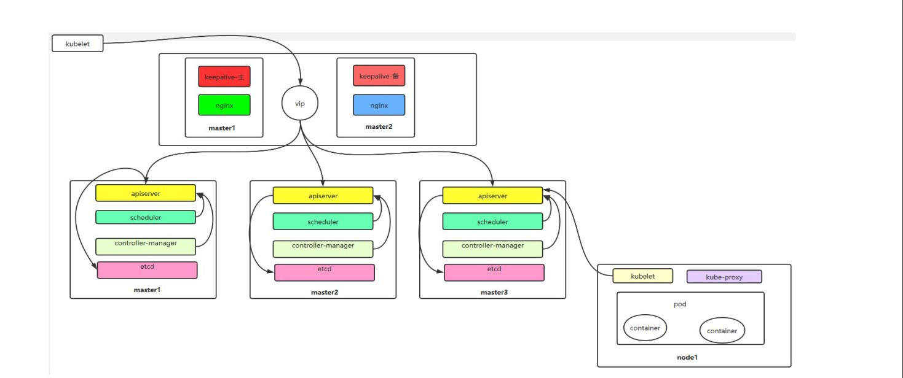

# 二进制安装k8s

## 1.环境准备

| 角色     | Ip             | 主机名  | 规划安装组件                                                 |
| -------- | -------------- | ------- | ------------------------------------------------------------ |
| 控制节点 | 192.168.89.135 | master1 | apiserver、controller-manager、scheduler、etcd、 docker、keepalived、nginx |
| 控制节点 | 192.168.89.136 | master2 | apiserver、controller-manager、scheduler、etcd、docker、keepalived、nginx |
| 控制节点 | 192.168.89.137 | master3 | apiserver、controller-manager、scheduler、etcd、 docker      |
| 工作节点 | 192.168.89.138 | node1   | kubelet、kube-proxy、docker、calico、coredns                 |
| vip      | 192.168.89.139 | vip     |                                                              |

## 2.架构图



## 3.初始化

### 3.1配置静态IP

```sh
vi /etc/sysconfig/network-scripts/ifcfg-ens33
```

内容

```sh
TYPE=Ethernet
PROXY_METHOD=none
BROWSER_ONLY=no
BOOTPROTO=static
IPADDR=192.168.89.135
NETMASK=255.255.255.0
GATEWAY=192.168.89.2
DNS1=8.8.8.8
DEFROUTE=yes
IPV4_FAILURE_FATAL=no
IPV6INIT=yes
IPV6_AUTOCONF=yes
IPV6_DEFROUTE=yes
IPV6_FAILURE_FATAL=no
IPV6_ADDR_GEN_MODE=stable-privacy
NAME=ens33
DEVICE=ens33
ONBOOT=yes
```

修改配置文件之后需要重启网络服务才能使配置生效，重启网络服务命令如下：

```sh
service network restart
```

> 注：/etc/sysconfig/network-scripts/ifcfg-ens33 文件里的配置说明： 
>
> NAME=ens33 #网卡名字，跟 DEVICE 名字保持一致即可 
>
> DEVICE=ens33 #网卡设备名，大家 ip addr 可看到自己的这个网卡设备名，每个人的机器可能这个名字不一样，需要写自己的 
>
> BOOTPROTO=static #static 表示静态 ip 地址 
>
> ONBOOT=yes #开机自启动网络，必须是 yes 
>
> IPADDR=192.168.89.135 #ip 地址，需要跟自己电脑所在网段一致 
>
> NETMASK=255.255.255.0 #子网掩码，需要跟自己电脑所在网段一致 
>
> GATEWAY=192.168.89.2 #网关，在自己电脑打开 cmd，输入 ipconfig /all 可看到 
>
> DNS1=8.8.8.8 #DNS，8.8.8.8，或者114.114.114.114都可以

### 3.2配置主机名字

````sh
#配置主机名：
#在 192.168.89.135 上执行如下：
hostnamectl set-hostname master1 &&bash
#在 192.168.89.136 上执行如下：
hostnamectl set-hostname master2 &&bash
#在 192.168.89.137 上执行如下：
hostnamectl set-hostname master3 &&bash
#在 192.168.89.138 上执行如下：
hostnamectl set-hostname node1   &&bash
#在 192.168.89.139 上执行如下：
hostnamectl set-hostname vip     &&bash
````

### 3.3 配置hosts文件

没有特殊情况，下面命令在每个服务器都需要重复执行在 `master1`，`master2`，`master3`，`node1`上

```sh
#修改 master1、master2、master3、node1 机器的/etc/hosts 文件，增加如下四行：
vi /etc/hosts
192.168.89.135 master1
192.168.89.136 master2
192.168.89.137 master3
192.168.89.138 node1
```

### 3.4 配置主机之间无密码登录

```sh
#生成 ssh 密钥对
ssh-keygen -t rsa #一路回车，不输入密码
把本地的 ssh 公钥文件安装到远程主机对应的账户
ssh-copy-id -i .ssh/id_rsa.pub master1
ssh-copy-id -i .ssh/id_rsa.pub master2
ssh-copy-id -i .ssh/id_rsa.pub master3
ssh-copy-id -i .ssh/id_rsa.pub node1
```

>如果报错如下：
>
>[root@master1 ~]# ssh-copy-id -i .ssh/id_rsa.pub master3
>/usr/bin/ssh-copy-id: INFO: Source of key(s) to be installed: ".ssh/id_rsa.pub"
>/usr/bin/ssh-copy-id: INFO: attempting to log in with the new key(s), to filter out any that are already installed
>
>/usr/bin/ssh-copy-id: ERROR: @@@@@@@@@@@@@@@@@@@@@@@@@@@@@@@@@@@@@@@@@@@@@@@@@@@@@@@@@@@
>ERROR: @    WARNING: REMOTE HOST IDENTIFICATION HAS CHANGED!     @
>ERROR: @@@@@@@@@@@@@@@@@@@@@@@@@@@@@@@@@@@@@@@@@@@@@@@@@@@@@@@@@@@
>ERROR: IT IS POSSIBLE THAT SOMEONE IS DOING SOMETHING NASTY!
>ERROR: Someone could be eavesdropping on you right now (man-in-the-middle attack)!
>ERROR: It is also possible that a host key has just been changed.
>ERROR: The fingerprint for the ECDSA key sent by the remote host is
>ERROR: SHA256:H4Q2zsjP81n8vjQqWSgun9toX5oM4HzCrHKLS0xcd2c.
>ERROR: Please contact your system administrator.
>ERROR: Add correct host key in /root/.ssh/known_hosts to get rid of this message.
>ERROR: Offending ECDSA key in /root/.ssh/known_hosts:3
>ERROR: ECDSA host key for master3 has changed and you have requested strict checking.
>ERROR: Host key verification failed.
>
>你在尝试将 SSH 公钥复制到名为 master3 的远程主机时，遇到了一个错误。错误信息显示，远程主机的身份发生了变化，这可能是由于远程主机的主机密钥发生了变化，或者是因为有人在进行中间人攻击（MITM 攻击）。具体的错误信息如下：
>
>为了解决这个问题，你可以按照以下步骤操作：
>
>1. **查看并确认问题：** 首先，你需要确认远程主机的主机密钥是否真的发生了变化。你可以联系系统管理员或使用其他安全渠道验证远程主机的密钥指纹。
>
>2. **更新已知主机文件：** 如果你确认远程主机的主机密钥确实发生了变化，你可以手动更新已知主机文件（`~/.ssh/known_hosts`），移除旧的主机密钥记录，然后重新连接以添加新的主机密钥。你可以使用以下命令移除已知主机文件中的特定条目：
>
>   ```bash
>   ssh-keygen -R master3
>   ```
>
>3. **重新连接并接受新的主机密钥：**
>   移除旧的主机密钥后，再次尝试连接远程主机，将提示你接受新的主机密钥：
>
>   ```bash
>   ssh master3
>   ```
>
>4. **重新执行 ssh-copy-id：**
>   确认并接受新的主机密钥后，你可以重新执行 `ssh-copy-id` 命令，将公钥复制到远程主机：
>
>   ```bash
>   ssh-copy-id -i .ssh/id_rsa.pub master3
>   ```

### 3.5关闭 firewalld 防火墙

```sh
systemctl stop firewalld ; systemctl disable firewalld
```

### 3.6关闭 selinux

```sh
sed -i 's/SELINUX=enforcing/SELINUX=disabled/g' /etc/selinux/config
#修改 selinux 配置文件之后，重启机器，selinux 配置才能永久生效
重启之后登录机器验证是否修改成功：
getenforce
#显示 Disabled 说明 selinux 已经关闭
```

### 3.7关闭交换分区 swap,在 master1、master2、master3、 node1 上操作

```sh
#临时关闭
swapoff -a
#永久关闭：注释 swap 挂载，给 swap 这行开头加一下注释
vim /etc/fstab
#/dev/mapper/centos-swap swap swap defaults 0 0
```

### 3.8修改内核参数

```sh
#加载 br_netfilter 模块
modprobe br_netfilter
#验证模块是否加载成功：
lsmod |grep br_netfilter

[root@master1 ~]# lsmod |grep br_netfilter
br_netfilter           22256  0 
bridge                151336  1 br_netfilter

#修改内核参数
cat > /etc/sysctl.d/k8s.conf <<EOF
net.bridge.bridge-nf-call-ip6tables = 1
net.bridge.bridge-nf-call-iptables = 1
net.ipv4.ip_forward = 1
EOF

#使刚才修改的内核参数生效
sysctl -p /etc/sysctl.d/k8s.conf
```

> 问题 1：sysctl 是做什么的？ 
>
> 在运行时配置内核参数 
>
> -p 从指定的文件加载系统参数，如不指定即从/etc/sysctl.conf 中加载 
>
> 问题 2：为什么要执行 modprobe br_netfilter？ 
>
> 修改/etc/sysctl.d/k8s.conf 文件，增加如下三行参数：
>
> net.bridge.bridge-nf-call-ip6tables = 1 
>
> net.bridge.bridge-nf-call-iptables = 1 
>
> net.ipv4.ip_forward = 1 
>
> sysctl -p /etc/sysctl.d/k8s.conf 出现报错： 
>
> sysctl: cannot stat /proc/sys/net/bridge/bridge-nf-call-ip6tables: No such file or  
>
> directory 
>
> sysctl: cannot stat /proc/sys/net/bridge/bridge-nf-call-iptables: No such file or directory 
>
> 解决方法： 
>
> modprobe br_netfilter
>
> 问题 3：为什么开启 net.bridge.bridge-nf-call-iptables 内核参数？ 
>
> 在 centos 下安装 docker，执行 docker info 出现如下警告： 
>
> WARNING: bridge-nf-call-iptables is disabled 
>
> WARNING: bridge-nf-call-ip6tables is disabled 
>
> 解决办法： 
>
> vim /etc/sysctl.d/k8s.conf 
>
> net.bridge.bridge-nf-call-ip6tables = 1 
>
> net.bridge.bridge-nf-call-iptables = 1
>
> 问题 4：为什么要开启 net.ipv4.ip_forward = 1 参数？ 
>
> kubeadm 初始化 k8s 如果报错： 
>
> ERROR FileContent--proc-sys-net-ipv4-ip_forward):/proc/sys/net/ipv4/ip_forward contents are not set to 1
>
> 就表示没有开启 ip_forward，需要开启。
>
> net.ipv4.ip_forward 是数据包转发： 
>
> 出于安全考虑，Linux 系统默认是禁止数据包转发的。所谓转发即当主机拥有多于一块的网卡时， 
>
> 其中一块收到数据包，根据数据包的目的 ip 地址将数据包发往本机另一块网卡，该网卡根据路由表继续 
>
> 发送数据包。这通常是路由器所要实现的功能。 
>
> 要让 Linux 系统具有路由转发功能，需要配置一个 Linux 的内核参数 net.ipv4.ip_forward。这个 
>
> 参数指定了 Linux 系统当前对路由转发功能的支持情况；其值为 0 时表示禁止进行 IP 转发；如果是 1, 
>
> 则说明 IP 转发功能已经打开。

### 3.9配置阿里云 repo 源

```sh
#安装 rzsz 命令
yum install lrzsz -y
#安装 scp
yum install openssh-clients
#备份基础 repo 源
mkdir /root/repo.bak&& cd /etc/yum.repos.d/ &&mv * /root/repo.bak/
#下载阿里云的 repo 源
把 CentOS-Base.repo 文件上传到 master1 主机的/etc/yum.repos.d/目录下
#配置国内阿里云 docker 的 repo 源
sudo yum install -y yum-utils
sudo yum-config-manager \
--add-repo \
http://mirrors.aliyun.com/docker-ce/linux/centos/docker-ce.repo

```

### 3.10配置时间同步

```sh
#安装 ntpdate 命令，
yum install ntpdate -y
#跟网络源做同步
ntpdate cn.pool.ntp.org
#把时间同步做成计划任务
crontab -e
* */1 * * * /usr/sbin/ntpdate cn.pool.ntp.org
#重启 crond 服务
service crond restart
```

3.11安装 iptables

如果用 firewalld 不习惯，在 master1、master2、master3、 node1 上操作

```sh
#安装 iptables
yum install iptables-services -y
#禁用 iptables
service iptables stop && systemctl disable iptables
#清空防火墙规则
iptables -F
```

### 3.12开启 ipvs

不开启 `ipvs` 将会使用` iptables` 进行数据包转发，但是效率低，所以官网推荐需要开通 `ipvs`。 

把 ipvs.modules 上传到机器的/etc/sysconfig/modules/目录下，以master1为例：

```sh
[root@master1 modules]# chmod 755 /etc/sysconfig/modules/ipvs.modules && bash /etc/sysconfig/modules/ipvs.modules && lsmod | grep ip_vs
ip_vs_ftp              13079  0 
nf_nat                 26583  1 ip_vs_ftp
ip_vs_sed              12519  0 
ip_vs_nq               12516  0 
ip_vs_sh               12688  0 
ip_vs_dh               12688  0 
ip_vs_lblcr            12922  0 
ip_vs_lblc             12819  0 
ip_vs_wrr              12697  0 
ip_vs_rr               12600  0 
ip_vs_wlc              12519  0 
ip_vs_lc               12516  0 
ip_vs                 145458  22 ip_vs_dh,ip_vs_lc,ip_vs_nq,ip_vs_rr,ip_vs_sh,ip_vs_ftp,ip_vs_sed,ip_vs_wlc,ip_vs_wrr,ip_vs_lblcr,ip_vs_lblc
nf_conntrack          139264  2 ip_vs,nf_nat
libcrc32c              12644  4 xfs,ip_vs,nf_nat,nf_conntrack


[root@master1~]# scp /etc/sysconfig/modules/ipvs.modules master2:/etc/sysconfig/modules/
[root@master1~]# scp /etc/sysconfig/modules/ipvs.modules master3:/etc/sysconfig/modules/
[root@master1~]# scp /etc/sysconfig/modules/ipvs.modules node1:/etc/sysconfig/modules/

[root@master2]# chmod 755 /etc/sysconfig/modules/ipvs.modules && bash /etc/sysconfig/modules/ipvs.modules && lsmod | grep ip_vs
ip_vs_ftp              13079  0 
nf_nat                 26583  1 ip_vs_ftp
ip_vs_sed              12519  0 
ip_vs_nq               12516  0 
ip_vs_sh               12688  0 
ip_vs_dh               12688  0 
ip_vs_lblcr            12922  0 
ip_vs_lblc             12819  0 
ip_vs_wrr              12697  0 
ip_vs_rr               12600  0 
ip_vs_wlc              12519  0 
ip_vs_lc               12516  0 
ip_vs                 145458  22 ip_vs_dh,ip_vs_lc,ip_vs_nq,ip_vs_rr,ip_vs_sh,ip_vs_ftp,ip_vs_sed,ip_vs_wlc,ip_vs_wrr,ip_vs_lblcr,ip_vs_lblc
nf_conntrack          139264  2 ip_vs,nf_nat
libcrc32c              12644  4 xfs,ip_vs,nf_nat,nf_conntrack

[root@master3]# chmod 755 /etc/sysconfig/modules/ipvs.modules && bash /etc/sysconfig/modules/ipvs.modules && lsmod | grep ip_vs
ip_vs_ftp              13079  0 
nf_nat                 26583  1 ip_vs_ftp
ip_vs_sed              12519  0 
ip_vs_nq               12516  0 
ip_vs_sh               12688  0 
ip_vs_dh               12688  0 
ip_vs_lblcr            12922  0 
ip_vs_lblc             12819  0 
ip_vs_wrr              12697  0 
ip_vs_rr               12600  0 
ip_vs_wlc              12519  0 
ip_vs_lc               12516  0 
ip_vs                 145458  22 ip_vs_dh,ip_vs_lc,ip_vs_nq,ip_vs_rr,ip_vs_sh,ip_vs_ftp,ip_vs_sed,ip_vs_wlc,ip_vs_wrr,ip_vs_lblcr,ip_vs_lblc
nf_conntrack          139264  2 ip_vs,nf_nat
libcrc32c              12644  4 xfs,ip_vs,nf_nat,nf_conntrack

[root@node1]# chmod 755 /etc/sysconfig/modules/ipvs.modules && bash /etc/sysconfig/modules/ipvs.modules && lsmod | grep ip_vs
ip_vs_ftp              13079  0 
nf_nat                 26583  1 ip_vs_ftp
ip_vs_sed              12519  0 
ip_vs_nq               12516  0 
ip_vs_sh               12688  0 
ip_vs_dh               12688  0 
ip_vs_lblcr            12922  0 
ip_vs_lblc             12819  0 
ip_vs_wrr              12697  0 
ip_vs_rr               12600  0 
ip_vs_wlc              12519  0 
ip_vs_lc               12516  0 
ip_vs                 145458  22 ip_vs_dh,ip_vs_lc,ip_vs_nq,ip_vs_rr,ip_vs_sh,ip_vs_ftp,ip_vs_sed,ip_vs_wlc,ip_vs_wrr,ip_vs_lblcr,ip_vs_lblc
nf_conntrack          139264  2 ip_vs,nf_nat
libcrc32c              12644  4 xfs,ip_vs,nf_nat,nf_conntrack
```

### 3.13安装基础软件包

```sh
sudo yum install -y yum-utils \
    device-mapper-persistent-data \
    lvm2 \
    wget \
    net-tools \
    nfs-utils \
    lrzsz \
    gcc \
    gcc-c++ \
    make \
    cmake \
    libxml2-devel \
    openssl-devel \
    curl \
    curl-devel \
    unzip \
    sudo \
    ntp \
    libaio-devel \
    wget \
    vim \
    ncurses-devel \
    autoconf \
    automake \
    zlib-devel \
    python-devel \
    epel-release \
    openssh-server \
    socat \
    ipvsadm \
    conntrack \
    ntpdate \
    telnet \
    ipvsadm
```

### 3.14 安装docker-ce

```sh
sudo yum install -y docker-ce docker-ce-cli containerd.io
```

启动

```bash
systemctl enable docker --now
```

3.15配置加速

> 这里额外添加了docker的生产环境核心配置cgroup

```bash
sudo mkdir -p /etc/docker
sudo tee /etc/docker/daemon.json <<-'EOF'
{
  "registry-mirrors": ["https://docker.m.daocloud.io"],
  "exec-opts": ["native.cgroupdriver=systemd"],
  "log-driver": "json-file",
  "log-opts": {
    "max-size": "100m"
  },
  "storage-driver": "overlay2"
}
EOF
sudo systemctl daemon-reload
sudo systemctl restart docker
```

## 4.搭建etcd集群

### 4.1配置 etcd 工作目录

```bash
#创建配置文件和证书文件存放目录
[root@master1 ~]# mkdir -p /etc/etcd/ssl
[root@master2 ~]# mkdir -p /etc/etcd/ssl
[root@master3 ~]# mkdir -p /etc/etcd/ssl
```

### 4.2安装签发证书工具 cfssl

```bash
[root@master1 ~]# mkdir /data/work -p
[root@master1 ~]# cd /data/work/
#cfssl-certinfo_linux-amd64 、cfssljson_linux-amd64 、cfssl_linux-amd64 上传到
/data/work/目录下
[root@master1 work]# ls
cfssl-certinfo_linux-amd64 cfssljson_linux-amd64 cfssl_linux-amd64
#把文件变成可执行权限
[root@master1 work]# chmod +x *
[root@master1 work]# mv cfssl_linux-amd64 /usr/local/bin/cfssl
[root@master1 work]# mv cfssljson_linux-amd64 /usr/local/bin/cfssljson
[root@master1 work]# mv cfssl-certinfo_linux-amd64 /usr/local/bin/cfssl-certinfo
```

4.3配置 ca 证书

```bash
#生成 ca 证书请求文件
[root@master1 work]# vim ca-csr.json
{
 "CN": "kubernetes",
 "key": {
 "algo": "rsa",
 "size": 2048
 },
 "names": [
 {
 "C": "CN",
 "ST": "Hubei",
 "L": "Wuhan",
 "O": "k8s",
 "OU": "system"
 }
 ],
 "ca": {
 "expiry": "87600h"
 }
}
[root@master1 work]# cfssl gencert -initca ca-csr.json | cfssljson -bare ca
```


>
>
>注： 
>
>CN：Common Name（公用名称），kube-apiserver 从证书中提取该字段作为请求的用户名 (User Name)； 
>
>浏览器使用该字段验证网站是否合法；对于 SSL 证书，一般为网站域名；而对于代码签名证书则为申请 
>
>单位名称；而对于客户端证书则为证书申请者的姓名。 
>
>O：Organization（单位名称），kube-apiserver 从证书中提取该字段作为请求用户所属的组 (Group)； 
>
>对于 SSL 证书，一般为网站域名；而对于代码签名证书则为申请单位名称；而对于客户端单位证书则为 
>
>证书申请者所在单位名称。 
>
>L 字段：所在城市 
>
>S 字段：所在省份 
>
>C 字段：只能是国家字母缩写，如中国：CN 

4.4生成ca证书文件

```sh
[root@xianchaomaster1 work]# vim ca-config.json 
{
 "signing": {
 "default": {
 "expiry": "87600h"
 },
 "profiles": {
 "kubernetes": {
 "usages": [
 "signing",
 "key encipherment",
 "server auth",
 "client auth"
 ],
 "expiry": "87600h"
 }
 }
 }
}
```

4.5 生成 etcd 证书 

 \#配置 etcd 证书请求，hosts 的 ip 变成自己 etcd 所在节点的 ip 

```bash
[root@master1 work]# vim etcd-csr.json 


{
 "CN": "etcd",
 "hosts": [
 "127.0.0.1",
 "192.168.89.135",
 "192.168.89.136",
 "192.168.89.137",
 "192.168.89.138"
 ],
 "key": {
 "algo": "rsa",
 "size": 2048
 },
 "names": [{
 "C": "CN",
 "ST": "Hubei",
 "L": "Wuhan",
 "O": "k8s",
 "OU": "system"
 }]
}
#上述文件 hosts 字段中 IP 为所有 etcd 节点的集群内部通信 IP，可以预留几个，做扩容用。
[root@master1 work]# cfssl gencert -ca=ca.pem -ca-key=ca-key.pem -config=caconfig.json -profile=kubernetes etcd-csr.json | cfssljson -bare etcd
[root@master1 work]# ls etcd*.pem
etcd-key.pem etcd.pem
```

4.6部署 etcd 集群

```bash
把 etcd-v3.4.13-linux-amd64.tar.gz 上传到/data/work 目录下
[root@master1 work]# pwd
/data/work
[root@master1 work]# tar -xf etcd-v3.4.13-linux-amd64.tar.gz
[root@master1 work]# cp -p etcd-v3.4.13-linux-amd64/etcd* /usr/local/bin/
[root@master1 work]# scp -r etcd-v3.4.13-linux-amd64/etcd* master2:/usr/local/bin/
[root@master1 work]# scp -r etcd-v3.4.13-linux-amd64/etcd* master3:/usr/local/bin/
#创建配置文件
[root@xianchaomaster1 work]# vim etcd.conf

#[Member]
ETCD_NAME="etcd1"
ETCD_DATA_DIR="/var/lib/etcd/default.etcd"
ETCD_LISTEN_PEER_URLS="https://192.168.89.135:2380"
ETCD_LISTEN_CLIENT_URLS="https://192.168.89.135:2379,http://127.0.0.1:2379"
#[Clustering]
ETCD_INITIAL_ADVERTISE_PEER_URLS="https://192.168.89.135:2380"
ETCD_ADVERTISE_CLIENT_URLS="https://192.168.89.135:2379"
ETCD_INITIAL_CLUSTER="etcd1=https://192.168.89.135:2380,etcd2=https://192.168.89.136:2380,etcd3=https://192.168.40.137:2380"
ETCD_INITIAL_CLUSTER_TOKEN="etcd-cluster"
ETCD_INITIAL_CLUSTER_STATE="new"
```


>
>
>\#注： 
>
>ETCD_NAME：节点名称，集群中唯一 
>
>ETCD_DATA_DIR：数据目录 
>
>ETCD_LISTEN_PEER_URLS：集群通信监听地址 
>
>ETCD_LISTEN_CLIENT_URLS：客户端访问监听地址 
>
>ETCD_INITIAL_ADVERTISE_PEER_URLS：集群通告地址 
>
>ETCD_ADVERTISE_CLIENT_URLS：客户端通告地址 
>
>ETCD_INITIAL_CLUSTER：集群节点地址 
>
>ETCD_INITIAL_CLUSTER_TOKEN：集群 Token 
>
>ETCD_INITIAL_CLUSTER_STATE：加入集群的当前状态，new 是新集群，existing 表示加入已有集群

4.7创建启动服务文件

```bash
[root@master1 work]# vim etcd.service 
[Unit]
Description=Etcd Server
After=network.target
After=network-online.target
Wants=network-online.target
[Service]
Type=notify
EnvironmentFile=-/etc/etcd/etcd.conf
WorkingDirectory=/var/lib/etcd/
ExecStart=/usr/local/bin/etcd \
 --cert-file=/etc/etcd/ssl/etcd.pem \
 --key-file=/etc/etcd/ssl/etcd-key.pem \
 --trusted-ca-file=/etc/etcd/ssl/ca.pem \
 --peer-cert-file=/etc/etcd/ssl/etcd.pem \
 --peer-key-file=/etc/etcd/ssl/etcd-key.pem \
 --peer-trusted-ca-file=/etc/etcd/ssl/ca.pem \
 --peer-client-cert-auth \
 --client-cert-auth
Restart=on-failure
RestartSec=5
LimitNOFILE=65536
[Install]
WantedBy=multi-user.target
[root@xianchaomaster1 work]# cp ca*.pem /etc/etcd/ssl/
[root@xianchaomaster1 work]# cp etcd*.pem /etc/etcd/ssl/
[root@xianchaomaster1 work]# cp etcd.conf /etc/etcd/
[root@xianchaomaster1 work]# cp etcd.service /usr/lib/systemd/system/
[root@xianchaomaster1 work]# for i in xianchaomaster2 xianchaomaster3;do rsync -vaz 
etcd.conf $i:/etc/etcd/;done
[root@xianchaomaster1 work]# for i in xianchaomaster2 xianchaomaster3;do rsync -vaz 
etcd*.pem ca*.pem $i:/etc/etcd/ssl/;done
[root@xianchaomaster1 work]# for i in xianchaomaster2 xianchaomaster3;do rsync -vaz 
etcd.service $i:/usr/lib/systemd/system/;done
#启动 etcd 集群
[root@xianchaomaster1 work]# mkdir -p /var/lib/etcd/default.etcd
[root@xianchaomaster2 work]# mkdir -p /var/lib/etcd/default.etcd
[root@xianchaomaster3 work]# mkdir -p /var/lib/etcd/default.etcd
[root@xianchaomaster2 ~]# vim /etc/etcd/etcd.conf 
#[Member]
ETCD_NAME="etcd2"
ETCD_DATA_DIR="/var/lib/etcd/default.etcd"
ETCD_LISTEN_PEER_URLS="https://192.168.40.181:2380"
ETCD_LISTEN_CLIENT_URLS="https://192.168.40.181:2379,http://127.0.0.1:2379"
#[Clustering]
ETCD_INITIAL_ADVERTISE_PEER_URLS="https://192.168.40.181:2380"
ETCD_ADVERTISE_CLIENT_URLS="https://192.168.40.181:2379"
ETCD_INITIAL_CLUSTER="etcd1=https://192.168.40.180:2380,etcd2=https://192.168.40.181:23
80,etcd3=https://192.168.40.182:2380"
ETCD_INITIAL_CLUSTER_TOKEN="etcd-cluster"
ETCD_INITIAL_CLUSTER_STATE="new"
[root@xianchaomaster3 ~]# vim /etc/etcd/etcd.conf 
#[Member]
ETCD_NAME="etcd3"
ETCD_DATA_DIR="/var/lib/etcd/default.etcd"
ETCD_LISTEN_PEER_URLS="https://192.168.40.182:2380"
ETCD_LISTEN_CLIENT_URLS="https://192.168.40.182:2379,http://127.0.0.1:2379"
#[Clustering]
ETCD_INITIAL_ADVERTISE_PEER_URLS="https://192.168.40.182:2380"
ETCD_ADVERTISE_CLIENT_URLS="https://192.168.40.182:2379"
ETCD_INITIAL_CLUSTER="etcd1=https://192.168.40.180:2380,etcd2=https://192.168.40.181:23
80,etcd3=https://192.168.40.182:2380"
ETCD_INITIAL_CLUSTER_TOKEN="etcd-cluster"
ETCD_INITIAL_CLUSTER_STATE="new"
[root@xianchaomaster1 work]# systemctl daemon-reload
[root@xianchaomaster1 work]# systemctl enable etcd.service
[root@xianchaomaster1 work]# systemctl start etcd.service
[root@xianchaomaster2 work]# systemctl daemon-reload
[root@xianchaomaster2 work]# systemctl enable etcd.service
[root@xianchaomaster2 work]# systemctl start etcd.service
启动 etcd 的时候，先启动 xianchaomaster1 的 etcd 服务，会一直卡住在启动的状态，然后接着再启
动 xianchaomaster2 的 etcd，这样 xianchaomaster1 这个节点 etcd 才会正常起来
[root@xianchaomaster3 work]# systemctl daemon-reload
[root@xianchaomaster3 work]# systemctl enable etcd.service
[root@xianchaomaster3 work]# systemctl start etcd.service
[root@xianchaomaster1]# systemctl status etcd
[root@xianchaomaster2]# systemctl status etcd
[root@xianchaomaster3]# systemctl status etcd
```

4.8查看 etcd 集群

```bash
[root@xianchaomaster1 work]# ETCDCTL_API=3
[root@xianchaomaster1 ~]# /usr/local/bin/etcdctl --write-out=table --
cacert=/etc/etcd/ssl/ca.pem --cert=/etc/etcd/ssl/etcd.pem --key=/etc/etcd/ssl/etcd-key.pem 
--
endpoints=https://192.168.40.180:2379,https://192.168.40.181:2379,https://192.168.40.182:23
79 endpoint health
+----------------------------+--------+-------------+-------+
| ENDPOINT | HEALTH | TOOK | ERROR |
+----------------------------+--------+-------------+-------+
| https://192.168.40.180:2379 | true | 12.614205ms | |
| https://192.168.40.181:2379 | true | 15.762435ms | |
| https://192.168.40.182:2379 | true | 76.066459ms | |
+----------------------------+--------+-------------+-------+ |
```

5安装 kubernetes 组件

