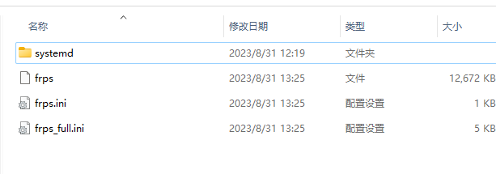
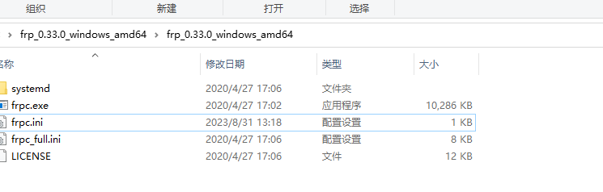

frp内网穿透

需要一台能有公网ip的服务器

1.下载frp

[frp](https://github.com/fatedier/frp)

2.安装服务端

解压并且去除客户端工具以及配置

```
tar -zxvf frp_0.33.0_linux_amd64.tar.gz
```





修改配置文件frps.ini如下，我这边以演示，所有设置的非常简单

```ini
[common]
# 客户端访问地址的端口
bind_port = 7777

# 服务端客户端交互token
token = 123
# 服务端web界面
dashboard_user = root	
dashboard_pwd =root
dashboard_port = 7778
```

启动也可以做成服务

```
# 前台启动
./frps -c ./frps.ini

# 后台启动
./frps -c ./frps.ini &

```


3.客户端选择的windows，也可以选择你需要的系统

解压去除不需要的文件,如下，修改frpc.ini文件



```ini
[common]
tls_enable=true
# 服务端公网ip的地址 或者域名
server_addr = XX.XX.XX.XX
# 服务端应用访问端口
server_port = 7777

token = 123

[ssh]
# 将ssh登录内网穿透,我们在局域网外就能访问内网服务器了
type = tcp
local_ip = 127.0.0.1
local_port = 3306
# 服务端代理端口:意思就是服务端的6666端口和被我们客户端的22端口关联了
remote_port = 6666
```


启动

windows启动

```
frpc.exe -c frpc.ini
```

等待一会就可以用公网ip访问你本地的数据库了，应该也可以用域名，暂时未有尝试

linux启动

```
# 前台启动
./frpc -c ./frpc.ini

# 后台启动
./frpc -c ./frpc.ini &

```


参考:

[内网穿透搭建之frp篇 - 简书 (jianshu.com)](https://www.jianshu.com/p/6643b60d969a) 

[FRP搭建内网穿透(亲测有效)_locyanfrp_Freguez · duoyu的博客-CSDN博客](https://blog.csdn.net/qq_36981760/article/details/115713179) 