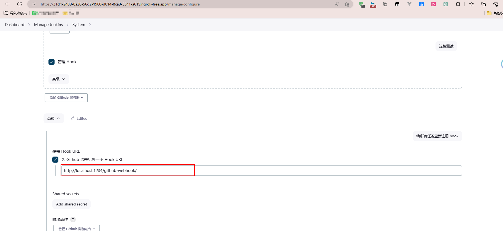
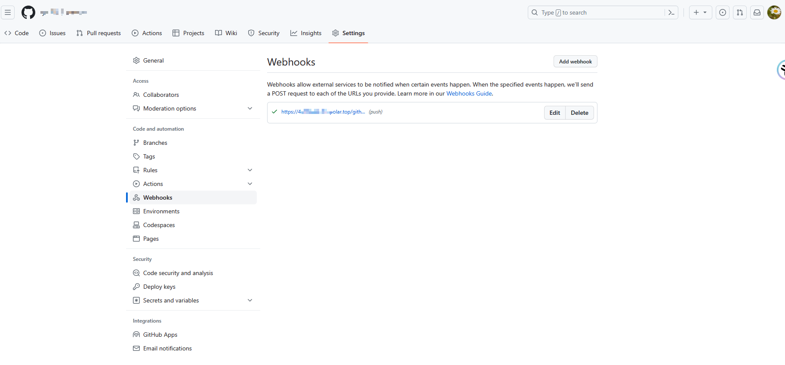
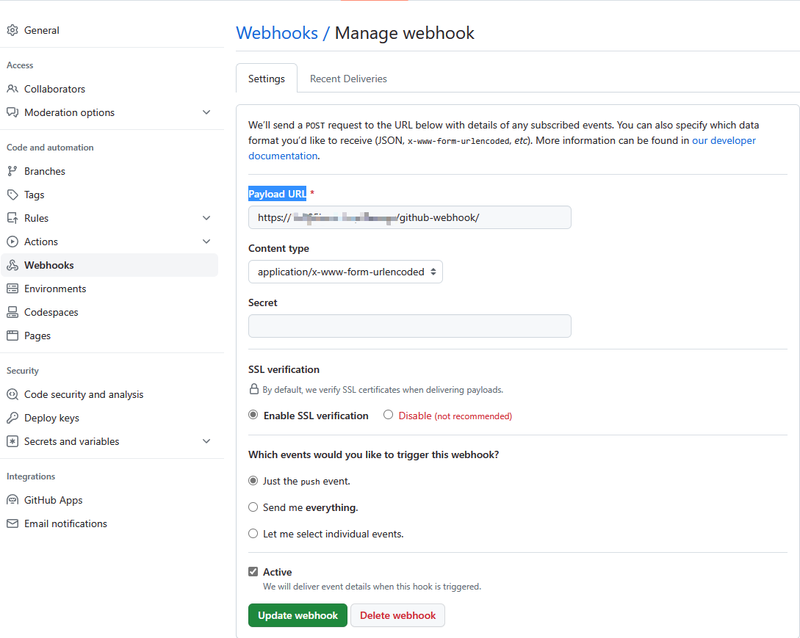
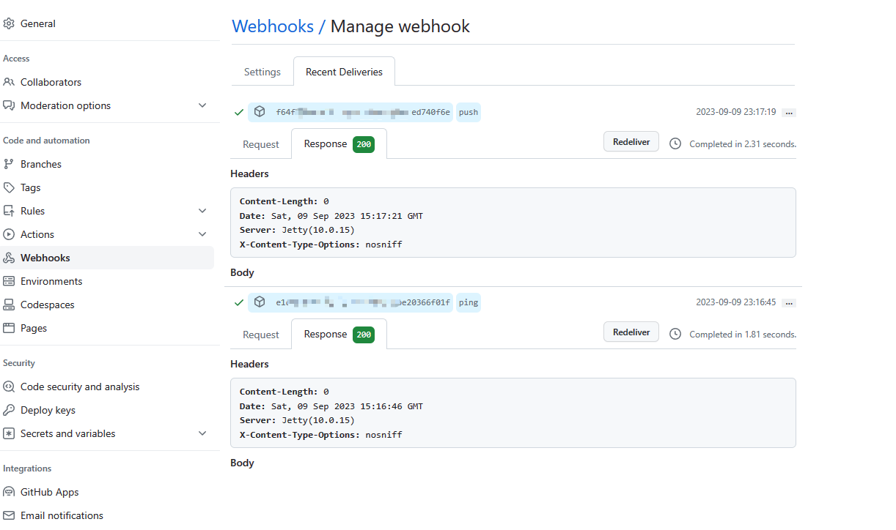
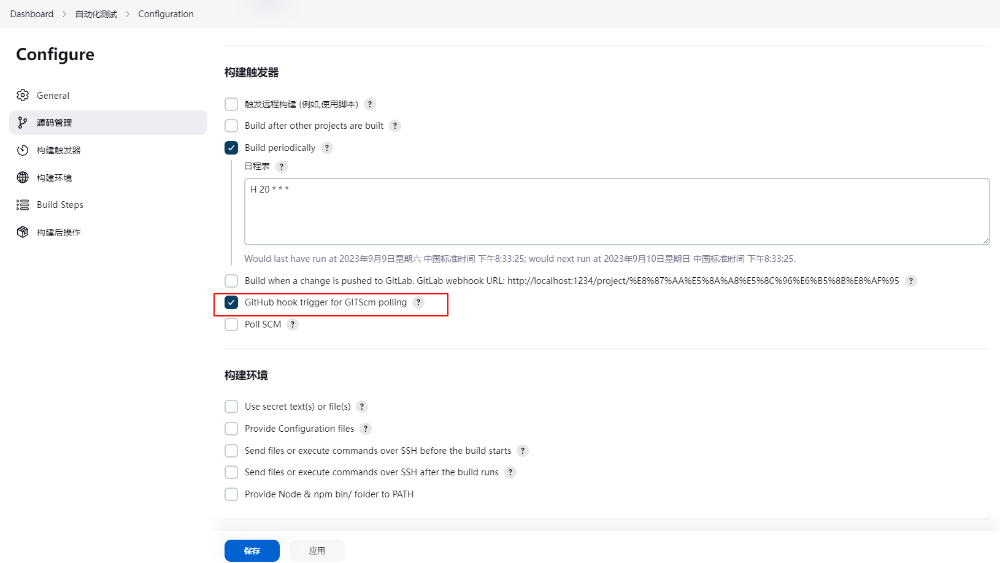

ngrok内网穿透

1.使用步骤

[参考官方文档即可](https://ngrok.com/download)

```
choco install ngrok   or下载zip文件夹
```

获取auth

```
#token需要去官方网站登录获取
ngrok config add-authtoken <token>
```

开启随机的内网穿透的地址

```
ngrok http 80
```


访问重定向的地址,最终拿到回调地址



2.Github配置（**也就是前面内网穿的地址拼接本地的内网jenkins回调地址**）

```
设置webhokd的Payload URL
```






并且都是测试过通过出现200状态



3.提交代码验证




后续有时间精力我专门做一个一键更新多个博客，平台代码，以及邮件发送通知的功能