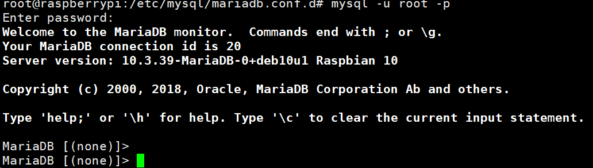

树莓派安装mariadb 

1.更新apt源文件

```shell
apt update
```

2.安装

```shell
sudo apt install mariadb-server
```

3配置 `mariadb-server`

```
sudo mysql
```

创建访问密码

```
UPDATE user SET password = password('密码') WHERE user = 'root';
UPDATE user SET plugin = 'mysql_native_password' WHERE user = 'root';
flush privileges;

```

执行完毕之后重启服务 

```
sudo systemctl restart mariadb
```

完成之后，执行登录查看效果 

```
mysql -u root -p
```





4.配置远程访问

```
vi /etc/mysql/mariadb.conf.d/50-server.cnf
```

找到被注释掉的 `port` 和没有注释掉的 `bind-address`，分别对其取消注释和增加注释。保存后重启服务。 

```
sudo systemctl restart mariadb
# 重新进入数据库
mysql -u root -p

```

创建远程访问账户 

```
CREATE user '访问名'@'%' identified by '访问密码';
GRANT ALL PRIVILEGES ON *.* TO 访问名@'%' WITH GRANT OPTION;
FLUSH PRIVILEGES

```

注意不要给文件太高权限否则会出现警告

```
Warning: World-writable config file '/etc/mysql/mariadb.conf.d/50-server.cnf' is ignored
```

降级文件权限

```
sudo chmod 644 50-server.cnf
```

5.服务器自启动

```
 sudo systemctl enable mariadb
```

6.补充命令

```
sudo systemctl status mariadb
sudo systemctl restart mariadb
sudo systemctl start mariadb
sudo systemctl stop mariadb
##卸载服务
sudo apt-get autoremove --purge mariadb-server 
```

