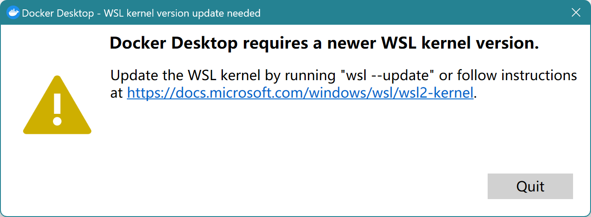
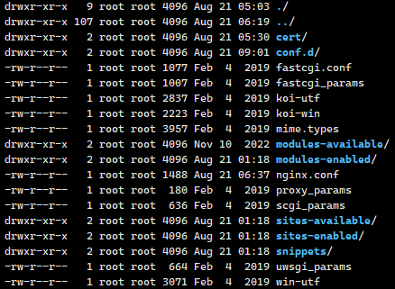
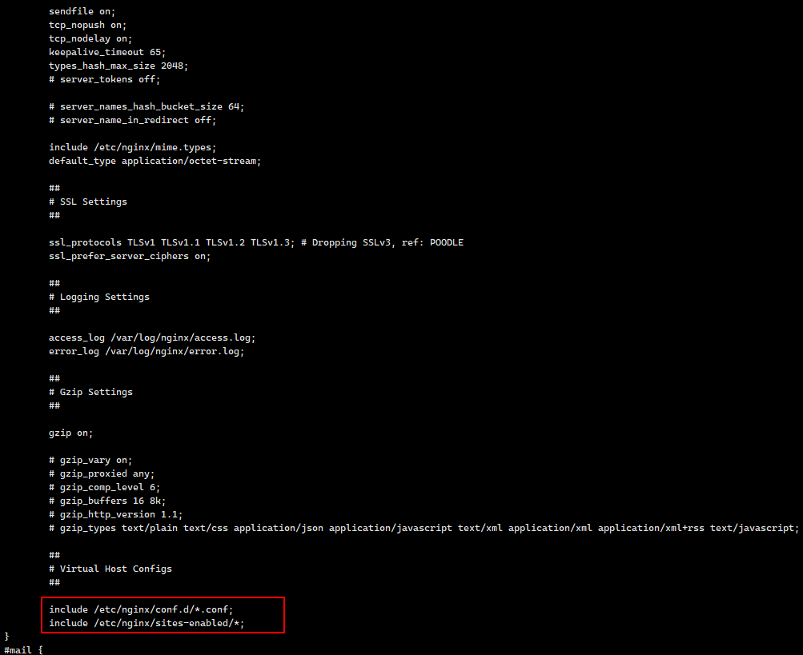
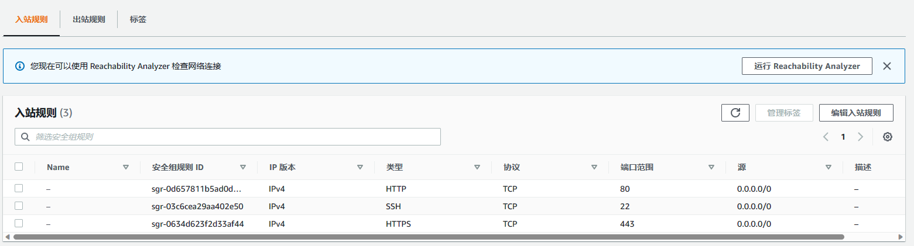
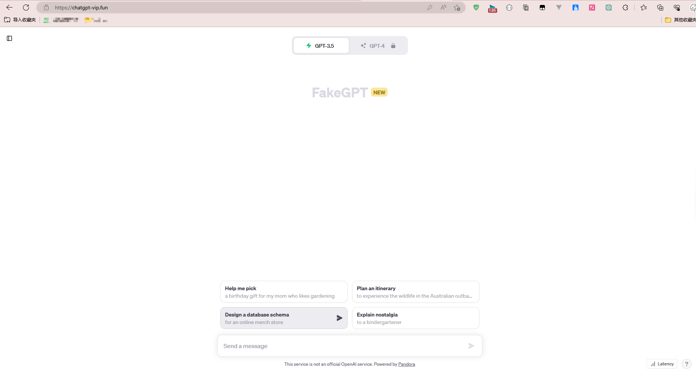
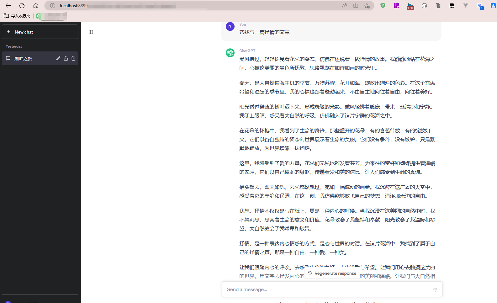

# chatgpt使用

## 1.注册chatgpt账号

由于我们国家不支持。所以需要其他国家号码激活 [获取虚拟手机号码。短期手机号码。手机短信激活服务 (sms-activate.org)](https://sms-activate.org/getNumber) ，大概费用15卢布不等,约等于1块钱左右

建议使用邮箱为outlook邮箱，不要使用qq或者网易邮箱，否则可能被封的风险


## 2.最好是能够魔法上网，不能魔法上网可以使用github[开源项目](https://github.com/pengzhile/pandora) pandora 

## 3安装部署

```sh
docker pull pengzhile/pandora 

docker run  -e PANDORA_CLOUD=cloud -e PANDORA_SERVER=0.0.0.0:8899 -p 8899:8899 -d pengzhile/pandora 
```

本地访问：http://localhost:8899

windows安装docker Desktop使用此命令可能报错



执行一下

```sh
wsl --update
```

## 4.nginx代理

4.1首先默认你已经安装过docker环境了，以及nginx，我这里是采用apt式安装的

```
apt update
apt-get install nginx
nginx -v
```

4.2基本命令

```
##启动
systemctl start nginx
##查看状态
systemctl status nginx
##加载配置文件
systemctl reload nginx
##重启
systemctl restart nginx


安装后面的文件路径配置
/usr/sbin/nginx：主程序
/usr/share/nginx：存放静态文件
/etc/nginx：存放配置文件
/var/log/nginx：存放日志
```

4.3安装完成的主要目录




4.4具体内容也不细说，有机会专门针对nginx做补充

```
 cat nginx.conf配置文件发现它引入了2个地方的配置文件
```



4.5在conf.d下面创建一个default.conf文件

```sh
server{
  listen 80;
  server_name  chatgpt-vip.fun;###你买的域名，需要配置域名解析
  index  index.php index.html index.htm;

  location / {
    proxy_pass  http://18.**.**.123:8899; # 转发规则
    proxy_set_header Host $proxy_host; # 修改转发请求头，让8080端口的应用可以受到真实的请求
    proxy_set_header X-Real-IP $remote_addr;
    proxy_set_header X-Forwarded-For $proxy_add_x_forwarded_for;
  }
}
####443端口代理
server {
    listen 443 ssl;
    server_name chatgpt-vip.fun;
    ssl_certificate /etc/nginx/cert/chatgpt-vip.fun_bundle.pem;####下载的证书
    ssl_certificate_key /etc/nginx/cert/chatgpt-vip.fun.key;####下载的证书

    location / {
        proxy_pass http://localhost:8899;
        proxy_set_header Host $host;
        proxy_set_header X-Real-IP $remote_addr;
        proxy_set_header X-Forwarded-For $proxy_add_x_forwarded_for;
    }
}

server {
  server_name  chatgpt-vip.fun;
  rewrite ^(.*)$ http://www.chatgpt-vip.fun$1 permanent;##使得访问前缀加www也能访问
}

```

```
systemctl reload nginx
```

4.6记得开放443入口端口的防火墙



4.7访问域名www.chatgpt-vip.fun或者https://chatgpt-vip.fun




## 5.最后可以愉快的使用了



有关nginx其他的命令

```
卸载上述nginx安装方式
1先停止nginx命令
systemctl stop nginx
2通过apt-get命令卸载nginx
apt-get --purge autoremove nginx

```

如果访问过程出现502报错补充一个参数

```
proxy_ssl_server_name on;
```

```
location ^~ /modules/abm/ {
        proxy_ssl_server_name on;
        proxy_ssl_name 域名;
        proxy_set_header Host 域名;
        proxy_pass https://abtest_management_api_backend/modules/abm/;
        proxy_read_timeout 1800s;
        proxy_set_header Origanization-Id qiancheng;
        proxy_set_header X-Real-IP $clientRealIp;
        proxy_set_header X-Forwarded-For $proxy_add_x_forwarded_for;
        proxy_pass_header    X-Accel-Buffering;
    }

upstream abtest_management_api_backend {
        server 域名:443;

    }
```


参考文档:

[nginx反向代理443端口-掘金 (juejin.cn)](https://juejin.cn/s/nginx%E5%8F%8D%E5%90%91%E4%BB%A3%E7%90%86443%E7%AB%AF%E5%8F%A3) 

[nginx反向代理https域名时，请求报错502问题排查_nginx 转发502_运维开发故事的博客-CSDN博客](https://blog.csdn.net/wanger5354/article/details/131934728) 

