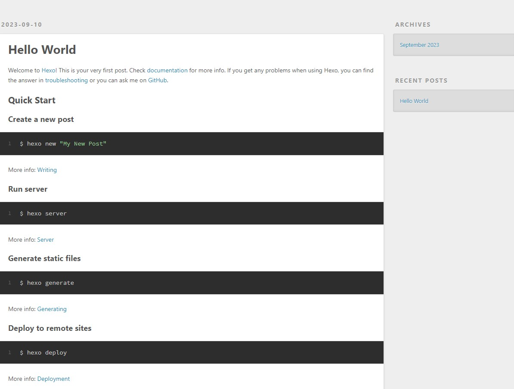
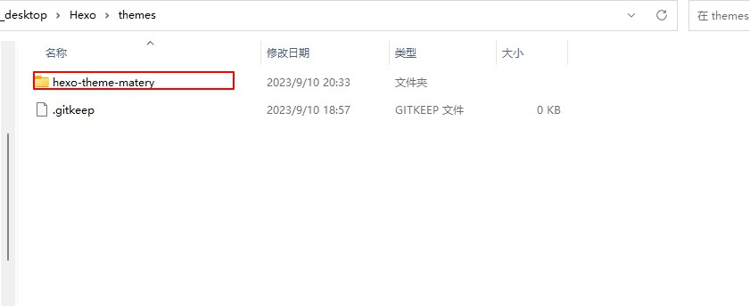

# Hexo博客搭建

## 1.环境准备

```
NodeJs，Git，Github账号
```

## 2.创建文件夹并且执行命令

### 2.1生成一个node_modules文件夹

```sh
npm install hexo
```

### 2.2初始化hexo环境

```sh
hexo init  
```

### 2.3安装npm依赖包

```sh
npm install
```

### 2.4生成静态页面

```sh
hexo generate
```

### 2.5启动[访问](http://localhost:4000/)

```sh
hexo server
```



## 3.修改配置文件_config.yml,修改成为你自己项目的名字

```sh
deploy:
  type: git
  repo: git@github.com:XXXX.git
  branch: main
```

## 4.执行命令

```sh
npm install hexo-deployer-git --save
hexo deploy
```

## 5.修改主题

我这里使用的[matery](https://github.com/blinkfox/hexo-theme-matery/tree/develop),先下载到自己本地然后复制到你的themes里面,最后再修改配置重新发布



```sh
theme: hexo-theme-matery
```

## 6.常用命令

```sh

hexo generate --生成个人博客所需的静态页面

hexo server --本地预览

hexo deploy --部署我们的个人博客

hexo clean --清除缓存

hexo s --debug


```


## 7.报错解决方案

```
hexo : 无法加载文件 C:\Users\16074\AppData\Roaming\npm\hexo.ps1，因为在此系统上禁止运行脚本。有关详细信息，请参阅 https
:/go.microsoft.com/fwlink/?LinkID=135170 中的 about_Execution_Policies。
```

使用管理员

```sh
set-ExecutionPolicy RemoteSigned
```

