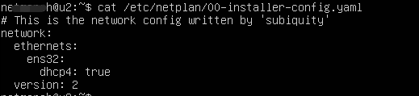
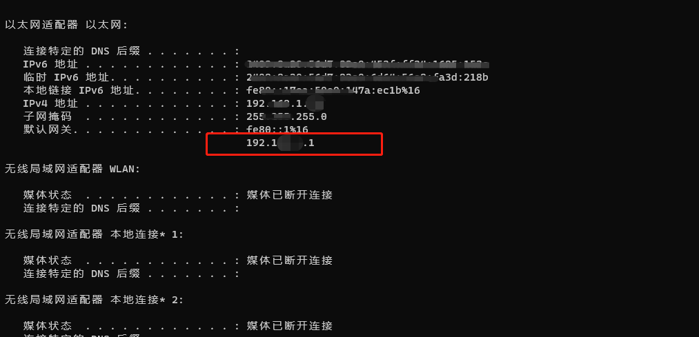

# 如何在ubuntu的桥接模式下面设置固定ip

## 1.起因

我在学习k8s的时候搭建集群使用ubuntu的桥接模式环境，第一天使用都是正常，但是第二天莫名其妙发现自己的服务器ip自动变化了，导致集群环境失败，原因是默认设置的是自动生成ip，如图默认展示




## 2.查看宿主机的网关地址待会要用到




## 3.修改配置文件

建议可以先备份一份防止出错

```
sudo vim /etc/netplan/00-network-manager-all.yaml
```

```
# This is the network config written by 'subiquity'
network:
  ethernets:
    ens32:
       dhcp4: no      #默认是yes的，也就是会自动变化ip
       addresses: [192.168.1.10/24]   #你想要设置的ip
       optional: true
       gateway4: 192.*.*.1    #第二步获取的网关地址
       nameservers:
              addresses: [114.114.114.114,8.8.8.8]
  version: 2
```

## 4.重启服务

```
sudo netplan apply
```


